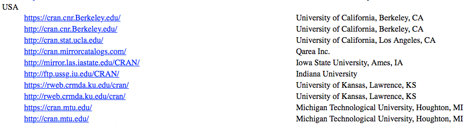
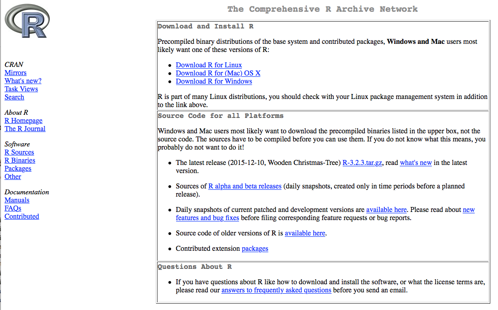
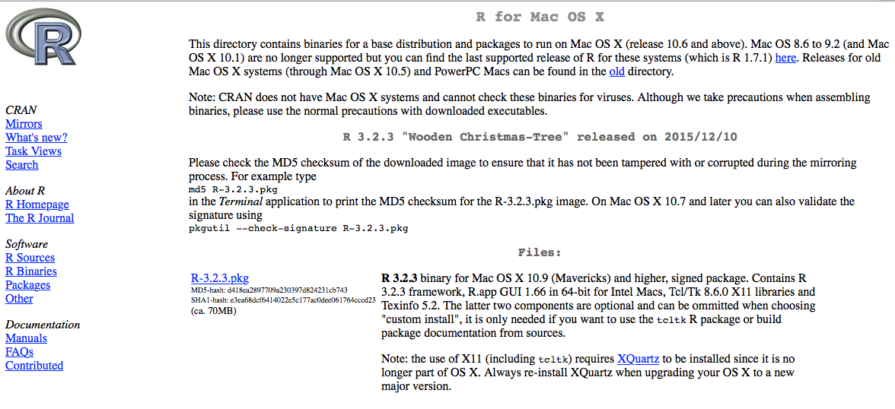
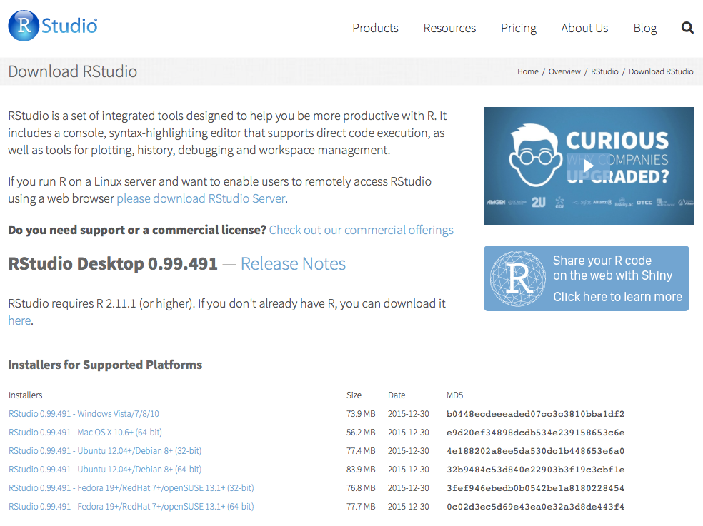
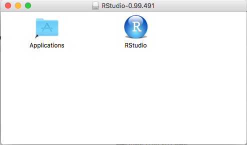
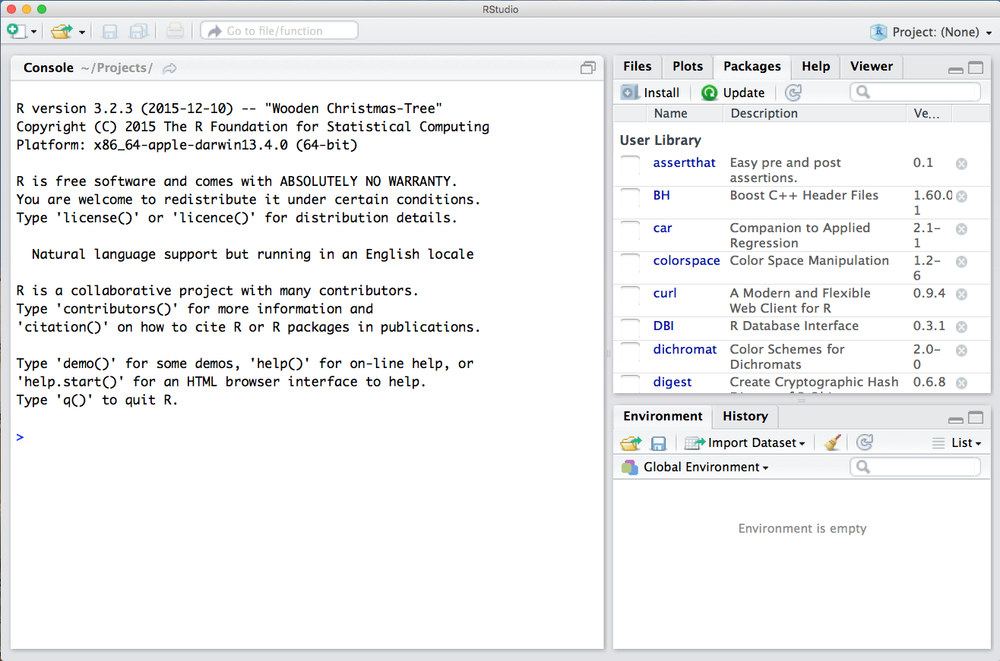

This page will walk you through the installation of R and RStudio.  R is the workhorse that actually does the computations.  You won't ever need to launch the R program directly, but it has to be installed on your computer.  RStudio is a nice graphical front-end to R.  This is the program you will interact with directly, but it depends "under the hood" on R itself.  

### Installing R

Go to the [R project website](https://www.r-project.org).  On the left-hand side, you'll see a link for CRAN under the "Download" heading.  Click it.

The website will now offer you a choice of "mirrors", like this.

These are just different servers that host the same downloads, to reduce the demand on any one server.  It really doesn't matter which one you pick; I just scrolled down to the USA section and picked the one in Dallas, since I'm in Texas.

Once you've chosen a mirror, you'll see a page like this:

Click on the appropriate Download link for your computer's operator system.  I'm on a Mac, so I clicked the "Download for (Mac) OS X" link.

Now you should be on the download page itself.  Click the link for the first file in the list, which for me is "R-3.2.3.pkg":

The 3.2.3 bit is the version number; if the number on your screen is a little different, it just means you're getting a slightly later version than me.  This is not a problem.

Once you've downloaded this file, open it to run the R installer.  Follow the instructions on screen.  You're done!  The R program should now live wherever programs normally live on your hard drive (e.g. in the "Applications" folder on your hard drive).

### Installing RStudio

Go to the [RStudio download page](http://www.rstudio.com/products/rstudio/download/), which looks like this.

Under the list entitled "Installers for Supported Platforms", click on the link for your computer's platform.  Again, I'm on a Mac, so I chose the second on the page you see above.

Once you've downloaded this file, open it to run the RStudio installer. On a Mac, installation is as simple as dragging the RStudio icon onto the icon for your Applications folder in the little window that pops up.

That's it; you should now have a copy of RStudio on your computer in your Applications folder (on a Mac), or the analogous location on a Windows machine.

Find the RStudio program and open it.  You should see a window that looks something like this, perhaps with minor differences in the layout of the panels.  

You're done!
