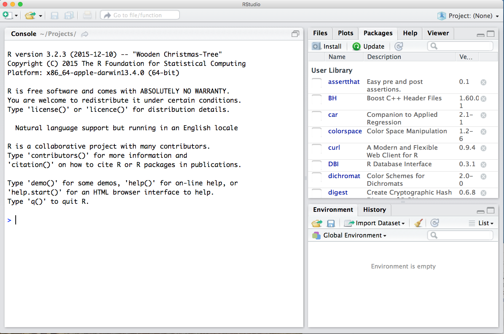
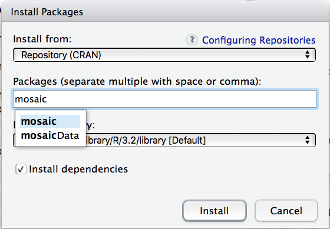
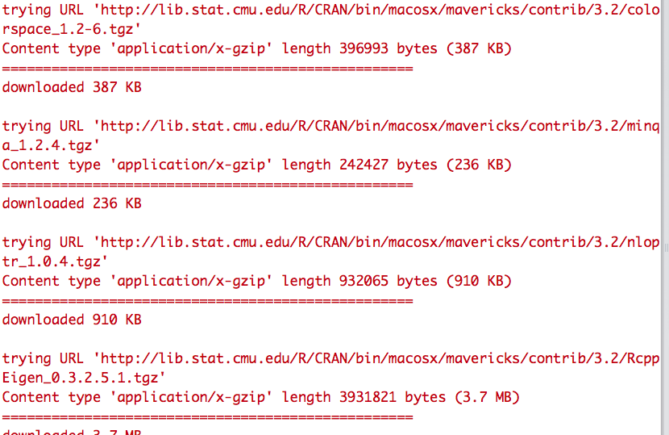
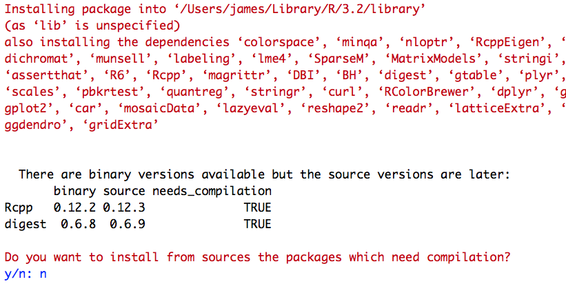

A library is a piece of software that provides additional functionality to R, beyond what's contained in the basic installation.  R has an enormous ecosystem of libraries (number in the tens of thousands) for various data-analysis tasks, ranging from the simple to the very sophisticated. The mosaic package was written specifically for use in statistics classrooms. We will use it along with a handful of other packages this semester, so you’ll need to learn how to install them. 

The first minute of [this video](https://www.youtube.com/watch?v=u1r5XTqrCTQ) gives a walk-through, but we'll walk through the steps here, too.  (The same process works for any of the other libraries you'll need).  Conveniently, libraries, also called packages, are installed from within RStudio itself.   

### Installing a library from within RStudio

Launch RStudio, and find the row of tabs for Files, Plots, Packages, etc.  You can see this on the upper-right panel in the figure below.

Click on the Packages tab, and then on the button in the row just beneath it that says "Install".  You should see a window pop up that looks like the one below.  Type "mosaic" into the field where it says "Packages."  

RStudio may autocomplete the available packages that begin with the string you've typed in.  If so, select "mosaic" from the list that appears.  IMPORTANT: make sure that the box next to "Install dependencies" is checked (as it is in the picture above).  If it isn't, check it.

Click the Install button.  Now a bunch of text will get dumped to the Console window, like this:

This indicates that the mosaic library (and several other libraries upon which it depends) are being installed.

It's possible that RStudio will give you a prompt like the following:

If so, just type "n" for no, and hit Enter to continue.

Eventually you will see that text has stopped appearing in the console, and that you have a blinking cursor next to a caret mark (>).  When this happens, the mosaic package has been installed, and is now available to be loaded and used.

