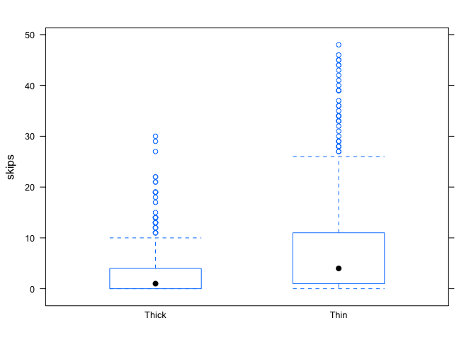
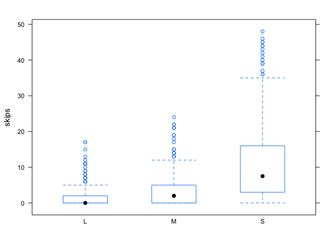
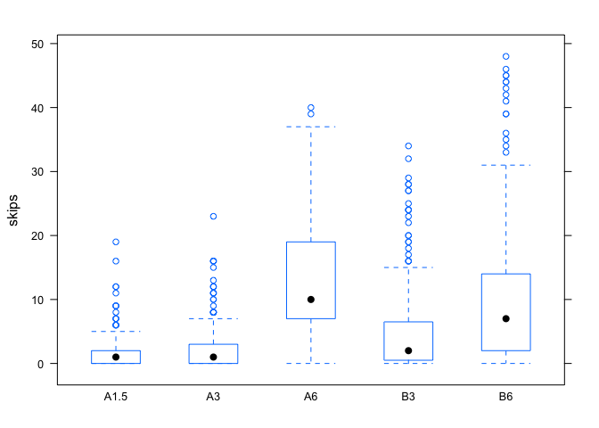

Manufacturing flaws in circuit boards
-------------------------------------

In this case study, you'll look at data from a quality-control
experiment from AT&T's process for manufacturing printed circuit boards.
The data are in
[solder.csv](http://jgscott.github.io/teaching/data/solder.csv), and
come to us courtesy of the R package `faraway.`

Load the data set using the Import Dataset button. Then load the mosaic
library and begin by summarizing the data set.

    library(mosaic)
    summary(solder)

    ##  Opening   Solder      Mask        PadType        Panel       skips      
    ##  L:300   Thick:450   A1.5:180   D4     : 90   Min.   :1   Min.   : 0.00  
    ##  M:300   Thin :450   A3  :270   D6     : 90   1st Qu.:1   1st Qu.: 0.00  
    ##  S:300               A6  : 90   D7     : 90   Median :2   Median : 2.00  
    ##                      B3  :180   L4     : 90   Mean   :2   Mean   : 5.53  
    ##                      B6  :180   L6     : 90   3rd Qu.:3   3rd Qu.: 7.00  
    ##                                 L7     : 90   Max.   :3   Max.   :48.00  
    ##                                 (Other):360

The response variable, skips, is the number of solder skips on the
circuit board (i.e. manufacturing flaws) that are apparent from a visual
inspection. The remaining variables refect different choices in the
manufacturing process. The goal is to understand which combination of
choices leads to the lowest number of skips, and therefore the most
reliable manufacturing process. We'll focus on three such variables:  
- Opening: the size of the opening on the solder gun (small, medium, or
large)  
- Solder: the thickness of the alloy used for soldering (thick or
thin)  
- Mask: according to Wikipedia, a solder mask is "a thin lacquer-like
layer of polymer that is usually applied to the copper traces of a
printed circuit board (PCB) for protection against oxidation and to
prevent solder bridges from forming between closely spaced solder pads."
This experiment involved five different masks, labeled as A1.5, A3, A6,
B3, and B6.

Let's start by looking at how the number of skips depends on each
variable individually.

    bwplot(skips ~ Solder, data=solder)

    bwplot(skips ~ Opening, data=solder)

    bwplot(skips ~ Mask, data=solder)

Each seems to predict some of the variation in solder skips.

Build a model to predict solder skips using these three predictor
variables. Include whatever combination of main effects and interaction
terms you deem appropriate. Justify your final choice of model and
explain what conclusions you can draw from your analysis of this data
set.

Citation for original data source: Comizzoli, R. B., J. M. Landwehr, and
J. D. Sinclair (1990). Robust materials and processes: Key to
reliability. AT&T Technical Journal 69(6), 113-128.
