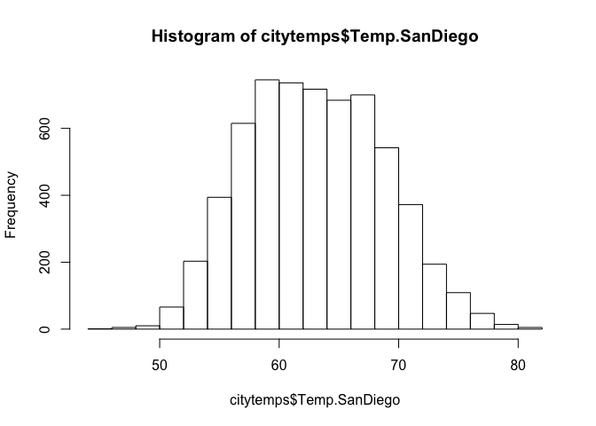
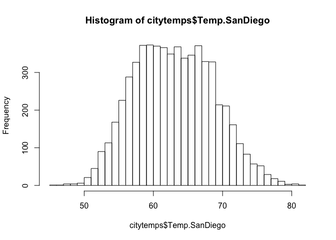
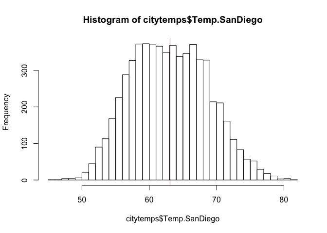
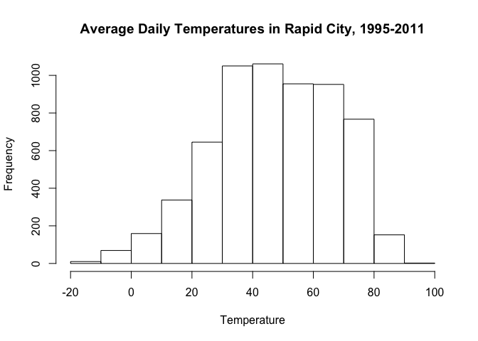
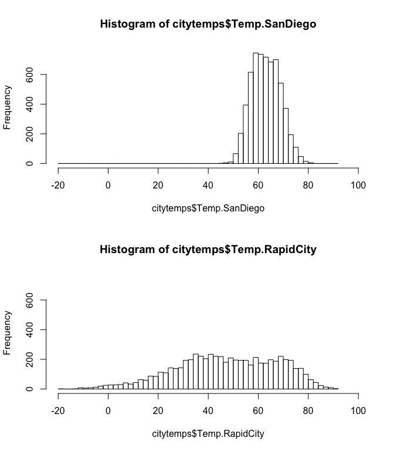
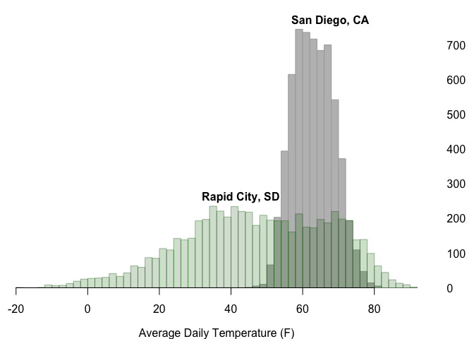

In this walk-through, you'll learn how to measure and visualize
dispersion of a single quantitative variable. You will also learn how to
change some of the default plot settings in R, like changing the axis
labels or the number of breaks in a histogram.

Data files:  
\*
[citytemps.csv](http://jgscott.github.io/teaching/data/citytemps.csv):
daily average temperatures in San Diego, CA and Rapid City, SD.

### Preliminary steps

First, load the mosaic library, like this.

    library(mosaic)

There will be a lot of information returned to the console when you load
the library, but you only have to worry if you see an actual error, like
this:

    Error in library(mosaic) : there is no package called ‘mosaic’

This means you haven't installed the package! You'll only have to do the
installation once, but you will have to load the mosaic library (as
above) at the beginning of each new R session if you intend to use it.
If you haven't installed the mosaic library, see the [instructions
here.](../basics/installing_library.md)

The mosaic library has two useful functions, `pdata` and `qdata`, for
dealing with quantiles of data sets. If you don't load the library, some
of the commands below won't work.

Next, download the citytemps.csv file and read it in. You can use
RStudio's Import Dataset button, or use the read.csv command:

    citytemps = read.csv('citytemps.csv')

If you do this second option, make sure you're working from the
directory where the data lives, or put the full path to the file between
the quotation marks.

### A simple histogram

We'll start off by getting R to summarize the variables:

    summary(citytemps)

    ##       Year          Month             Day        Temp.SanDiego  
    ##  Min.   :1995   Min.   : 1.000   Min.   : 1.00   Min.   :45.10  
    ##  1st Qu.:1999   1st Qu.: 4.000   1st Qu.: 8.00   1st Qu.:58.70  
    ##  Median :2003   Median : 7.000   Median :16.00   Median :63.00  
    ##  Mean   :2003   Mean   : 6.492   Mean   :15.71   Mean   :63.08  
    ##  3rd Qu.:2007   3rd Qu.: 9.000   3rd Qu.:23.00   3rd Qu.:67.30  
    ##  Max.   :2011   Max.   :12.000   Max.   :31.00   Max.   :81.30  
    ##  Temp.RapidCity  
    ##  Min.   :-19.00  
    ##  1st Qu.: 33.30  
    ##  Median : 47.60  
    ##  Mean   : 47.28  
    ##  3rd Qu.: 63.95  
    ##  Max.   : 91.90

You can see we have 17 years of temperature data on San Diego and Rapid
City. Let's focus on San Diego. We'll start with a histogram, one of the
most basic plots for a single quantitative variable:

    hist(citytemps$Temp.SanDiego)

If you want the histogram to have more bins, you can specify this via
the `breaks` flag:

    hist(citytemps$Temp.SanDiego, breaks=30)

 This
is called "adding a flag", (in this case, `breaks=30`) to the basic
command. This is a very common paradigm in R: a command will have a
default behavior which you can modify by providing a function with
optional flags. In this case, we're asking R to provide a histogram with
(approximately) 30 breaks.

R plots can have a lot more bells and whistles than this, some of which
we'll encounter below. To give a simple example, we can add a vertical
line at the sample mean.

    muSanDiego = mean(citytemps$Temp.SanDiego)
    hist(citytemps$Temp.SanDiego, breaks=30)
    abline(v=muSanDiego, col='red')

### Measuring dispersion: standard deviation and quantiles

You already know one way of summarizing the dispersion of this
distribution: the standard deviation.

    sd(citytemps$Temp.SanDiego)

    ## [1] 5.698457

Another measure of dispersion is the coverage interval: that is, an
interval covering a specified fraction of the observations. For example,
to get a central 50% coverage interval, we'd need the 25th and 75
percentiles of the distribution. By definition, 50% of the observations
are between these two numbers. You can get these from the `qdata`
function.

    qdata(citytemps$Temp.SanDiego)

    ##      quantile    p
    ## 0%       45.1 0.00
    ## 25%      58.7 0.25
    ## 50%      63.0 0.50
    ## 75%      67.3 0.75
    ## 100%     81.3 1.00

This tells you that, for example, the 75th percentile of the data is at
67.3 degrees.

You can also ask for different quantiles by passing in a flag called "p"
(for probability) like this:

    qdata(citytemps$Temp.SanDiego, p=c(0.05, 0.95))

    ##     quantile    p
    ## 5%      54.2 0.05
    ## 95%     72.6 0.95

In this case, `p=c(0.05, 0.95)` is flag that modifies the default
behavior of the quantile function to yield the requested quantiles, in
this case the 5th and 95th percentiles. We could use these numbers to
construct a 90% coverage interval.

We can also do the inverse calculation using the `pdata` function,
asking which quantile a specific value corresponds to:

    pdata(citytemps$Temp.SanDiego, q=c(60, 70))

    ## [1] 0.3310602 0.8796883

This tells us that 60 degrees is the 33rd percentile of the data set and
that 70 degrees is the 88th percentile.

To summarize:  
- You give `qdata` a data set and a requested quantile, and it returns
the corresponding value at that quantile.  
- You give `pdata` a data set and a value, and it returns the
corresponding quantile for that value.

### Standardizing using z-scores

Which temperature is more extreme: 50 degrees in San Diego, or 10
degrees in Rapid City? In an absolute sense, of course 10 degrees is a
more extreme temperature. But what about in a relative sense? In other
words, is a 10-degree day more extreme *for Rapid City* than a 50-degree
day is for San Diego?

This question could certainly be answered using quantiles, which you've
already learned how to handle. But let's discuss a second way: by
calculating a z-score for each temperature.

A z-score is the number of standard deviations by which some observation
is above the mean. (So if a z-score is negative, then the corresponding
observation is *below* the mean.) To calculate a z-score, we subtract
the mean and divide by the standard deviation. For a 50-degree day in
San Diego, this is:

    (50 - mean(citytemps$Temp.SanDiego)) / sd(citytemps$Temp.SanDiego)

    ## [1] -2.295631

Or about 2.3 standard deviations *below* the mean.

On the other hand, for a 10-degree day in Rapid City, this is

    (10 - mean(citytemps$Temp.RapidCity)) / sd(citytemps$Temp.RapidCity)

    ## [1] -1.859056

Or about 1.9 standard deviations below the mean. Thus a 50-degree day in
San Diego is actually more extreme than a 10-degree day in Rapid City!

As this example suggests, z-scores are useful for comparing numbers that
come from different distributions, with different statistical
properties. It tells you how extreme a number is, relative to other
numbers from that some distribution.

### Fancier histograms

To close, we'll make a histogram for Rapid City, except we'll change the
default title and x-axis label to something a bit more fit for human
consumption.

    hist(citytemps$Temp.RapidCity, main="Average Daily Temperatures in Rapid City, 1995-2011", xlab='Temperature')

Notice again that we've used optional flags (main and xlab) to change
the main title and x-axis label, respectively.

Next, let's stack the two histograms on top of each other, to make a
multi-frame plot. We do this with the following code block. The first
line says to make a multi-frame plot (filled in along the rows) with 2
rows and 1 column. The next two plotting commands then fill in the two
frames.

    par(mfrow=c(2,1))
    hist(citytemps$Temp.SanDiego)
    hist(citytemps$Temp.RapidCity)

This won't do: notice that the axes and bin sizes differ between the two
plots. This makes it hard to compare the two distributions at a glance.
We need to align these two plots to have the same axes and bins. Just as
we did above, we'll do this by passing additional flags to the `hist`
function.

First, we must define a set of breakpoints for the histogram grams.
We'll do this with the `seq` (which stands for sequence) command:

    mybreaks = seq(-20, 92, by=2)

This says to make a sequence running from -20 to 92 degrees in
increments of 2. You'll see the whole sequence if you type `mybreaks`
directly into the console"

    mybreaks

    ##  [1] -20 -18 -16 -14 -12 -10  -8  -6  -4  -2   0   2   4   6   8  10  12
    ## [18]  14  16  18  20  22  24  26  28  30  32  34  36  38  40  42  44  46
    ## [35]  48  50  52  54  56  58  60  62  64  66  68  70  72  74  76  78  80
    ## [52]  82  84  86  88  90  92

Now we can make the histograms using these custom bins. We'll also
change the x and y axes using the xlim and ylim arguments:

    par(mfrow=c(2,1))
    hist(citytemps$Temp.SanDiego, breaks=mybreaks, xlim=c(-20,100), ylim=c(0, 760))
    hist(citytemps$Temp.RapidCity, breaks=mybreaks, xlim=c(-20,100), ylim=c(0, 760))

 Now
the bins and axes are comparable, making the distributions themselves
much easier to compare.

In the expression above, you'll notice that we used the same `breaks`
flag as before, except this time we passed in a full set of breaks
rather than an integer. R lets us do either.

### Optional

Below, I've included a set of commands that produce a much prettier
plot. Feel free to go line by line and modify these commands to see what
behavior they produce. You can learn a lot about R this way.

    mybreaks = seq(-20, 92, by=2)
    par(mfrow=c(1,1), mar=c(3,0,1,3), mgp=c(2,1,0))
    hist(citytemps$Temp.SanDiego, breaks=mybreaks, xlab="Average Daily Temperature (F)", main="", border="darkgrey", col="grey", axes=FALSE, ylim=c(0, 760))
    hist(citytemps$Temp.RapidCity,breaks=mybreaks,add=TRUE, border=rgb(0,100,0,100,maxColorValue=255), col= rgb(0,100,0,50,maxColorValue=255))
    axis(4,at=seq(0,700,by=100), las=1,tick=FALSE)
    axis(1,pos=0)
    text(55, 770, "San Diego, CA", pos=4, font=2)
    text(30, 260, "Rapid City, SD", pos=4, font=2)

Remember you that can always use the question mark, e.g.

    ?text

to see the list of available arguments/flags for a given function.
