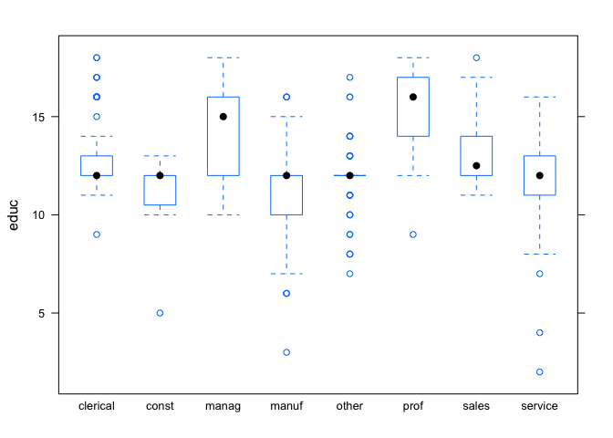

Hourly wages in the Current Population Survey
---------------------------------------------

Learning goals:  
\* observe how and why collinearity impacts an ANOVA table for a
multiple regression model.  
\* use AIC to judge the fit-simplicity tradeoff when deciding whether to
include a variable in a model.  
\* choose a subset of variables in a regression model via stepwise
selection.

Data files:  
\* [cps.csv](cps.csv): data from the [Current Population
Survey](http://www.census.gov/cps/)], a major source of data about the
American labor force.

### ANOVA tables in multiple regression

We'll start by loading the mosaic library, reading in the CPS data set,
and summarizing the variables.

    library(mosaic)
    cps = read.csv("cps.csv", header=TRUE)
    summary(cps)

    ##       wage             educ       race     sex     hispanic   south   
    ##  Min.   : 1.000   Min.   : 2.00   NW: 67   F:245   Hisp: 27   NS:378  
    ##  1st Qu.: 5.250   1st Qu.:12.00   W :467   M:289   NH  :507   S :156  
    ##  Median : 7.780   Median :12.00                                       
    ##  Mean   : 9.024   Mean   :13.02                                       
    ##  3rd Qu.:11.250   3rd Qu.:15.00                                       
    ##  Max.   :44.500   Max.   :18.00                                       
    ##                                                                       
    ##     married        exper         union          age             sector   
    ##  Married:350   Min.   : 0.00   Not  :438   Min.   :18.00   prof    :105  
    ##  Single :184   1st Qu.: 8.00   Union: 96   1st Qu.:28.00   clerical: 97  
    ##                Median :15.00               Median :35.00   service : 83  
    ##                Mean   :17.82               Mean   :36.83   manuf   : 68  
    ##                3rd Qu.:26.00               3rd Qu.:44.00   other   : 68  
    ##                Max.   :55.00               Max.   :64.00   manag   : 55  
    ##                                                            (Other) : 58

There are 11 variables in this data set: \* wage: a person's hourly wage
in dollars (the data is from 1985).  
\* educ: number of years of formal education. Here 12 indicates the
completion of high school.  
\* race: white or non-white.  
\* sex: male or female.  
\* hispanic: an indicator of whether the person is Hispanic or
non-Hispanic.  
\* south: does the person live in a southern (S) or non-southern (NS)
state?  
\* married: is the person married or single?  
\* exper: number of years of work experience  
\* union: an indicator for whether the person is in a union or not.  
\* age: age in years  
\* sector: clerical, construction, management, manufacturing,
professional (lawyer/doctor/accountant/etc), sales, service, or other.

First consider a two-variable regression model that uses a person's
education level and sector of employment as predictors of his or her
wage:

    lm1 = lm(wage ~ educ + sector, data=cps)
    summary(lm1)

    ## 
    ## Call:
    ## lm(formula = wage ~ educ + sector, data = cps)
    ## 
    ## Residuals:
    ##     Min      1Q  Median      3Q     Max 
    ## -10.344  -2.953  -0.755   2.243  32.102 
    ## 
    ## Coefficients:
    ##               Estimate Std. Error t value Pr(>|t|)    
    ## (Intercept)    0.60754    1.33098   0.456  0.64825    
    ## educ           0.52674    0.09647   5.460 7.34e-08 ***
    ## sectorconst    3.02131    1.13154   2.670  0.00782 ** 
    ## sectormanag    4.41563    0.78483   5.626 3.00e-08 ***
    ## sectormanuf    1.53365    0.73969   2.073  0.03862 *  
    ## sectorother    1.66512    0.72821   2.287  0.02262 *  
    ## sectorprof     3.10268    0.69218   4.482 9.07e-06 ***
    ## sectorsales    0.02658    0.87188   0.030  0.97569    
    ## sectorservice -0.18152    0.69298  -0.262  0.79347    
    ## ---
    ## Signif. codes:  0 '***' 0.001 '**' 0.01 '*' 0.05 '.' 0.1 ' ' 1
    ## 
    ## Residual standard error: 4.554 on 525 degrees of freedom
    ## Multiple R-squared:  0.2266, Adjusted R-squared:  0.2148 
    ## F-statistic: 19.23 on 8 and 525 DF,  p-value: < 2.2e-16

Now see what happens when we switch the order of the two variables:

    lm2 = lm(wage ~ sector + educ, data=cps)
    summary(lm2)

    ## 
    ## Call:
    ## lm(formula = wage ~ sector + educ, data = cps)
    ## 
    ## Residuals:
    ##     Min      1Q  Median      3Q     Max 
    ## -10.344  -2.953  -0.755   2.243  32.102 
    ## 
    ## Coefficients:
    ##               Estimate Std. Error t value Pr(>|t|)    
    ## (Intercept)    0.60754    1.33098   0.456  0.64825    
    ## sectorconst    3.02131    1.13154   2.670  0.00782 ** 
    ## sectormanag    4.41563    0.78483   5.626 3.00e-08 ***
    ## sectormanuf    1.53365    0.73969   2.073  0.03862 *  
    ## sectorother    1.66512    0.72821   2.287  0.02262 *  
    ## sectorprof     3.10268    0.69218   4.482 9.07e-06 ***
    ## sectorsales    0.02658    0.87188   0.030  0.97569    
    ## sectorservice -0.18152    0.69298  -0.262  0.79347    
    ## educ           0.52674    0.09647   5.460 7.34e-08 ***
    ## ---
    ## Signif. codes:  0 '***' 0.001 '**' 0.01 '*' 0.05 '.' 0.1 ' ' 1
    ## 
    ## Residual standard error: 4.554 on 525 degrees of freedom
    ## Multiple R-squared:  0.2266, Adjusted R-squared:  0.2148 
    ## F-statistic: 19.23 on 8 and 525 DF,  p-value: < 2.2e-16

In a word, nothing! The coefficients, standard errors, t statistics, and
p-values are all the same. That's because the model itself---that is,
the underlying regression equation relating the outcome to the
predictors---is the same regardless of the order in which we name the
variables. (That's because we add the individual terms in the regression
equation together, and [addition is
commutative](http://en.wikipedia.org/wiki/Commutative_property).) This
is comforting: it means our model doesn't depend on some arbitrary
choice of how to order the variables.

However, the ANOVA tables for the two models are different. In the first
table, it looks like education contributes more to the predictive
abilities of the model than sector of employment:

    anova(lm1)

    ## Analysis of Variance Table
    ## 
    ## Response: wage
    ##            Df  Sum Sq Mean Sq F value    Pr(>F)    
    ## educ        1  2053.3 2053.29 99.0165 < 2.2e-16 ***
    ## sector      7  1136.6  162.37  7.8298 4.917e-09 ***
    ## Residuals 525 10886.8   20.74                      
    ## ---
    ## Signif. codes:  0 '***' 0.001 '**' 0.01 '*' 0.05 '.' 0.1 ' ' 1

In the second table, while the residual sum of squares is the same as
for the first table, it now looks like a person's sector of employment
contributes more than his or her education:

    anova(lm2)

    ## Analysis of Variance Table
    ## 
    ## Response: wage
    ##            Df  Sum Sq Mean Sq F value    Pr(>F)    
    ## sector      7  2571.6  367.37  17.716 < 2.2e-16 ***
    ## educ        1   618.3  618.28  29.816 7.342e-08 ***
    ## Residuals 525 10886.8   20.74                      
    ## ---
    ## Signif. codes:  0 '***' 0.001 '**' 0.01 '*' 0.05 '.' 0.1 ' ' 1

In other words, the ANOVA table usually *does* depend on the order in
which we name the variables, even though the model itself does not. The
only exception is when the variables are independent of one another.
This exception doesn't apply here, because some sectors of the economy
have more educated workers than other sectors"

    bwplot(educ ~ sector, data=cps)

We therefore reach an important conclusion about the ANOVA table for a
multiple-regression model:  
\* The ANOVA table attempts to partition credit among the variables by
measuring their contribution to the model's predictable sums of squares.
More specifically, it assigns credit by adding the variables one at a
time and measuring the corresponding decrease in the residual sum of
squares.  
\* But the table depends on the ordering of the variables, and the
ordering of the variables is arbitrary.  
\* We therefore cannot give credit to the individual variables in a
model without making an arbitrary decision about their order.

Though this seems like a paradox, it's really a manifestation of a
broader concept. In a regression model, the variables work as a team.
And it is difficult to partition credit to the individuals who compose a
team---whether it's a team of lawyers, film-makers, or basketball
players---except in the rare case where the individuals contribute to
the team in totally independent ways.

### Choosing a model by greedy backward selection

We have learned that it is difficult to partition credit among the
individual variables in a model. Because of this, the problem of
*variable selection*, or choosing which variables to include in a model
in a way that optimally balances fit and simplicity, is also difficult.

There is no single, objectively correct approach to variable selection.
But all such approaches must confront two basic questions:  
1) How should we prioritize the tradeoff between fit and simplicity?  
2) How should we actually find the model that exhibits the best
tradeoff?

The commands below show you how to implement a particular approach to
variable selection called the stepwise AIC method. (AIC stands for
["Akaike's Information
Criterion."](http://en.wikipedia.org/wiki/Akaike_information_criterion))
This method measures the fit/simplicity tradeoff using a somewhat
complicated formula involving the residual sums of squares and the
number of parameters in the model. Smaller values of AIC are better.

To see stepwise AIC selection in action, we will start with a model of
wages that uses most of the other predictors in the data set.

    lm2 = lm(wage ~ educ + sector + age + sex + south + married + race + union, data=cps)
    anova(lm2)

    ## Analysis of Variance Table
    ## 
    ## Response: wage
    ##            Df Sum Sq Mean Sq  F value    Pr(>F)    
    ## educ        1 2053.3 2053.29 111.6081 < 2.2e-16 ***
    ## sector      7 1136.6  162.37   8.8255 2.809e-10 ***
    ## age         1  667.7  667.73  36.2948 3.216e-09 ***
    ## sex         1  396.1  396.05  21.5276 4.421e-06 ***
    ## south       1   70.0   70.00   3.8046  0.051649 .  
    ## married     1   19.4   19.36   1.0523  0.305466    
    ## race        1   19.3   19.29   1.0485  0.306328    
    ## union       1  166.2  166.21   9.0347  0.002777 ** 
    ## Residuals 519 9548.2   18.40                       
    ## ---
    ## Signif. codes:  0 '***' 0.001 '**' 0.01 '*' 0.05 '.' 0.1 ' ' 1

The ANOVA table gives you an idea of which variables might be good
candidates to drop. But we've learned to be somewhat skeptical the ANOVA
table in situations where the predictors are correlated. Moreover, it
would be tedious to go in and drop each variable one by one to see its
effect on the model. Luckily, the handy "drop1" function automates this
process for us:

    drop1(lm2)

    ## Single term deletions
    ## 
    ## Model:
    ## wage ~ educ + sector + age + sex + south + married + race + union
    ##         Df Sum of Sq     RSS    AIC
    ## <none>                9548.2 1569.9
    ## educ     1    707.85 10256.1 1606.1
    ## sector   7    658.05 10206.3 1591.5
    ## age      1    502.68 10050.9 1595.3
    ## sex      1    356.89  9905.1 1587.5
    ## south    1     46.25  9594.5 1570.5
    ## married  1     10.76  9559.0 1568.5
    ## race     1     31.18  9579.4 1569.6
    ## union    1    166.21  9714.4 1577.1

This function considers all possible one-variable deletions from the
model and calculates the residual sum of squares and AIC for each
candidate. In this case, it looks like the model in which the "married"
variable is dropped leads to the smallest AIC. If we wanted to, we could
repeat this process starting from the model without this variable:

    lm3 = lm(wage ~ educ + sector + age + sex + south + race + union, data=cps)
    drop1(lm3)

    ## Single term deletions
    ## 
    ## Model:
    ## wage ~ educ + sector + age + sex + south + race + union
    ##        Df Sum of Sq     RSS    AIC
    ## <none>               9559.0 1568.5
    ## educ    1    702.56 10261.5 1604.4
    ## sector  7    669.86 10228.8 1590.7
    ## age     1    577.03 10136.0 1597.8
    ## sex     1    355.51  9914.5 1586.0
    ## south   1     45.06  9604.0 1569.0
    ## race    1     32.64  9591.6 1568.3
    ## union   1    173.60  9732.6 1576.1

It looks now like deleting "race" would lead to a slight improvement in
AIC.

This procedure---sequentially pruning variables in a way that makes AIC
as small as possible---is often called "greedy backward selection." It's
"backward" because we start from a large model and prune downwards, and
it's "greedy" because at each stage we delete the single worst variable,
as measured by AIC.

In large models, doing this by hand can become tedious. To automate the
process, use the "step" function, starting from the largest candidate
model:

    lm4 = lm(wage ~ educ + sector + age + sex + south + married + race + union + sex:age, data=cps)
    lmstep = step(lm4, direction='backward')

    ## Start:  AIC=1567.36
    ## wage ~ educ + sector + age + sex + south + married + race + union + 
    ##     sex:age
    ## 
    ##           Df Sum of Sq     RSS    AIC
    ## - married  1      4.63  9471.9 1565.6
    ## - race     1     23.47  9490.8 1566.7
    ## <none>                  9467.3 1567.4
    ## - south    1     51.73  9519.0 1568.3
    ## - age:sex  1     80.89  9548.2 1569.9
    ## - union    1    148.74  9616.1 1573.7
    ## - sector   7    612.00 10079.3 1586.8
    ## - educ     1    731.75 10199.1 1605.1
    ## 
    ## Step:  AIC=1565.62
    ## wage ~ educ + sector + age + sex + south + race + union + age:sex
    ## 
    ##           Df Sum of Sq     RSS    AIC
    ## - race     1     24.08  9496.0 1565.0
    ## <none>                  9471.9 1565.6
    ## - south    1     51.08  9523.0 1566.5
    ## - age:sex  1     87.02  9559.0 1568.5
    ## - union    1    152.84  9624.8 1572.2
    ## - sector   7    617.52 10089.5 1585.3
    ## - educ     1    729.02 10201.0 1603.2
    ## 
    ## Step:  AIC=1564.98
    ## wage ~ educ + sector + age + sex + south + union + age:sex
    ## 
    ##           Df Sum of Sq     RSS    AIC
    ## <none>                  9496.0 1565.0
    ## - south    1     58.54  9554.6 1566.3
    ## - age:sex  1     95.59  9591.6 1568.3
    ## - union    1    142.58  9638.6 1570.9
    ## - sector   7    635.08 10131.1 1585.5
    ## - educ     1    727.18 10223.2 1602.4

If we change the flag specifying `direction='backward'` to
`direction='both'`, we are allowing the possibility that a variable,
once deleted, can be re-introduced at some point later on in the
step-wise procedure:

    lmstep = step(lm4, direction='both')

    ## Start:  AIC=1567.36
    ## wage ~ educ + sector + age + sex + south + married + race + union + 
    ##     sex:age
    ## 
    ##           Df Sum of Sq     RSS    AIC
    ## - married  1      4.63  9471.9 1565.6
    ## - race     1     23.47  9490.8 1566.7
    ## <none>                  9467.3 1567.4
    ## - south    1     51.73  9519.0 1568.3
    ## - age:sex  1     80.89  9548.2 1569.9
    ## - union    1    148.74  9616.1 1573.7
    ## - sector   7    612.00 10079.3 1586.8
    ## - educ     1    731.75 10199.1 1605.1
    ## 
    ## Step:  AIC=1565.62
    ## wage ~ educ + sector + age + sex + south + race + union + age:sex
    ## 
    ##           Df Sum of Sq     RSS    AIC
    ## - race     1     24.08  9496.0 1565.0
    ## <none>                  9471.9 1565.6
    ## - south    1     51.08  9523.0 1566.5
    ## + married  1      4.63  9467.3 1567.4
    ## - age:sex  1     87.02  9559.0 1568.5
    ## - union    1    152.84  9624.8 1572.2
    ## - sector   7    617.52 10089.5 1585.3
    ## - educ     1    729.02 10201.0 1603.2
    ## 
    ## Step:  AIC=1564.98
    ## wage ~ educ + sector + age + sex + south + union + age:sex
    ## 
    ##           Df Sum of Sq     RSS    AIC
    ## <none>                  9496.0 1565.0
    ## + race     1     24.08  9471.9 1565.6
    ## - south    1     58.54  9554.6 1566.3
    ## + married  1      5.24  9490.8 1566.7
    ## - age:sex  1     95.59  9591.6 1568.3
    ## - union    1    142.58  9638.6 1570.9
    ## - sector   7    635.08 10131.1 1585.5
    ## - educ     1    727.18 10223.2 1602.4
