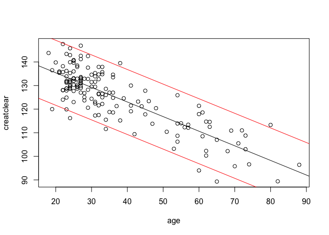

Learning goals:  
\* create a prediction interval to quantify forecasting uncertainty  
\* compute R-squared of a linear model, both "by hand" and using R's
`summary` function.

Data files:  
\* [creatinine.csv](creatinine.csv): data on age and kidney function for
157 adult males from a single clinic.

### Prediction intervals

First, load the mosaic library.

    library(mosaic)

Now let's read in the creatinine data set and get a summary of the
variables.

    creatinine = read.csv('creatinine.csv', header=TRUE)
    summary(creatinine)

    ##       age          creatclear   
    ##  Min.   :18.00   Min.   : 89.3  
    ##  1st Qu.:25.00   1st Qu.:118.6  
    ##  Median :31.00   Median :128.0  
    ##  Mean   :36.39   Mean   :125.3  
    ##  3rd Qu.:43.00   3rd Qu.:133.3  
    ##  Max.   :88.00   Max.   :147.6

The two variables are  
\* age: the patient's age.  
\* creatclear: the patient's creatinine-clearance rate, measured in
ml/minute. According to the [National Institutes of
Health](http://www.nlm.nih.gov/medlineplus/ency/article/003611.htm),
"The creatinine clearance test helps provide information about how well
the kidneys are working. The test compares the creatinine level in urine
with the creatinine level in blood.... Creatinine is removed, or
cleared, from the body entirely by the kidneys. If kidney function is
abnormal, creatinine level increases in the blood because less
creatinine is released through the urine."

Let's start by looking at the relationship between creatinine clearance
rate and age.

    # Plot the data
    plot(creatclear~age, data=creatinine)
    # Fit a straight line to the data by least squares
    lm1 = lm(creatclear~age, data=creatinine)
    # Extract the coefficients and plot the line
    coef(lm1)

    ## (Intercept)         age 
    ## 147.8129158  -0.6198159

    abline(lm1)

Clearly a decline in kidney function is something we can all look
forward to as we age.

According to the National Institutes of Health, the normal range of
values for creatinine clearance is 97 to 137 ml/min. We can verify that
these figures are reasonably close to the endpoints of a 95% coverage
interval for our sample of men.

    quantile(creatinine$creatclear, probs=c(0.025, 0.975))

    ##   2.5%  97.5% 
    ##  96.34 143.44

However, since the expected clearance rate changes as a function of the
patient's age, it stands to reason that the normal range of clearance
rates ought to change with the patient's age as well. We will use the
our fitted model to construct an age-dependent range of normal values.

Consider the case of a 50-year-old man. We can use the fitted line to
predict his creatinine clearance rate as follows:

    betahat = coef(lm1)
    newx = 50
    yhat = betahat[1] + betahat[2]*newx
    yhat

    ## (Intercept) 
    ##    116.8221

But the creatinine-clearance rate of the men in our sample deviated from
the line. By how much? The simplest way of quantifying this is to
compute the standard deviation of the residuals. This quantifies the
typical accuracy with which the model predicts creatinine clearance
rate.

    sigma = sd(resid(lm1))
    sigma

    ## [1] 6.888353

Let's use this information to construct a prediction interval for our
hypothetical 50-year-old man. We center our interval at the model's
prediction and use some multiple (say, 2) of the residual standard
deviation to determine the width of the interval.

    yhat - 2*sigma

    ## (Intercept) 
    ##    103.0454

    yhat + 2*sigma

    ## (Intercept) 
    ##    130.5988

Notice that our interval for a 50-year-old man is a good bit narrower
than the NIH's age-independent interval. That's because we've used the
patient's age in constructing a range of normal values. If instead we'd
considered the case of a 40-year-old man, the interval would have been
different. In this way, the linear model gives us a family of prediction
intervals, one for every possible value of the predictor variable.

### Visualizing the intervals and measuring their accuracy

We can visualize the whole family of intervals at once by plotting their
lower and upper bounds as a function of age. The upper-bound line and
lower-bound line will have the same slope as the fitted line, but their
intercepts will be shifted up and down accordingly.

    # Plot the data and show the straight-line fit
    plot(creatclear~age, data=creatinine)
    abline(betahat[1], betahat[2])
    # Now shift the intercept of fitted line up and down to get the interval bounds
    abline(betahat[1] + 2*sigma, betahat[2], col='red')
    abline(betahat[1] - 2*sigma, betahat[2], col='red')

What if we wanted to quantify the accuracy of our family of prediction
intervals? Let's count the number of times our intervals missed (i.e.
failed to cover) the actual creatinine clearance rate of a man in our
data set. We first construct the lower and upper bounds of the
prediction interval for everyone:

    yhat_all = fitted(lm1)
    lower_bound = yhat_all - 2*sigma
    upper_bound = yhat_all + 2*sigma

    # Store the actual values along with the intervals in a data frame
    predinterval_all = data.frame(creatinine, lower_bound, yhat_all, upper_bound)
    # Show the first 10 rows of this data frame
    head(predinterval_all, n=10)

    ##    age creatclear lower_bound yhat_all upper_bound
    ## 1   31      117.3   114.82192 128.5986    142.3753
    ## 2   36      124.8   111.72284 125.4995    139.2763
    ## 3   24      145.8   119.16063 132.9373    146.7140
    ## 4   35      118.8   112.34265 126.1194    139.8961
    ## 5   53      103.2   101.18597 114.9627    128.7394
    ## 6   36      127.0   111.72284 125.4995    139.2763
    ## 7   38      139.5   110.48321 124.2599    138.0366
    ## 8   73      103.0    88.78965 102.5664    116.3431
    ## 9   38      115.2   110.48321 124.2599    138.0366
    ## 10  32      134.7   114.20210 127.9788    141.7555

Now let's count how many times someone in our data set had an actual
creatinine-clearance rate that fell outside our family of prediction
intervals. We could do this manually by checking each row of the matrix
stored in `predinterval_all`, or we can ask R to count for us:

    misses_above = sum(creatinine$creatclear > upper_bound)
    misses_below = sum(creatinine$creatclear < lower_bound)
    misses_above + misses_below

    ## [1] 8

    (misses_above + misses_below)/nrow(creatinine)

    ## [1] 0.05095541

It looks like 8 data points, or about 5% of the total, fell outside our
family of prediction intervals. Thus our intervals have an empirical
coverage (or accuracy) rate of 95%.

### Using the `predict` function as a shortcut

Hopefully you now have some intuition about what a prediction interval
is, and how its accuracy is measured. But admittedly, the commands we've
learned can get a bit tedious. Luckily, there is a shortcut, using R's
`predict` function.

There are two commands in the following block of code. The first
constructs a prediction interval for every case in the original data
set, at the 95% coverage level. The second command shows the intervals
for the first 6 cases.

    pred_interval = predict(lm1, interval = 'prediction', level = 0.95)

    ## Warning in predict.lm(lm1, interval = "prediction", level = 0.95): predictions on current data refer to _future_ responses

    head(pred_interval)

    ##        fit      lwr      upr
    ## 1 128.5986 114.8992 142.2980
    ## 2 125.4995 111.8051 139.1940
    ## 3 132.9373 119.2165 146.6581
    ## 4 126.1194 112.4246 139.8141
    ## 5 114.9627 101.2209 128.7044
    ## 6 125.4995 111.8051 139.1940

We get three columns: `fit` gives the fitted values from the model,
while `lwr` and `upr` show the lower and upper ranges of the prediction
interval. As before, we can combine these with the original data set
into a new data frame:

    predinterval_all = data.frame(creatinine, pred_interval)
    # Show the first 10 rows of this data frame
    head(predinterval_all, n=10)

    ##    age creatclear      fit       lwr      upr
    ## 1   31      117.3 128.5986 114.89923 142.2980
    ## 2   36      124.8 125.4995 111.80513 139.1940
    ## 3   24      145.8 132.9373 119.21654 146.6581
    ## 4   35      118.8 126.1194 112.42463 139.8141
    ## 5   53      103.2 114.9627 101.22093 128.7044
    ## 6   36      127.0 125.4995 111.80513 139.1940
    ## 7   38      139.5 124.2599 110.56508 137.9547
    ## 8   73      103.0 102.5664  88.64338 116.4893
    ## 9   38      115.2 124.2599 110.56508 137.9547
    ## 10  32      134.7 127.9788 114.28109 141.6765

Note that these predictions on current data refer to *future* responses.
That is, suppose we saw a new group of patients whose ages were the same
as those in the original data set. These prediction intervals gives us a
range of plausible values for those patients' creatinine clearance
levels.

You can change the coverage level as desired, by changing the
`level = 0.95` flag to whatever you want.

### Predictions on new data

What if we wanted to form prediction intervals for a genuinely new group
of patients? To be concrete, let's say we're interested in three
patients whose ages are 40, 50, and 60.

We can use the `predict` function for this case as well. There's a
two-step process: first we create a new data frame, corresponding to our
new group of patients. This data frame must have the same predictor
variable as the original data frame (in this case, age). Second, we
input this new data frame into the `predict` function, together with the
model we fit to the original data set. It goes like this:

    # 1) Create new data frame
    new_patients = data.frame(age=c(40,50,60))
    # 2) Input this data frame to the predict function
    predinterval_new = predict(lm1, newdata=new_patients, interval = 'prediction', level = 0.95)

    # Output the x values along with the endpoints and centers of the intervals in a data frame
    data.frame(age = new_patients$age, predinterval_new)

    ##   age      fit       lwr      upr
    ## 1  40 123.0203 109.32365 136.7169
    ## 2  50 116.8221 103.09593 130.5483
    ## 3  60 110.6240  96.83406 124.4139

The predictions are ordered in the same way as the `new_patients` data
frame: that is, for the 40, 50, and 60 year old.

### The variance decomposition and R-squared

To introduce the idea of the variance decomposition and R^2, let's
compare the following three quantities:  
\* the standard deviation of the original response variable (creatinine
clearance)  
\* the standard deviation of the fitted values from our linear model  
\* the standard deviation of the residuals

    sigma_y = sd(creatinine$creatclear)
    sigma_yhat = sd(fitted(lm1))
    sigma_e = sd(resid(lm1))

A remarkable fact is that these three numbers form a Pythagorean triple.
We can verify this easily:

    sigma_y^2

    ## [1] 144.8554

    sigma_yhat^2 + sigma_e^2

    ## [1] 144.8554

Because the variance is the square of the standard deviation, we could
also have computed the same numbers using R's `var` function:

    var(creatinine$creatclear)

    ## [1] 144.8554

    var(fitted(lm1)) + var(resid(lm1))

    ## [1] 144.8554

This is not just a coincidence for this data set; it's a fundamental
fact about linear statistical models fit by ordinary least squares. In
statistics, this fact is called the "decomposition of variance," but
it's really the Pythagorean theorem in disguise.

The decomposition of variance leads to R^2 (sometimes called the
"coefficient of determination"), which is a standard measure of the
predictive ability of a linear statistical model. It is computed as the
ratio of the variance of the fitted values to the variance of the
original data points. For a model fit by ordinary least squares, it is
always between 0 and 1:

    R2 = var(fitted(lm1)) / var(creatinine$creatclear)
    R2

    ## [1] 0.6724361

This number means that about 67% of the total variation in creatinine
clearance rate is predictable using age. Luckily there's a shortcut:
using the `mosaic` library's `rsquared` function, we can extract this
information directly from the fitted model object:

    rsquared(lm1)

    ## [1] 0.6724361

We can also get the same number from R's `summary` function:

    summary(lm1)

    ## 
    ## Call:
    ## lm(formula = creatclear ~ age, data = creatinine)
    ## 
    ## Residuals:
    ##      Min       1Q   Median       3Q      Max 
    ## -18.2249  -4.6175   0.2221   4.7212  15.8221 
    ## 
    ## Coefficients:
    ##              Estimate Std. Error t value Pr(>|t|)    
    ## (Intercept) 147.81292    1.37965  107.14   <2e-16 ***
    ## age          -0.61982    0.03475  -17.84   <2e-16 ***
    ## ---
    ## Signif. codes:  0 '***' 0.001 '**' 0.01 '*' 0.05 '.' 0.1 ' ' 1
    ## 
    ## Residual standard error: 6.911 on 155 degrees of freedom
    ## Multiple R-squared:  0.6724, Adjusted R-squared:  0.6703 
    ## F-statistic: 318.2 on 1 and 155 DF,  p-value: < 2.2e-16

At the bottom of this output, you will notice the phrase
`Multiple R-squared:  0.6724`, which is exactly the number we just
computed by hand.
