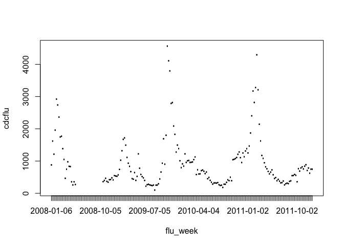
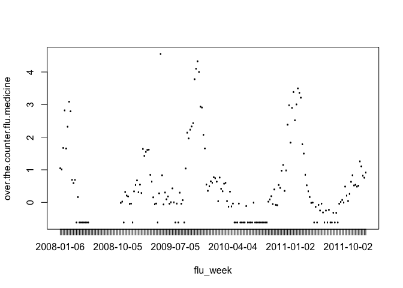
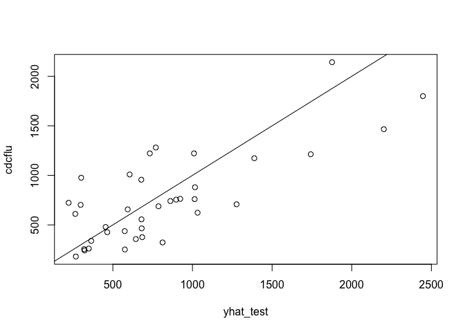
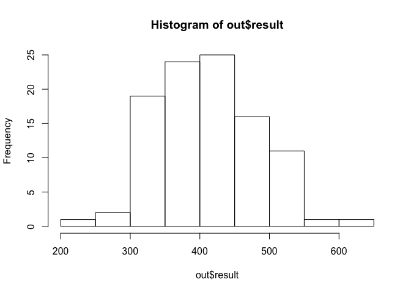

Predictive models for flu activity: Google flu trends
-----------------------------------------------------

In this walk-through, you'll build and test a predictive model using
stepwise selection.

The data you'll look at contain weekly data from the Centers for Disease
Control on the number of influenza-like illnesses reported in the
south-eastern United States. This column is labeled "cdcflu" in the data
file. The data run from 2008 through the last week of 2011.

In addition, you have information on 86 flu-related search terms from
Google's databases. Some are obvious ("how.long.does.flu.last"); some
tug at the heart a bit ("child.temperature"); a handful are funny
("can.dogs.get.the.flu"). Each entry indicates how often someone Googled
that phrase during that particular week. The units here are standard
deviations above the mean for that particular search string (or any
search string containing the given string). Thus a positive number
indicates that more people Googled that phrase in that particular week
than they did in an average week.

Data files:  
\* [flu.csv](http://jgscott.github.io/teaching/data/flu.csv): data from
2008 through 2011.

As usual, load the mosaic library and the data set.

    library(mosaic)
    flu = read.csv("flu.csv", header=TRUE)
    names(flu)  # the actual search terms

    ##  [1] "week"                                    
    ##  [2] "cdcflu"                                  
    ##  [3] "dangerous.fever"                         
    ##  [4] "how.long.does.flu.last"                  
    ##  [5] "i.have.the.flu"                          
    ##  [6] "fever.cough"                             
    ##  [7] "what.to.eat.when.you.have.the.flu"       
    ##  [8] "medicine.for.flu"                        
    ##  [9] "how.long.are.you.contagious.with.the.flu"
    ## [10] "viral.pneumonia"                         
    ## [11] "how.to.get.over.the.flu"                 
    ## [12] "treat.the.flu"                           
    ## [13] "signs.of.the.flu"                        
    ## [14] "flu.contagious"                          
    ## [15] "ear.thermometer"                         
    ## [16] "can.dogs.get.the.flu"                    
    ## [17] "anas.barbariae.hepatis"                  
    ## [18] "how.to.treat.flu"                        
    ## [19] "cure.flu"                                
    ## [20] "treat.flu"                               
    ## [21] "cold.or.flu"                             
    ## [22] "what.is.a.high.fever"                    
    ## [23] "oscillococcinum"                         
    ## [24] "treatment.for.flu"                       
    ## [25] "remedies.for.flu"                        
    ## [26] "how.to.get.rid.of.the.flu"               
    ## [27] "bacterial.pneumonia"                     
    ## [28] "symptoms.of.the.flu"                     
    ## [29] "fever.and.cough"                         
    ## [30] "braun.thermoscan"                        
    ## [31] "how.long.am.i.contagious"                
    ## [32] "home.remedies.for.flu"                   
    ## [33] "cough.fever"                             
    ## [34] "cure.the.flu"                            
    ## [35] "low.body.temperature"                    
    ## [36] "contagious.flu"                          
    ## [37] "headache.cough"                          
    ## [38] "painful.cough"                           
    ## [39] "get.rid.of.flu"                          
    ## [40] "normal.body"                             
    ## [41] "cough.headache"                          
    ## [42] "how.to.fight.the.flu"                    
    ## [43] "flu.or.cold"                             
    ## [44] "over.the.counter.flu.medicine"           
    ## [45] "flu.and.fever"                           
    ## [46] "viral.bronchitis"                        
    ## [47] "thermoscan"                              
    ## [48] "taking.temperature"                      
    ## [49] "influenza.a.and.b"                       
    ## [50] "fever.flu"                               
    ## [51] "oral.thermometer"                        
    ## [52] "the.flu"                                 
    ## [53] "medicine.for.the.flu"                    
    ## [54] "treat.a.fever"                           
    ## [55] "cough.after.flu"                         
    ## [56] "acute.bronchitis"                        
    ## [57] "what.to.do.when.you.have.the.flu"        
    ## [58] "bronchitis"                              
    ## [59] "extractum"                               
    ## [60] "best.flu.medicine"                       
    ## [61] "how.long.are.you.contagious"             
    ## [62] "fever.reducers"                          
    ## [63] "body.temperature"                        
    ## [64] "reduce.fever"                            
    ## [65] "flu.remedies"                            
    ## [66] "anas.barbariae.hepatis.et.cordis"        
    ## [67] "remedies.for.the.flu"                    
    ## [68] "symptoms.pneumonia"                      
    ## [69] "viral.syndrome"                          
    ## [70] "the.flu.symptoms"                        
    ## [71] "what.is.influenza"                       
    ## [72] "pneumonia"                               
    ## [73] "fever.temperature"                       
    ## [74] "child.temperature"                       
    ## [75] "incubation.period.for.the.flu"           
    ## [76] "high.fever"                              
    ## [77] "low.body.temp"                           
    ## [78] "how.long.does.fever.last"                
    ## [79] "is.it.the.flu"                           
    ## [80] "what.to.do.for.the.flu"                  
    ## [81] "fight.the.flu"                           
    ## [82] "symptoms.of.bronchitis"                  
    ## [83] "bacterial.bronchitis"                    
    ## [84] "chest.cough"                             
    ## [85] "fever.breaks"                            
    ## [86] "cough.and.fever"                         
    ## [87] "fever.too.high"                          
    ## [88] "early.flu.symptoms"

### Data cleaning and pre-processing

The first thing to notice here is that the data set has 21 observations
with missing outcome variables, denoted `NA`:

    summary(flu$cdcflu)

    ##    Min. 1st Qu.  Median    Mean 3rd Qu.    Max.    NA's 
    ##   100.0   399.0   708.0   939.1  1111.0  4565.0      21

We can use the `is.na` function to tell us which cases these are:

    na_cases = which(is.na(flu$cdcflu))
    flu[na_cases, 1:2]

    ##          week cdcflu
    ## 21 2008-05-25     NA
    ## 22 2008-06-01     NA
    ## 23 2008-06-08     NA
    ## 24 2008-06-15     NA
    ## 25 2008-06-22     NA
    ## 26 2008-06-29     NA
    ## 27 2008-07-06     NA
    ## 28 2008-07-13     NA
    ## 29 2008-07-20     NA
    ## 30 2008-07-27     NA
    ## 31 2008-08-03     NA
    ## 32 2008-08-10     NA
    ## 33 2008-08-17     NA
    ## 34 2008-08-24     NA
    ## 35 2008-08-31     NA
    ## 36 2008-09-07     NA
    ## 37 2008-09-14     NA
    ## 38 2008-09-21     NA
    ## 39 2008-09-28     NA
    ## 40 2008-10-05     NA
    ## 41 2008-10-12     NA

It looks like these are all in the summer, way out of flu season. We'll
remove these cases (rows) from the data set, since we can't learn
anything from a data point where the y variable isn't observed.

    flu = flu[-na_cases,]

We next need to take care of a minor pre-processing step: separating the
"week" variable from the data. We don't want R thinking "week" is a
variable to be used for prediction when we build a model. Therefore,
we'll peel the first column off the data set and save it as a separate
"flu\_week" variable. Then we'll delete that first column from the main
data set.

    flu_week = flu[,1]
    flu = flu[,-1]

Now we'll tell R that to use the `flu_week` variable as the row names of
the `flu` data frame. That way we'll have informative row names:

    rownames(flu) = flu_week
    flu[1:6,1:3]  # first 6 rows and 3 columns

    ##            cdcflu dangerous.fever how.long.does.flu.last
    ## 2008-01-06    880          -0.577                 -0.091
    ## 2008-01-13   1620          -0.577                  0.993
    ## 2008-01-20   1213           1.019                  0.583
    ## 2008-01-27   1959           0.737                  2.554
    ## 2008-02-03   2921           1.281                  2.189
    ## 2008-02-10   2739           2.119                  3.813

### Building and checking a predictive model

Let's start by plotting the outcome variable over time and compare this
to one of the predictors:

    plot(cdcflu~flu_week, data=flu)

    plot(over.the.counter.flu.medicine~flu_week, data=flu)

It looks like the search terms will be useful here; certainly searches
for "over the counter flu medicine" look to have a very similar seasonal
pattern as actual flu cases.

To illustrate the process of building and checking a predictive model,
let's do three things:  
1. Split the data into a training and testing set.  
2. Fit a model to the training set.  
3. Make predictions on the testing set and check our generalization
error.

First, let's create our training and testing sets. There are 187 data
points in the sample; let's use 150 of them (about 80%) as a training
set, and the remaining 20% as a testing set.

To do this, we'll use the `sample` function to randomly sample a set of
cases in the training set:

    n = nrow(flu)  # how many total observations?
    train_cases = sample(1:n, size=150) # which cases are in the training set?
    flu_train = flu[train_cases,] # these cases in the training set
    flu_test = flu[-train_cases,] # remaining cases in testing set

The `train_cases` variable tells you which rows (cases) of the flu data
frame are in the training set. We store these rows in the `flu_train`
data frame, and the remaining ones in the `flu_test` data frame.

Now let's fit a simple model (with only three search terms) using the
data in `flu_train`, and then use the data in `flu_test` to make
predictions.

    lm1 = lm(cdcflu ~ flu.and.fever + over.the.counter.flu.medicine + treat.a.fever, data=flu_train)
    yhat_test = predict(lm1, newdata=flu_test)

These are *out-of-sample* predictions, since we didn't use these data
points to help fit the original model. These predictions are reasonably
well correlated with the actual responses in the testing set:

    plot(cdcflu ~ yhat_test, data = flu_test)
    abline(0,1)

Finally, let's calculate the mean-squared prediction error (MSPE) on the
test set:

    MSPE =  mean( (yhat_test-flu_test$cdcflu)^2)
    RMSPE = sqrt(MSPE)
    RMSPE

    ## [1] 462.24

Your number will be slightly different from mine, since the train/test
split is random.

### Averaging over multiple train/test splits

Our estimate of the mean-squared prediction error depends on the
particular (random) way in which we split the data into training and
testing sets. To reduce this dependence, we can average our results over
many different train/test splits. This is easy to accomplish in R, by
placing our code for split/fit/test inside a loop.

The code below averages the RMSPE over 100 different train/test splits:

    n_splits = 100
    out = do(n_splits)*{
      # Step 1: split
      train_cases = sample(1:n, size=150) # different sample each time
      flu_train = flu[train_cases,] # training set
      flu_test = flu[-train_cases,] # testing set

      # Step 2: fit
      lm1 = lm(cdcflu ~ flu.and.fever + over.the.counter.flu.medicine +
                 treat.a.fever, data=flu_train)
      
      # Step 3: test
      yhat_test = predict(lm1, newdata=flu_test)
      MSPE =  mean( (yhat_test-flu_test$cdcflu)^2)
      RMSPE = sqrt(MSPE)
      RMSPE
    }

We now have 100 different estimates of the (root) mean-squared
predictive error:

    hist(out$result)

And we can average these to get an estimate of MSPE that is less subject
to Monte Carlo variability:

    mean(out$result)

    ## [1] 421.311

### Comparing with the full model

Can we do better than this simple three-variable model? To see, we'll
use every search term in the data set as a predictor. This will give us
quite a big model, with 87 parameters (an intercept + 86 search terms).
In the following model statement, the \`.' means "use every variable not
otherwise named."

    lm_big = lm(cdcflu ~ ., data=flu_train)
    coef(lm_big)

    ##                              (Intercept) 
    ##                              574.7792551 
    ##                          dangerous.fever 
    ##                               10.1563293 
    ##                   how.long.does.flu.last 
    ##                              264.5559616 
    ##                           i.have.the.flu 
    ##                              230.0980499 
    ##                              fever.cough 
    ##                               53.2588417 
    ##        what.to.eat.when.you.have.the.flu 
    ##                              106.2188906 
    ##                         medicine.for.flu 
    ##                              107.6863163 
    ## how.long.are.you.contagious.with.the.flu 
    ##                               66.7708499 
    ##                          viral.pneumonia 
    ##                              126.1719228 
    ##                  how.to.get.over.the.flu 
    ##                              173.0398752 
    ##                            treat.the.flu 
    ##                             -649.4337441 
    ##                         signs.of.the.flu 
    ##                              -28.9892728 
    ##                           flu.contagious 
    ##                               -7.0306621 
    ##                          ear.thermometer 
    ##                              -53.7921370 
    ##                     can.dogs.get.the.flu 
    ##                               79.1066905 
    ##                   anas.barbariae.hepatis 
    ##                               11.4602881 
    ##                         how.to.treat.flu 
    ##                               90.8010913 
    ##                                 cure.flu 
    ##                              370.2647391 
    ##                                treat.flu 
    ##                               -2.3919247 
    ##                              cold.or.flu 
    ##                               58.6911522 
    ##                     what.is.a.high.fever 
    ##                               18.5235817 
    ##                          oscillococcinum 
    ##                               11.5593276 
    ##                        treatment.for.flu 
    ##                              149.9627522 
    ##                         remedies.for.flu 
    ##                             -602.5401878 
    ##                how.to.get.rid.of.the.flu 
    ##                              109.8842819 
    ##                      bacterial.pneumonia 
    ##                                8.9460911 
    ##                      symptoms.of.the.flu 
    ##                             -232.4405631 
    ##                          fever.and.cough 
    ##                               27.5937292 
    ##                         braun.thermoscan 
    ##                               -0.4694415 
    ##                 how.long.am.i.contagious 
    ##                              -12.9619358 
    ##                    home.remedies.for.flu 
    ##                              259.5772567 
    ##                              cough.fever 
    ##                               -1.8638884 
    ##                             cure.the.flu 
    ##                              -79.9163183 
    ##                     low.body.temperature 
    ##                             -256.2670365 
    ##                           contagious.flu 
    ##                               47.0825515 
    ##                           headache.cough 
    ##                               83.5058418 
    ##                            painful.cough 
    ##                               70.4084316 
    ##                           get.rid.of.flu 
    ##                              -32.8942484 
    ##                              normal.body 
    ##                              -12.8520172 
    ##                           cough.headache 
    ##                              -41.9942601 
    ##                     how.to.fight.the.flu 
    ##                             -104.6573021 
    ##                              flu.or.cold 
    ##                             -298.1330851 
    ##            over.the.counter.flu.medicine 
    ##                              -76.1903750 
    ##                            flu.and.fever 
    ##                               12.8277770 
    ##                         viral.bronchitis 
    ##                              -23.6266194 
    ##                               thermoscan 
    ##                              104.7916489 
    ##                       taking.temperature 
    ##                              107.8744598 
    ##                        influenza.a.and.b 
    ##                                9.8787215 
    ##                                fever.flu 
    ##                              179.9350131 
    ##                         oral.thermometer 
    ##                                0.7774768 
    ##                                  the.flu 
    ##                                6.4132449 
    ##                     medicine.for.the.flu 
    ##                              164.6661989 
    ##                            treat.a.fever 
    ##                              -97.9147282 
    ##                          cough.after.flu 
    ##                             -106.0255974 
    ##                         acute.bronchitis 
    ##                               92.0216616 
    ##         what.to.do.when.you.have.the.flu 
    ##                              -67.6171389 
    ##                               bronchitis 
    ##                               64.9231736 
    ##                                extractum 
    ##                              -10.3284239 
    ##                        best.flu.medicine 
    ##                                8.9042059 
    ##              how.long.are.you.contagious 
    ##                             -111.0845950 
    ##                           fever.reducers 
    ##                              140.2853536 
    ##                         body.temperature 
    ##                               84.9721864 
    ##                             reduce.fever 
    ##                              -21.4841528 
    ##                             flu.remedies 
    ##                               31.4493938 
    ##         anas.barbariae.hepatis.et.cordis 
    ##                              237.0209692 
    ##                     remedies.for.the.flu 
    ##                              -12.0229448 
    ##                       symptoms.pneumonia 
    ##                              -61.7503476 
    ##                           viral.syndrome 
    ##                               59.7938784 
    ##                         the.flu.symptoms 
    ##                             -106.0050967 
    ##                        what.is.influenza 
    ##                               90.3650641 
    ##                                pneumonia 
    ##                               55.7366742 
    ##                        fever.temperature 
    ##                               -6.6689307 
    ##                        child.temperature 
    ##                               28.2386276 
    ##            incubation.period.for.the.flu 
    ##                             -208.0295899 
    ##                               high.fever 
    ##                             -132.5657827 
    ##                            low.body.temp 
    ##                               55.5041267 
    ##                 how.long.does.fever.last 
    ##                               43.5754236 
    ##                            is.it.the.flu 
    ##                               13.2412759 
    ##                   what.to.do.for.the.flu 
    ##                                9.2890543 
    ##                            fight.the.flu 
    ##                              129.5018026 
    ##                   symptoms.of.bronchitis 
    ##                             -207.5998002 
    ##                     bacterial.bronchitis 
    ##                               37.6700681 
    ##                              chest.cough 
    ##                              -37.9055993 
    ##                             fever.breaks 
    ##                               83.1734352 
    ##                          cough.and.fever 
    ##                               11.1822361 
    ##                           fever.too.high 
    ##                               52.8355496 
    ##                       early.flu.symptoms 
    ##                               32.2512955

That's a lot of coefficients! Let's now use the testing set to compare
the error of this big model with the small three-variable model:

    # Fit small model
    lm_small = lm(cdcflu ~ flu.and.fever + over.the.counter.flu.medicine + treat.a.fever, data=flu_train)

    # Form predictions
    yhat_test_small = predict(lm_small, newdata=flu_test)
    yhat_test_big = predict(lm_big, newdata=flu_test)

    # Check generalization error of each model
    RMSPE_small = sqrt(mean( (yhat_test_small-flu_test$cdcflu)^2))
    RMSPE_big = sqrt(mean( (yhat_test_big-flu_test$cdcflu)^2))

    # The result?
    c(RMSPE_small, RMSPE_big)

    ## [1] 368.6170 553.3426

This tells which model performed better on this particular testing set.
But clearly it will be better to average over many different train/test
splits.

    n_splits = 100
    out = do(n_splits)*{
      # Step 1: split
      train_cases = sample(1:n, size=150) # different sample each time
      flu_train = flu[train_cases,] # training set
      flu_test = flu[-train_cases,] # testing set

      # Step 2: fit both models
      lm_big = lm(cdcflu ~ ., data=flu_train)
      lm_small = lm(cdcflu ~ flu.and.fever + over.the.counter.flu.medicine +
                      treat.a.fever, data=flu_train)

      # Step 3: form predictions and test
      yhat_test_small = predict(lm_small, newdata=flu_test)
      yhat_test_big = predict(lm_big, newdata=flu_test)
      RMSPE_small = sqrt(mean( (yhat_test_small-flu_test$cdcflu)^2))
      RMSPE_big = sqrt(mean( (yhat_test_big-flu_test$cdcflu)^2))

      # The result?
      c(RMSPE_small, RMSPE_big)
    }

And now we can calculate the mean of each model's generalization error
across all these different train/test splits:

    colMeans(out)

    ##       V1       V2 
    ## 413.2376 519.6006

It looks as though the big model has *worse* generalization error than
the simple three-variable model --- a classic example of overfitting. In
this case, the big model has 87 parameters, but there are only 150 data
points in the training set, and so the big model is overwhelmed by noise
in the data.

### Using stepwise selection

We've seen that the small three-variable model actually outperforms the
big, 86-variable model at prediction. But is there medium-sized model
that's better than either of them? That is, can we do better by
including somewhere between 3 and 86 variables in our model?

We'll use stepwise selection to search for a model that leads to
superior generalization error, starting from the big model. A key point
is that we use *all* the data, not just the training data, to actually
search for a model using stepwise selection.

When you run the `step` command below, it should show *a lot* of output
on your screen as it searches for possible additions and deletions that
improve the out-of-sample generalization error of the model. If you want
to suppress this output, add the flag `trace=0` to the `step` command:

    lm_big = lm(cdcflu ~ ., data=flu)  # fit the big model
    lm_step = step(lm_big, data = flu) # run stepwise selection
    coef(lm_step) # look at the coefficients of the selected model

    ##                   (Intercept)        how.long.does.flu.last 
    ##                     689.02117                     173.03993 
    ##               viral.pneumonia       how.to.get.over.the.flu 
    ##                     152.86586                     147.26484 
    ##              signs.of.the.flu                flu.contagious 
    ##                     154.90361                     -29.27350 
    ##          can.dogs.get.the.flu        anas.barbariae.hepatis 
    ##                     101.02217                     153.24357 
    ##                      cure.flu                     treat.flu 
    ##                     180.58940                      43.83036 
    ##             treatment.for.flu              remedies.for.flu 
    ##                     116.62396                    -291.86649 
    ##     how.to.get.rid.of.the.flu           symptoms.of.the.flu 
    ##                      54.00117                    -148.97596 
    ##                  cure.the.flu          low.body.temperature 
    ##                    -114.24131                    -165.14211 
    ##                contagious.flu                 painful.cough 
    ##                      80.86923                     130.34918 
    ##                   flu.or.cold                    thermoscan 
    ##                    -225.87288                      53.26366 
    ##            taking.temperature                     fever.flu 
    ##                      84.86497                     153.94250 
    ##              oral.thermometer                 treat.a.fever 
    ##                      89.74740                    -114.22976 
    ##                fever.reducers                  reduce.fever 
    ##                     154.33660                     -72.75817 
    ##                  flu.remedies            symptoms.pneumonia 
    ##                    -336.41910                     -34.60397 
    ##             what.is.influenza incubation.period.for.the.flu 
    ##                     135.13813                     -67.56347 
    ##                    high.fever      how.long.does.fever.last 
    ##                     -65.25695                     110.52540 
    ##                   chest.cough 
    ##                     -48.53005

Once the `step` function cannot make any improvements to the model, the
algorithm terminates, and stores the resulting model in what we've
called `lm_step`.

We can now compare the sizes of the two models:

    length(coef(lm_big))

    ## [1] 87

    length(coef(lm_step))

    ## [1] 33

The stepwise-selected model uses 32 variables (plus an intercept) --
more than 3, but a lot less than 86!

Let's now see how our stepwise-selection model performs when we test its
true out-of-sample performance. There's a cute trick we can use here to
save a lot of typing. Having fit the model to the full data set, we can
use the `update` function to refit that model to the training data only.
This saves us from having to laboriously type out the model formula
using all 32 variables selected by the `step` function:

    # Step 1: split
    train_cases = sample(1:n, size=150) # different sample each time
    flu_train = flu[train_cases,] # training set
    flu_test = flu[-train_cases,] # testing set

    # Step 2: fit the model, i.e. update the stepwise-selected model
    # to use the training data only rather than the full data set
    lm_step_train = update(lm_step, data=flu_train)  # use update rather than lm

    # Step 3: form predictions and test
    yhat_test_step = predict(lm_step_train, newdata=flu_test)
    RMSPE_step = sqrt(mean( (yhat_test_step-flu_test$cdcflu)^2))

And the result?

    RMSPE_step

    ## [1] 267.0951

Again, your number will be different because of Monte Carlo variability.

Of course, we'll get much more stable results by averaging over lots of
train/test splits. Let's do this, and compare the generalization error
to what we get from the small and big models on the same set of splits:

    out = do(100)*{
      # Step 1: split
      train_cases = sample(1:n, size=150) # different sample each time
      flu_train = flu[train_cases,] # training set
      flu_test = flu[-train_cases,] # testing set
      
      # Step 2: fit all three models (the stepwise model using update)
      lm_big = lm(cdcflu ~ ., data=flu_train)
      lm_small = lm(cdcflu ~ flu.and.fever + over.the.counter.flu.medicine +
                       treat.a.fever, data=flu_train)
      lm_step_train = update(lm_step, data=flu_train)  # use update rather than lm
      
      # Step 3: form predictions and test
      yhat_test_big = predict(lm_big, newdata=flu_test)
      yhat_test_small = predict(lm_small, newdata=flu_test)
      yhat_test_step = predict(lm_step_train, newdata=flu_test)
      RMSPE_big = sqrt(mean( (yhat_test_big-flu_test$cdcflu)^2))
      RMSPE_small = sqrt(mean( (yhat_test_small-flu_test$cdcflu)^2))
      RMSPE_step = sqrt(mean( (yhat_test_step-flu_test$cdcflu)^2))
      
      # The result?
      c(RMSPE_small, RMSPE_big, RMSPE_step)
    }

    # Average of the different splits
    colMeans(out)

    ##       V1       V2       V3 
    ## 416.6317 517.9292 284.5821

Your numbers will be a bit different, but on average, you should notice
that the stepwise model (the third entry) significantly outperforms both
the small model and the big model.
