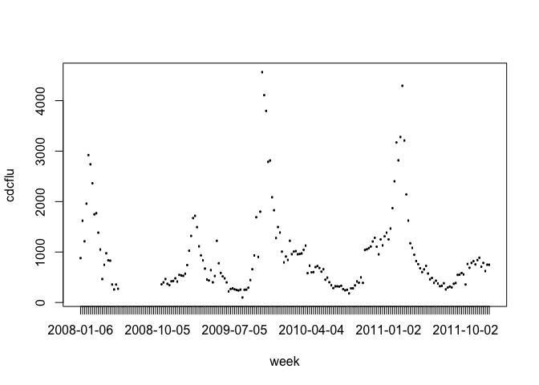
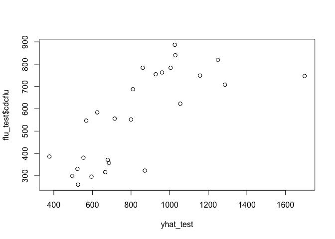

Predictive models for flu activity: Google flu trends
-----------------------------------------------------

In this walk-through, you'll build and test a predictive model using
forward and backward stepwise selection.

The data you'll look at contain weekly data from the Centers for Disease
Control on the number of influenza-like illnesses reported in the
south-eastern United States. This column is labeled "TILI" in the two
data files below. The data run from 2008 through the last week of 2011.

In addition, you have information on 86 flu-related search terms from
Google's databases. Some are obvious ("how.long.does.flu.last"); some
tug at the heart a bit ("child.temperature"); a handful are funny
("can.dogs.get.the.flu"). Each entry indicates how often someone Googled
that phrase during that particular week. The units here are standard
deviations above the mean for that particular search string (or any
search string containing the given string). Thus a positive number
indicates that more people Googled that phrase in that particular week
than they did in an average week.

Data files:  
\* [flu.csv](flu.csv): data from 2008 through 2011.

As usual, load the mosaic library and the data set.

    library(mosaic)
    flu = read.csv("flu.csv", header=TRUE)
    names(flu)

    ##  [1] "week"                                    
    ##  [2] "cdcflu"                                  
    ##  [3] "dangerous.fever"                         
    ##  [4] "how.long.does.flu.last"                  
    ##  [5] "i.have.the.flu"                          
    ##  [6] "fever.cough"                             
    ##  [7] "what.to.eat.when.you.have.the.flu"       
    ##  [8] "medicine.for.flu"                        
    ##  [9] "how.long.are.you.contagious.with.the.flu"
    ## [10] "viral.pneumonia"                         
    ## [11] "how.to.get.over.the.flu"                 
    ## [12] "treat.the.flu"                           
    ## [13] "signs.of.the.flu"                        
    ## [14] "flu.contagious"                          
    ## [15] "ear.thermometer"                         
    ## [16] "can.dogs.get.the.flu"                    
    ## [17] "anas.barbariae.hepatis"                  
    ## [18] "how.to.treat.flu"                        
    ## [19] "cure.flu"                                
    ## [20] "treat.flu"                               
    ## [21] "cold.or.flu"                             
    ## [22] "what.is.a.high.fever"                    
    ## [23] "oscillococcinum"                         
    ## [24] "treatment.for.flu"                       
    ## [25] "remedies.for.flu"                        
    ## [26] "how.to.get.rid.of.the.flu"               
    ## [27] "bacterial.pneumonia"                     
    ## [28] "symptoms.of.the.flu"                     
    ## [29] "fever.and.cough"                         
    ## [30] "braun.thermoscan"                        
    ## [31] "how.long.am.i.contagious"                
    ## [32] "home.remedies.for.flu"                   
    ## [33] "cough.fever"                             
    ## [34] "cure.the.flu"                            
    ## [35] "low.body.temperature"                    
    ## [36] "contagious.flu"                          
    ## [37] "headache.cough"                          
    ## [38] "painful.cough"                           
    ## [39] "get.rid.of.flu"                          
    ## [40] "normal.body"                             
    ## [41] "cough.headache"                          
    ## [42] "how.to.fight.the.flu"                    
    ## [43] "flu.or.cold"                             
    ## [44] "over.the.counter.flu.medicine"           
    ## [45] "flu.and.fever"                           
    ## [46] "viral.bronchitis"                        
    ## [47] "thermoscan"                              
    ## [48] "taking.temperature"                      
    ## [49] "influenza.a.and.b"                       
    ## [50] "fever.flu"                               
    ## [51] "oral.thermometer"                        
    ## [52] "the.flu"                                 
    ## [53] "medicine.for.the.flu"                    
    ## [54] "treat.a.fever"                           
    ## [55] "cough.after.flu"                         
    ## [56] "acute.bronchitis"                        
    ## [57] "what.to.do.when.you.have.the.flu"        
    ## [58] "bronchitis"                              
    ## [59] "extractum"                               
    ## [60] "best.flu.medicine"                       
    ## [61] "how.long.are.you.contagious"             
    ## [62] "fever.reducers"                          
    ## [63] "body.temperature"                        
    ## [64] "reduce.fever"                            
    ## [65] "flu.remedies"                            
    ## [66] "anas.barbariae.hepatis.et.cordis"        
    ## [67] "remedies.for.the.flu"                    
    ## [68] "symptoms.pneumonia"                      
    ## [69] "viral.syndrome"                          
    ## [70] "the.flu.symptoms"                        
    ## [71] "what.is.influenza"                       
    ## [72] "pneumonia"                               
    ## [73] "fever.temperature"                       
    ## [74] "child.temperature"                       
    ## [75] "incubation.period.for.the.flu"           
    ## [76] "high.fever"                              
    ## [77] "low.body.temp"                           
    ## [78] "how.long.does.fever.last"                
    ## [79] "is.it.the.flu"                           
    ## [80] "what.to.do.for.the.flu"                  
    ## [81] "fight.the.flu"                           
    ## [82] "symptoms.of.bronchitis"                  
    ## [83] "bacterial.bronchitis"                    
    ## [84] "chest.cough"                             
    ## [85] "fever.breaks"                            
    ## [86] "cough.and.fever"                         
    ## [87] "fever.too.high"                          
    ## [88] "early.flu.symptoms"

### Building and checking a predictive model

Let's plot the outcome variable over time and compare this to one of the
predictors:

    plot(cdcflu~week, data=flu)

    plot(over.the.counter.flu.medicine~week, data=flu)

It looks like the search terms will be useful here. Let's do three
things: 1) Split the data into a training and testing set, for the
purpose of building and testing a predictive model for flu activity.  
2) Fit a model to the training set.  
3) Make predictions on the testing set and check our performance.

We first need to take care of a minor pre-processing step: separating
the "week" variable from the data. We don't want R thinking "week" is a
variable to be used for prediction when we build a model.

    flu_week = flu[,1]
    flu = flu[,-1]

First let's create the training and testing sets. There are 208 data
points in the sample; let's use the last 26 of them (6 months) as a
testing set. We'll use the `head` and `tail` functions to take the first
182 and last 26 weeks, respectively.

    flu_train = head(flu, 182)
    flu_test = tail(flu, 26)

Now let's fit a model to `flu_train` and make predictions:

    lm1 = lm(cdcflu ~ flu.and.fever + over.the.counter.flu.medicine + treat.a.fever, data=flu_train)
    yhat_test = predict(lm1, newdata=flu_test)

Finally, let's calculate the prediction error we make on the test set:

    plot(yhat_test, flu_test$cdcflu)

    # Calculate correlation and root mean-squared error
    cor(yhat_test, flu_test$cdcflu)

    ## [1] 0.7347405

    RMSE = sqrt(mean( (yhat_test-flu_test$cdcflu)^2))
    RMSE

    ## [1] 337.2119

### Using stepwise selection

A natural question is: can we do better than this simple three-variable
model? We'll use every search term in the data set. In R, the \`.' in a
formula statement means "use every variable not otherwise named."

    lm_all = lm(cdcflu ~ ., data=flu_train)
    yhat_all = predict(lm_all, newdata=flu_test)
    cor(yhat_all, flu_test$cdcflu)

    ## [1] 0.8414808

A natural question is: can we do at least as well (or even better!) with
a simpler model? Let's use stepwise selection selection to check:

    lm_step = step(lm_all, direction='both', trace=0)
    summary(lm_step)

    ## 
    ## Call:
    ## lm(formula = cdcflu ~ how.long.does.flu.last + fever.cough + 
    ##     viral.pneumonia + signs.of.the.flu + flu.contagious + can.dogs.get.the.flu + 
    ##     cure.flu + remedies.for.flu + how.to.get.rid.of.the.flu + 
    ##     symptoms.of.the.flu + cough.fever + cure.the.flu + painful.cough + 
    ##     flu.or.cold + taking.temperature + influenza.a.and.b + fever.flu + 
    ##     treat.a.fever + best.flu.medicine + fever.reducers + reduce.fever + 
    ##     incubation.period.for.the.flu + how.long.does.fever.last + 
    ##     symptoms.of.bronchitis + chest.cough, data = flu_train)
    ## 
    ## Residuals:
    ##     Min      1Q  Median      3Q     Max 
    ## -587.08 -124.16   16.63  122.39  734.93 
    ## 
    ## Coefficients:
    ##                               Estimate Std. Error t value Pr(>|t|)    
    ## (Intercept)                     696.80      38.41  18.143  < 2e-16 ***
    ## how.long.does.flu.last          229.95      63.98   3.594 0.000455 ***
    ## fever.cough                     201.75      79.10   2.551 0.011868 *  
    ## viral.pneumonia                 190.92      52.05   3.668 0.000350 ***
    ## signs.of.the.flu                268.50      83.08   3.232 0.001546 ** 
    ## flu.contagious                  -41.88      16.82  -2.491 0.013963 *  
    ## can.dogs.get.the.flu            123.05      59.18   2.079 0.039489 *  
    ## cure.flu                        230.80      52.78   4.373 2.43e-05 ***
    ## remedies.for.flu               -339.37      74.67  -4.545 1.21e-05 ***
    ## how.to.get.rid.of.the.flu        63.97      32.73   1.955 0.052698 .  
    ## symptoms.of.the.flu            -183.60      51.66  -3.554 0.000523 ***
    ## cough.fever                    -203.75      73.67  -2.766 0.006473 ** 
    ## cure.the.flu                   -102.00      62.49  -1.632 0.104955    
    ## painful.cough                   136.82      61.38   2.229 0.027469 *  
    ## flu.or.cold                    -224.30      83.01  -2.702 0.007779 ** 
    ## taking.temperature               77.44      31.48   2.460 0.015147 *  
    ## influenza.a.and.b                85.39      38.00   2.247 0.026250 *  
    ## fever.flu                       151.46      72.36   2.093 0.038226 *  
    ## treat.a.fever                  -219.90      68.94  -3.190 0.001771 ** 
    ## best.flu.medicine               112.44      47.40   2.372 0.019085 *  
    ## fever.reducers                  167.27      47.55   3.518 0.000594 ***
    ## reduce.fever                    -94.59      35.04  -2.700 0.007826 ** 
    ## incubation.period.for.the.flu  -127.71      44.51  -2.869 0.004775 ** 
    ## how.long.does.fever.last        110.56      45.49   2.430 0.016397 *  
    ## symptoms.of.bronchitis          156.99      58.32   2.692 0.008006 ** 
    ## chest.cough                     -63.74      39.46  -1.615 0.108570    
    ## ---
    ## Signif. codes:  0 '***' 0.001 '**' 0.01 '*' 0.05 '.' 0.1 ' ' 1
    ## 
    ## Residual standard error: 240.9 on 135 degrees of freedom
    ##   (21 observations deleted due to missingness)
    ## Multiple R-squared:  0.9319, Adjusted R-squared:  0.9193 
    ## F-statistic: 73.93 on 25 and 135 DF,  p-value: < 2.2e-16

    yhat_step = predict(lm_step, newdata=flu_test)

    cor(yhat_step, flu_test$cdcflu)

    ## [1] 0.8498439

We can also compare the sizes of the two models:

    length(coef(lm_all))

    ## [1] 87

    length(coef(lm_step))

    ## [1] 26

We use many fewer predictors in the stepwise-selected model, but get
predictions that are just as good (or even a tiny bit better) than the
full model.
