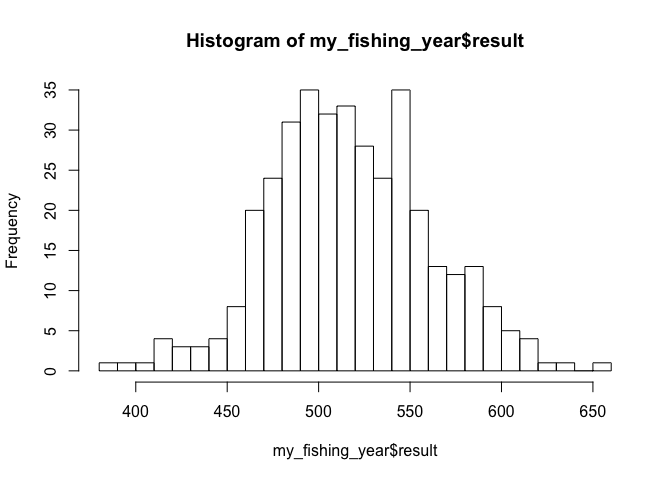
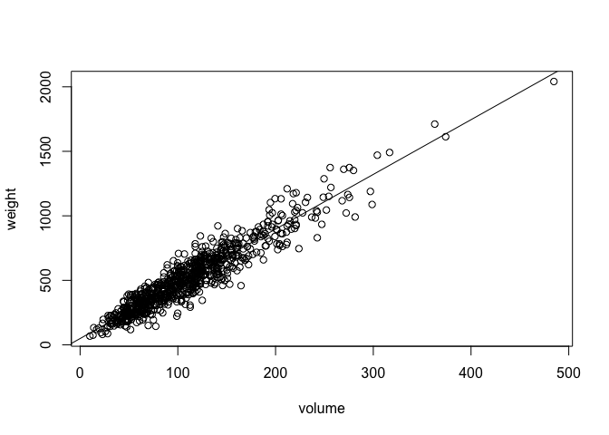
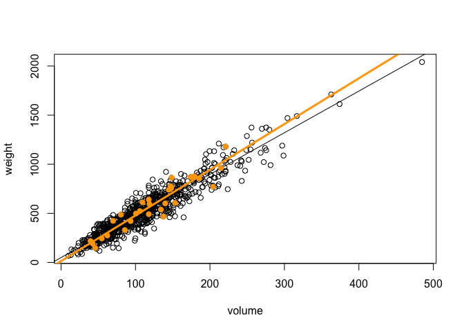
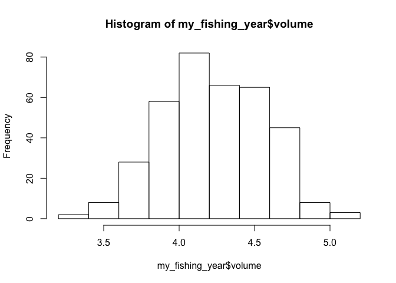
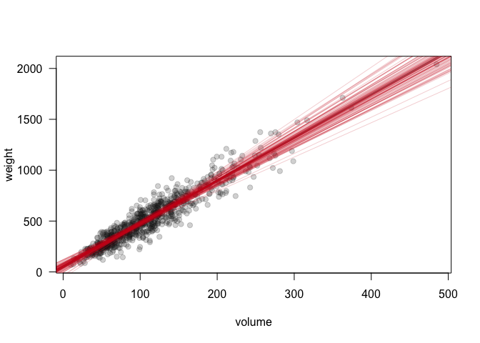

Sampling distributions
----------------------

In this walk-through, you'll learn about sampling distributions.

Data files:  
\* [gonefishing.csv](https://raw.githubusercontent.com/jaredsmurray/learnR/master/gonefishing/gonefishing.csv): fictional data on fictional fish
in a fictional lake.

As usual, load the mosaic library.

    library(mosaic)

Now let's meet the 800 fish who live in Lake Woebegone:

    gonefishing = read.csv('gonefishing.csv', header=TRUE)
    summary(gonefishing)

    ##      length          height          width           weight    
    ##  Min.   : 5.30   Min.   :2.100   Min.   :0.900   Min.   :  68  
    ##  1st Qu.:10.40   1st Qu.:4.200   1st Qu.:1.600   1st Qu.: 338  
    ##  Median :11.90   Median :4.800   Median :1.800   Median : 480  
    ##  Mean   :11.93   Mean   :4.768   Mean   :1.792   Mean   : 519  
    ##  3rd Qu.:13.20   3rd Qu.:5.300   3rd Qu.:2.000   3rd Qu.: 655  
    ##  Max.   :20.20   Max.   :8.000   Max.   :3.000   Max.   :2041

From the variation in height, length, and width (measured in inches), as
well as from the variation in weight (from 68 grams to over 2 kilos),
you can see that the fish come in many different sizes.

Let's look at a histogram of weights for the entire fish population.

    hist(gonefishing$weight, breaks=20)
    mean_weight_pop = mean(gonefishing$weight)
    abline(v=mean_weight_pop, lwd=4, col='blue')

    mean_weight_pop

    ## [1] 518.9675

The mean weight for the whole population is about 519 grams, with
considerable variation about this mean.

### The sampling distribution of the sample mean

Now let's say you go on a fishing trip and catch 30 fish. What would you
expect the mean of your sample to be? Let's use R's ability to take a
random sample in order to simulate this process.

    n_fish = 30
    # Take a random sample from the population of fish in the lake
    fishing_trip = sample(gonefishing, n_fish)
    # Look at the measurements of the first five fish we caught
    head(fishing_trip, 5)

    ##     length height width weight orig.ids
    ## 533   11.7    4.7   1.8    387      533
    ## 35    12.9    5.1   1.9    572       35
    ## 539   10.8    4.3   1.7    400      539
    ## 605    9.6    3.8   1.4    333      605
    ## 214   12.4    4.9   1.9    537      214

The row names tell us which fish (numbered 1 to 800 in the original data
set) that we happened to catch on this trip. Because the sample is
random, your particular fish will be different than the ones you see
here.

Next, let's compute the mean weight of the fish in our sample:

    mean_weight_sample = mean(fishing_trip$weight)
    mean_weight_sample

    ## [1] 500.4667

Because your random sample will be different from mine, the sample mean
you compute will be different from mine as well. Crucially, both also
differ from the true population mean of 519, which we calculated above.

That was yesterday's fishing trip. What about today's? (Let's say we
released the fish back into the lake, so we're taking a fresh sample
from the population.) We'll repeat all the commands above to get a new
sample mean:

    fishing_trip = sample(gonefishing, n_fish)
    mean_weight_sample = mean(fishing_trip$weight)
    mean_weight_sample

    ## [1] 515.7333

Today's sample mean will be different from yesterday's. Both will be
different from the population mean. The next step is to get a sense of
how the sample mean varied under lots and lots of samples (i.e. more
than two). To do so, we will use the `mosaic` package's functions for
performing a Monte Carlo simulation. Try this:

    do(25)*{
      fishing_trip = sample(gonefishing, n_fish)
      mean_weight_sample = mean(fishing_trip$weight)
      mean_weight_sample
    }

    ##      result
    ## 1  489.0000
    ## 2  614.4333
    ## 3  497.7333
    ## 4  535.1333
    ## 5  502.7000
    ## 6  512.2333
    ## 7  493.2000
    ## 8  610.6333
    ## 9  529.2333
    ## 10 524.3667
    ## 11 529.3333
    ## 12 516.5667
    ## 13 518.9000
    ## 14 446.9667
    ## 15 562.8333
    ## 16 554.8000
    ## 17 483.6667
    ## 18 529.4333
    ## 19 561.3667
    ## 20 446.0000
    ## 21 478.4000
    ## 22 506.0333
    ## 23 568.9333
    ## 24 546.6000
    ## 25 548.1333

Notice what we did here:  
1) We took our original code block for performing a random sample from
the population and calculating the mean weight of that sample.  
2) We placed that code block in curly braces {}.  
3) We then told R to repeat that code block 25 times, via the `do(25)*`
command.

The result is 25 different sample means, each corresponding to a
different random sample from the population. This process is an example
of Monte Carlo simulation, wherein a computer is used to simulate a
random process. Our code above produced 25 Monte Carlo samples.

Now let's make two small modifications: we'll do more than 25 Monte
Carlo samples, and we'll save the result.

    # Save the Monte Carlo output
    my_fishing_year = do(365)*{
      fishing_trip = sample(gonefishing, n_fish)
      mean_weight_sample = mean(fishing_trip$weight)
      mean_weight_sample
    }
    # Examine the first several entries
    head(my_fishing_year)

    ##     result
    ## 1 504.8333
    ## 2 497.6667
    ## 3 519.2667
    ## 4 542.2000
    ## 5 587.9000
    ## 6 551.2333

You can see that `my_fishing_year` is a data frame with one column
called "result." This column contains 365 sample means, one for each
fishing trip (i.e. sample of size 30 from the population). Let's look at
a histogram of these simulated sample means:

    hist(my_fishing_year$result, breaks=20)

    sd(my_fishing_year$result)

    ## [1] 43.95984

We call this the sampling distribution of the sample mean. The
dispersion of this distribution tells us how precisely the mean from any
given sample of size 30 approximates the population mean. The standard
deviation of this sampling distribution is a natural measure of this
dispersion; it is usually called the "standard error" of the sample
mean.

Note: because we'll each have a different set of random samples, your
standard deviation and histogram won't match mine exactly. But they
should be pretty similar.

### The sampling distribution of the ordinary least squares estimator

Once you learn the basic trick of simulating a sampling distribution,
you can apply it to any kind of statistical model. For example, let's
say we wanted to fit a model for the weight of a fish versus it's
volume:

    # Define the volume variable and add it to the original data frame
    gonefishing$volume = gonefishing$height * gonefishing$length * gonefishing$width
    # Model weight versus volume
    plot(weight ~ volume, data=gonefishing)
    lm0 = lm(weight ~ volume, data=gonefishing)
    abline(lm0)

    coef(lm0)

    ## (Intercept)      volume 
    ##   48.947898    4.240374

For the population, it looks like the slope of the line is about 4.24
grams per cubic inch.

What about for a sample of 30 fish? Try executing this block of code a
few times and compare the different lines you get.

    # Plot the population
    plot(weight ~ volume, data=gonefishing)
    abline(lm0)
    # Take a sample, show the points, and fit a straight line
    n_fish = 30
    fishing_trip = sample(gonefishing, n_fish)
    lm1 = lm(weight ~ volume, data=fishing_trip)
    points(weight ~ volume, data=fishing_trip, pch=19, col='orange')
    abline(lm1, lwd=3, col='orange')

 For
each Monte Carlo sample, you should see a slightly different fitted
line, reflecting the variability from sample to sample. The line from
the sample should be close to the true population line, but they won't
be exactly the same.

Next, let's use the same approach as above to look at the sampling
distribution of the least-squares estimator from a sample of size 30.
This time we'll collect the intercept and slope of the least-squares
line, rather than the sample mean of the weight. We'll use 365 Monte
Carlo samples, to simulate a year of fishing trips.

    my_fishing_year = do(365)*{
      fishing_trip = sample(gonefishing, n_fish)
      lm1 = lm(weight ~ volume, data=fishing_trip)
      coef(lm1)
    }
    # Look at the first few lines of the outpout
    head(my_fishing_year)

    ##    Intercept   volume
    ## 1  52.908723 4.256654
    ## 2  63.129530 4.174433
    ## 3  67.565998 4.164029
    ## 4 -22.938851 4.817717
    ## 5  22.948715 4.716953
    ## 6   8.077959 4.735984

Notice that the `my_fishing_year` variable has two columns, representing
the intercept and slope for the `volume` variable. To examine the
sampling distribution of the slope, we could look at a histogram and
compute the standard error:

    hist(my_fishing_year$volume)

    sd(my_fishing_year$volume)

    ## [1] 0.3312174

365 different fishing trips of 30 fish, 365 different estimates slopes:
a sampling distribution.

### Fancy plots (optional)

You can get really fancy with R plots. Here's an example where we
superimpose the fitted lines from 100 different samples on a plot of the
population. There are also some extra flags passed to the plotting
function to make things more visually appealing.

    n_fish = 30
    ghost_grey = rgb(0.1, 0.1, 0.1, 0.2)
    ghost_red = rgb(0.8, 0.1, 0.1, 0.2)
    plot(weight ~ volume, data=gonefishing, pch=19, col=ghost_grey, las=1)
    abline(lm0, lwd=3, col='darkgrey')
    # Take 100 samples and fit a straight line to each one
    for(i in 1:100) {
      fishing_trip = sample(gonefishing, n_fish)
      lm1 = lm(weight ~ volume, data=fishing_trip)
      abline(lm1, col=ghost_red)
    }

The "fan" of different fitted lines provides a visual depiction of the
sampling distribution of the OLS estimator. Note: if you want to see all
the different graphical parameters, try typing `?par` into the console.
