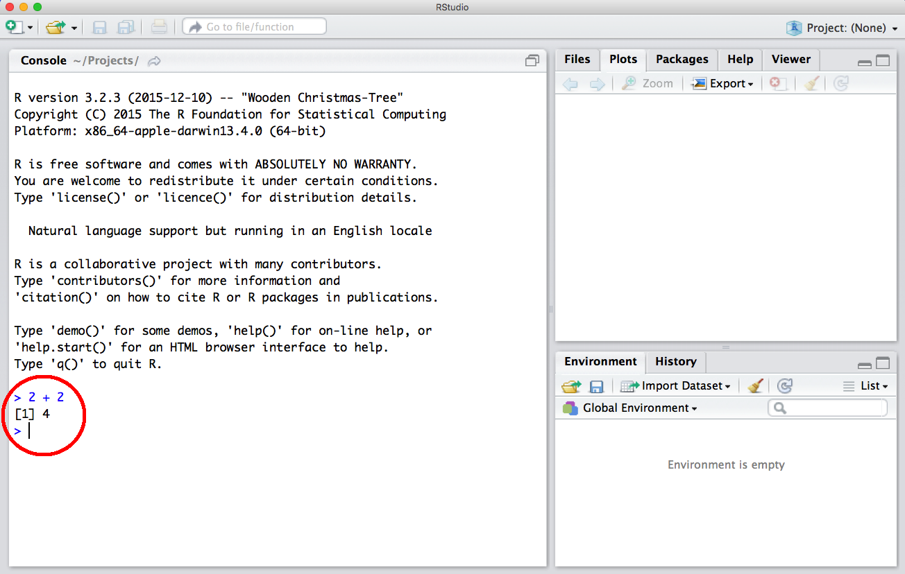
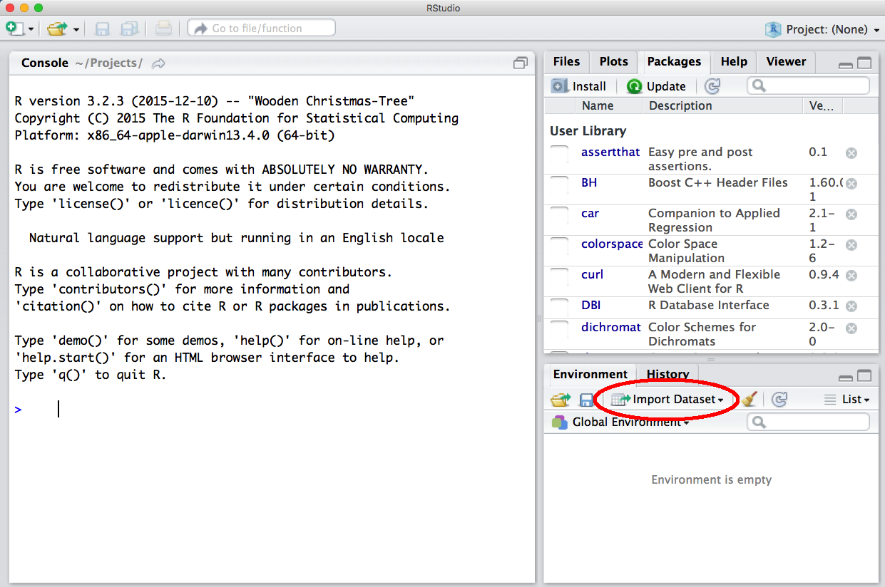
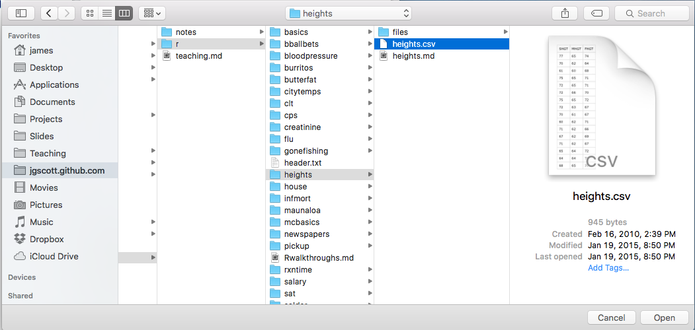
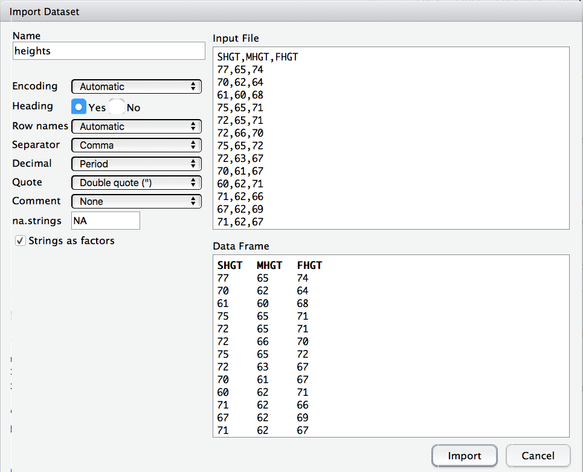

This is a "hello world" walk-through intended as a gentle introduction to R.

### Using R as a calculator

Let's start with the simplest thing of all that you can do with R: use it as a scientific calculator.

Open up RStudio; on the left-hand side is the Console window with a little caret mark (>), where you can type in commands directly and see the results of computations (circled in red below).

Try typing some basic mathematical expressions directly into the console and verify that the output looks right. To execute any command, like `2+2`, just type it into the console and hit Enter.

    2 + 2
    3*7
    20/4
    2^3
    sqrt(16)
    log10(100)

R obeys the usual order of operations for mathematical expressions.  Therefore use parentheses appropriately to convey your meaning:

    4 + 2 * 3
    [1] 10

    (4 + 2) * 3
    [1] 18

You can also use R as a graphing calculator.  Try typing the following command:

    curve(sqrt(x), from=0, to=9)

You should get a plot of the square-root function from x=0 to x=9 that pops up on your screen.

### Defining variables

Another basic operation in R is to store the results of computations in new variables, whose names we get to choose.  Try typing the following command:

    foo = 10

This defines a variable called foo, which stores the number 10. When you execute this command, you won't see any output in the console. But the variable foo is now available to be used in subsequent computations as if it were a number:

    foo + 3
    [1] 13

This may not look all that impressive.  But as you'll soon learn, the ability to store the results of intermediate computations for future use is a source of great power as we start to do more sophisticated things with R.  

### A first look at data

For this part, you'll need to download the following data file to your hard drive:   
* [heights.csv](http://jgscott.github.io/teaching/data/heights.csv)  

Let's look at some data on the data on students' heights versus their parents' heights; this was from a survey taken in the first class that I ever taught at the University of Texas.

Read in the heights.csv data set by clicking the Import Dataset button in RStudio.  This is under the Environment tab:

When you click Import Dataset, choose the "From Text File..." option, and in the window that pops up, surf to wherever you've downloaded the heights.csv file.

Select the heights.csv file and open it from this window.  Now you should see a new window pop up, like this:

Three common things that you'll want to double-check in this window:  
- What do you want the data set to be called within the R environment?  By default, RStudio will name the data set after the file, so in this case the imported data frame will be stored as ``heights'' unless you provide an alternative in the "Name" field.  
- Does the data file have a header row (i.e. is the first row the names of the variables)?  If so, make sure the "Yes" button next to "Heading" is selection.  In this case, we do have a header row providing the variable names (SHGT, MHGT, and FHGT).
- What separates the data fields?  Comma-separated files (like this one) are common; so are tab-separated files.  

Usually RStudio does a good job at auto-detecting these features of the file.  But sometimes it can get tripped up, so it's good to verify what the program thinks it is seeing in this window.  

Once you've double-checked these details, click Import.  You now have a data set called "heights", which has three variables:  
* SHGT: student height in inches  
* MHGT: mother's height in inches  
* FHGT: father's height in inches  

R has many functions for computing basic summary statistics.  Meet three of the most basic by copying the following code to your console.

    # Get a summary of each variable in the data set
    summary(heights)
    
    # Compute the mean and standard deviation of the SHGT variable
	mean(heights$SHGT)
	sd(heights$SHGT)

You should see the following output:

	> summary(heights)
	      SHGT            MHGT            FHGT      
	 Min.   :60.00   Min.   :54.00   Min.   :63.00  
	 1st Qu.:67.00   1st Qu.:62.00   1st Qu.:68.00  
	 Median :70.00   Median :64.00   Median :70.00  
	 Mean   :69.56   Mean   :64.05   Mean   :69.73  
	 3rd Qu.:72.00   3rd Qu.:65.50   3rd Qu.:72.00  
	 Max.   :78.00   Max.   :71.00   Max.   :78.00  
	> 
	> # Compute the mean and standard deviation of the SHGT variable
	> mean(heights$SHGT)
	[1] 69.56311
	> sd(heights$SHGT)
	[1] 3.881631

Notice two things:  
1) Anything followed by a pound sign (#) is a comment and is ignored by R.  
2) When we say "heights$SHGT" we are asking R to access the SHGT variable inside the heights data frame.  This is the basic way we access variables in R.

We can store information about the data set in variables whose names we get to choose.  Try these commands:

	mu = mean(heights$SHGT)
	sigma = sd(heights$SHGT)

In computer-science parlance, this is called "declaring variables."  We're telling R to store the mean of the student height variable in a new variable called "mu" and to store the standard deviation in a new variable called "sigma".  As above, when you execute these commands you won't see any output in the console.  But now these variables are available to be used in subsequent computations.  We can just refer to them by name:

	> mu - 2*sigma
	[1] 61.79985
	> mu + 2*sigma
	[1] 77.32637

An important thing to remember is that R is case sensitive.  If you use the wrong case, you'll get an error:

	> Mu + 2*sigma
	Error: object 'Mu' not found
	> mu + 2*Sigma
	Error: object 'Sigma' not found

All R commands have extensive documentation.  You can get help about anything using the question mark:

	?mean
	?sd
    ?median
    ?range

