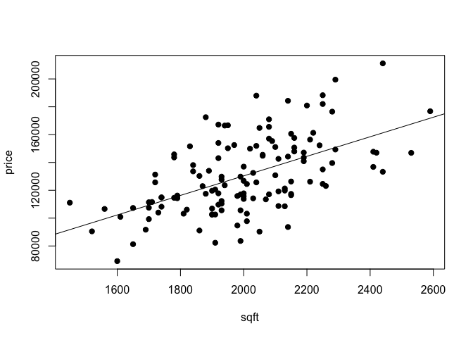
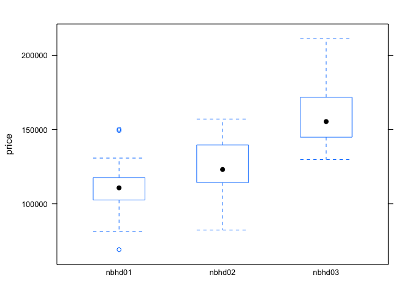
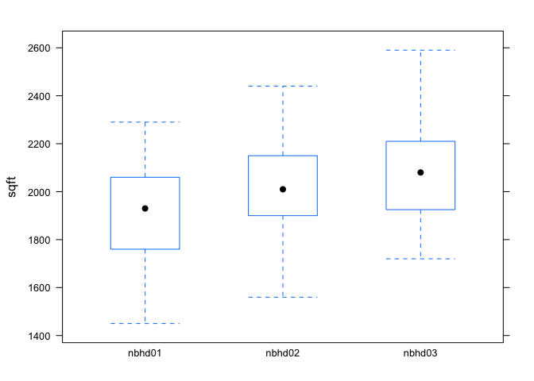
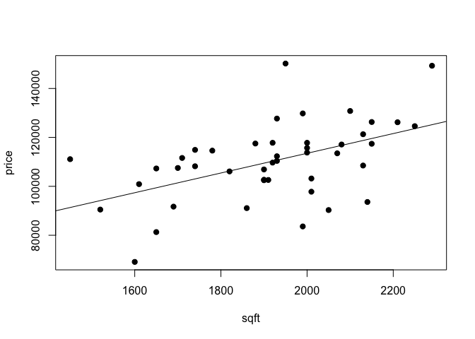
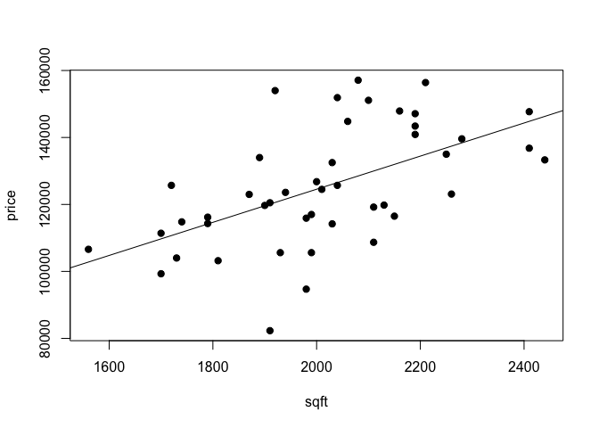
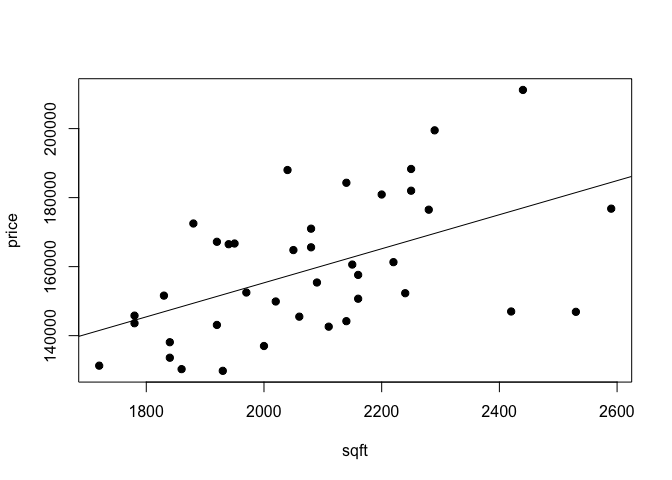
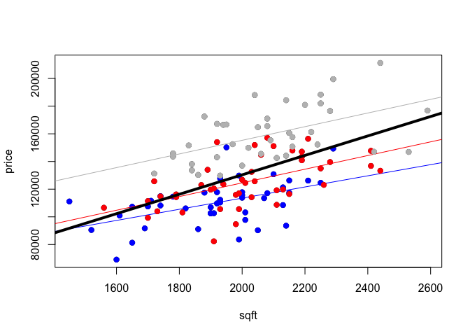

House prices
------------

Learning goals:  
\* fit regression models with a single numerical predictor and multiple
categorical predictors  
\* correctly interpret dummy variables and interaction terms in linear
regression models  
\* correctly interpret an ANOVA table in a model with correlated
predictors

Data files:  
\* [house.csv](house.csv): sales prices of houses in Kansas City

### Aggregation paradoxes in regression

Let's start by loading the mosaic library, reading in the house-price
data set and summarizing the variables.

    library(mosaic)

    summary(house)

    ##       home            nbhd        offers           sqft      brick   
    ##  Min.   :  1.00   nbhd01:44   Min.   :1.000   Min.   :1450   No :86  
    ##  1st Qu.: 32.75   nbhd02:45   1st Qu.:2.000   1st Qu.:1880   Yes:42  
    ##  Median : 64.50   nbhd03:39   Median :3.000   Median :2000           
    ##  Mean   : 64.50               Mean   :2.578   Mean   :2001           
    ##  3rd Qu.: 96.25               3rd Qu.:3.000   3rd Qu.:2140           
    ##  Max.   :128.00               Max.   :6.000   Max.   :2590           
    ##     bedrooms       bathrooms         price       
    ##  Min.   :2.000   Min.   :2.000   Min.   : 69100  
    ##  1st Qu.:3.000   1st Qu.:2.000   1st Qu.:111325  
    ##  Median :3.000   Median :2.000   Median :125950  
    ##  Mean   :3.023   Mean   :2.445   Mean   :130427  
    ##  3rd Qu.:3.000   3rd Qu.:3.000   3rd Qu.:148250  
    ##  Max.   :5.000   Max.   :4.000   Max.   :211200

Although there are a lot of variables in this data set, we will focus on
four: \* price: the sales price of the house.  
\* sqrt: the size of the house in square feet.  
\* nbhd: a categorical variable indicating which of three neighborhoods
the house is in.  
\* brick: a categorical variable indicating whether the house is made of
brick.

We'll begin by fitting a regression line for the price of the house in
terms of its square footage:

    plot(price~sqft, data=house, pch=19)
    lm0 = lm(price~sqft, data=house)
    abline(lm0)

  

    coef(lm0)

    ##  (Intercept)         sqft 
    ## -10091.12991     70.22632

According to the estimated slope of this model, each additional square
foot costs roughly $70.

However, the following two plots might give you cause for concern about
this answer.

    bwplot(price ~ nbhd, data=house)

  

    bwplot(sqft ~ nbhd, data=house)

  
 We see that the both the prices and sizes of houses differ
systematically across neighborhoods. Might the neighborhood be a
confounding variable that distorts our estimate of the size-versus-price
relationship? For example, some neighborhoods might be more desirable
because of their location, not merely because of the size of the houses
there.

Let's look at the neighborhoods individually to get a sense of whether
this is plausible. First, neighborhood 1:

    plot(price~sqft, data=subset(house, nbhd=='nbhd01'), pch=19)
    lm1 = lm(price~sqft, data=subset(house, nbhd=='nbhd01'))
    abline(lm1)

  

    coef(lm1)

    ## (Intercept)        sqft 
    ## 32906.42259    40.30018

Within neighborhood 1 alone, it looks like each additional square costs
about $40. How about neighborhood 2?

    plot(price~sqft, data=subset(house, nbhd=='nbhd02'), pch=19)
    lm2 = lm(price~sqft, data=subset(house, nbhd=='nbhd02'))
    abline(lm2)

  

    coef(lm2)

    ## (Intercept)        sqft 
    ##  25682.1102     49.4285

Here the size premium is about $50 per square foot. And neighborhood 3?

    plot(price~sqft, data=subset(house, nbhd=='nbhd03'), pch=19)
    lm3 = lm(price~sqft, data=subset(house, nbhd=='nbhd03'))
    abline(lm3)

  

    coef(lm3)

    ## (Intercept)        sqft 
    ## 56659.14762    49.32586

Also about $50 per square foot. So let's recap:  
\* In each individual neighborhood, the price of an additional square
foot is between 40 and 50 dollars.  
\* Yet for all three neighborhoods together, the price of an additional
square foot is 70 dollars.

This is a classic example of an aggregation paradox: that is, something
which appears to hold for a group (all three neighborhoods together)
simultaneously fails to hold for the individual members of that group.
The following picture may give you some intuition for what's going on
here. We will plot the points for the individual neighborhoods in
different colors:

    # Plot the whole data set
    plot(price~sqft, data=house)
    # Color the points and add the line for nbhd 1
    points(price~sqft, data=subset(house, nbhd=='nbhd01'), pch=19, col='blue')
    abline(lm1, col='blue')
    # Color the points and add the line for nbhd 2
    points(price~sqft, data=subset(house, nbhd=='nbhd02'), pch=19, col='red')
    abline(lm2, col='red')
    # Color the points and add the line for nbhd 3
    points(price~sqft, data=subset(house, nbhd=='nbhd03'), pch=19, col='grey')
    abline(lm3, col='grey')
    # Finally, add the "global" line
    abline(lm0, lwd=4)

  
 You can see that the lines for the individual neighborhoods are all
less steep than the overall line for the aggregrated data set. This
suggests that neighborhood is indeed a confounder for the
price-versus-size relationship.

### Dummy variables

To resolve the aggregation paradox in the house-price data set, we
applied a "split and fit" strategy:  
1) Split the data into subsets, one for each group. 2) Fit a separate
model to each subset.

With only a single grouping variable, the "split-and-fit" strategy often
works just fine. But with multiple grouping variables, it gets
cumbersome quickly. Therefore, we'll learn an alternative strategy that
will prove to be much more useful than split-and-fit: dummy variables
and interactions.

Remember that a dummy variable is a 0/1 indicator of membership in a
particular group. Here's how we introduce dummy variables in a
regression model.

    lm4 = lm(price ~ sqft + nbhd, data=house)
    coef(lm4)

    ## (Intercept)        sqft  nbhdnbhd02  nbhdnbhd03 
    ## 21241.17443    46.38592 10568.69781 41535.30643

This output says that there are three different lines for the three
different neighborhoods:  
\* Neighborhood 1 (the baseline): price = 21241 + 46.39 \* sqft  
\* Neighborhood 2: price = (21241 + 10569) + 46.39 \* sqft  
\* Neighborhood 3: price = (21241 + 41535) + 46.39 \* sqft

That is, three different lines with three different intercepts and the
same slope (46.39). The coefficient labeled "(Intercept)" is the
intercept for the baseline category (in this case, neighborhood 1). The
coefficients on the nbhd02 and nbhd03 dummy variables are the offsets.

### Interactions

If we believe that the price-versus-size relationship is different for
each neighborhood, we may want to introduce an interaction term:

    lm5 = lm(price ~ sqft + nbhd + nbhd:sqft, data=house)
    coef(lm5)

    ##     (Intercept)            sqft      nbhdnbhd02      nbhdnbhd03 
    ##    32906.422594       40.300183    -7224.312425    23752.725029 
    ## sqft:nbhdnbhd02 sqft:nbhdnbhd03 
    ##        9.128318        9.025674

Now we're allowing both the slope and intercept to differ from
neighborhood to neighborhood. The rules are: \* The coefficients on the
dummy variables get added to the baseline intercept to form each
neighborhood-specific intercept.  
\* The coefficients on the interaction terms get added to the baseline
slope to form each neighborhood-specific slope.

Thus our model above output says that:  
\* Neighborhood 1 (the baseline): price = 32906 + 40.30 \* sqft  
\* Neighborhood 2: price = (32906 - 7224) + (40.30 + 9.13) \* sqft  
\* Neighborhood 3: price = (32906 + 23753) + (40.30 + 9.02) \* sqft

### Multiple categorical predictors

Once you've got the idea of dummy variables and interactions, you can
add as many categorical variables as you want. (Word to the wise: doing
so will not necessarily be a good idea!) For example, try interpreting
the coefficients for the following model:

    lm6 = lm(price ~ sqft + nbhd + brick + brick:sqft, data=house)
    coef(lm6)

    ##   (Intercept)          sqft    nbhdnbhd02    nbhdnbhd03      brickYes 
    ##   28434.99926      41.27425    5447.01983   36547.03947  -16787.14206 
    ## sqft:brickYes 
    ##      17.85384

### ANOVA in the presence of correlated predictors

In the walkthrough on [reaction time in video
games](http://jgscott.github.io/teaching/r/rxntime/rxntime.html), we
learned that an analysis of variance can be used to partition variation
in the outcome among the individual predictor variables in a regression
model. An ANOVA table is constructed by adding variables to the model
sequentially, and tracking the amount by which the predictive ability of
the model improves at each stage. We measure the improvement by change
in predictable variation (PV), or equivalently the reduction in the
residual sums of squares (unpredictable variation, or UV).

If we run an analysis of variance on our final model above, we get the
following table. We'll divide the sales price by $1000 (so that an
outcome of 200 corresponds to a $200,000 sales price), just to make the
numbers in our ANOVA table a little bit easier to interpret:

    lm6 = lm(price/1000 ~ sqft + nbhd + brick + brick:sqft, data=house)
    anova(lm6)

    ## Analysis of Variance Table
    ## 
    ## Response: price/1000
    ##             Df Sum Sq Mean Sq  F value    Pr(>F)    
    ## sqft         1  28036 28036.4 181.2712 < 2.2e-16 ***
    ## nbhd         2  34773 17386.4 112.4130 < 2.2e-16 ***
    ## brick        1   9646  9646.5  62.3698 1.404e-12 ***
    ## sqft:brick   1    360   360.4   2.3305    0.1295    
    ## Residuals  122  18869   154.7                       
    ## ---
    ## Signif. codes:  0 '***' 0.001 '**' 0.01 '*' 0.05 '.' 0.1 ' ' 1

It looks as though the neighborhood predicts the most variation (change
in PV = 34773), followed by sqft (delta-PV = 28036) and then brick
(delta-PV = 9646).

But what if we arbitrarily change the order in which we add the
variables?

    lm6alt = lm(price/1000 ~ brick + nbhd + sqft + brick:sqft, data=house)
    anova(lm6alt)

    ## Analysis of Variance Table
    ## 
    ## Response: price/1000
    ##             Df Sum Sq Mean Sq  F value    Pr(>F)    
    ## brick        1  18799 18799.4 121.5490 < 2.2e-16 ***
    ## nbhd         2  42777 21388.5 138.2888 < 2.2e-16 ***
    ## sqft         1  10879 10879.2  70.3403 1.023e-13 ***
    ## brick:sqft   1    360   360.4   2.3305    0.1295    
    ## Residuals  122  18869   154.7                       
    ## ---
    ## Signif. codes:  0 '***' 0.001 '**' 0.01 '*' 0.05 '.' 0.1 ' ' 1

Now the importance of brick and neighborhood looks much larger, and the
importance of size much smaller. But the coefficients in the two models
are exactly the same:

    coef(lm6)

    ##   (Intercept)          sqft    nbhdnbhd02    nbhdnbhd03      brickYes 
    ##   28.43499926    0.04127425    5.44701983   36.54703947  -16.78714206 
    ## sqft:brickYes 
    ##    0.01785384

    coef(lm6alt)

    ##   (Intercept)      brickYes    nbhdnbhd02    nbhdnbhd03          sqft 
    ##   28.43499926  -16.78714206    5.44701983   36.54703947    0.04127425 
    ## brickYes:sqft 
    ##    0.01785384

When the predictor variables are correlated with each other, an analysis
of variance for a regression model---but not the model itself---will
depend upon the order in which those variables are added. This is
because the first predictor your add greedily takes credit for all the
information it shares in common with any other predictors that are
subsequently added to the model.

The moral of the story is that there is no such thing as "the" ANOVA
table for a regression model with correlated predictors. There are
multiple ANOVA tables, one for each possible ordering of the variables.
Thus there is no unique way to unambiguously assign credit to individual
variables in the model.

### Advanced plotting (optional)

You can use a lattice plot to reproduce my "split and fit" strategy from
above: that is, split the data into subsets and fit a line to each one.
Here's one way that involves defining a custom "panel function" that is
used by `xyplot`.

    # Define a custom plotting function to be applied to each panel
    plot_with_lines = function(x, y) {
             panel.xyplot(x, y)
             model_for_panel = lm(y~x)
             panel.abline(model_for_panel)         
    }

    # Pass this custom plotting function to xyplot
    xyplot(price ~ sqft | nbhd, data=house, panel=plot_with_lines)

