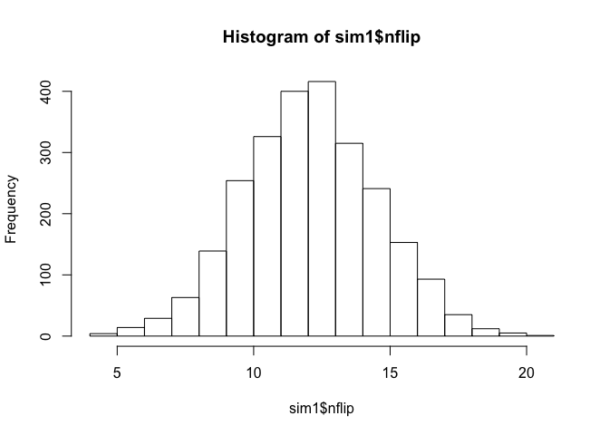

A simple hypothesis test
------------------------

In a 25-game stretch of the 2014-15 NFL seasons, the New England
Patriots won 19 coin tosses, for a winning percentage of 76%. The
Patriots have a reputation for ethical lapses. Could they have cheated
at the coin toss, too?

In this walkthrough, we'll conduct a simple hypothesis test. For this
you'll need the mosaic library, so make sure to load it first:

    library(mosaic)

### Simulating data under the null hypothesis

Our null hypothesis here is that the Patriots had a 50% chance of
winning each coin toss. Obviously they might not win *exactly* 50% in
any given sequence of tosses. We can see this by simulating a few runs
of 25 coin tosses, using the `nflip` command in the mosaic library:

    nflip(n=25)

    ## [1] 11

    nflip(n=25)

    ## [1] 14

    nflip(n=25)

    ## [1] 13

This simulates three different sequences of 25 fair coin tosses, and
counts how many times that one side (the Patriots) won the toss. Due to
random variation, the answer is different each time. What we've done
here is a simple Monte Carlo simulation, in which we use a computer to
simulate a random process.

Well, three sequences is fine for getting a little bit of intuition, but
it's better to run a lot more than three. We can do this using the
`do()` function in the mosaic library:

    do(20)*nflip(n=25)

    ##    nflip
    ## 1     10
    ## 2     12
    ## 3     11
    ## 4     15
    ## 5     10
    ## 6     15
    ## 7     13
    ## 8     11
    ## 9      9
    ## 10    15
    ## 11    14
    ## 12    15
    ## 13    11
    ## 14    16
    ## 15    10
    ## 16    15
    ## 17     9
    ## 18    14
    ## 19     7
    ## 20    13

That's 20 sequences of 25 fair coin flips, with each line representing
the number of flips won by the Patriots (assuming a 50% win probability)
for a single simulation.

Let's now run a much larger Monte Carlo simulation (i.e. many more than
20 sequences of 25 flips), and save the result in an object called
`sim1`:

    sim1 = do(2500)*nflip(n=25)
    head(sim1)

    ##   nflip
    ## 1    10
    ## 2    16
    ## 3    13
    ## 4    11
    ## 5    12
    ## 6    11

You can see that `sim1` is a data frame with 1 variable, called `nflip`.
If we look at a histogram of `sim1$nflip`, we will see the probability
distribution of Patriots' wins in 25 fair coin tosses:

    hist(sim1$nflip, breaks=20)

Reaching 19 wins looks pretty unusual under this probability
distribution. If you want to quantify just how unlikely this would be,
you can can simply count up the number of times that the team reached 19
wins or more, divided by the number of simulations (here 2500):

    pval = sum(sim1$nflip >= 19)/2500
    pval

    ## [1] 0.0072

This probability is called a p-value. This one is pretty small (less
than 1%, although yours will be different than mine, because of Monte
Carlo variability). We conclude that it would be pretty unlikely for a
team to win at least 19 times in 25 coin tosses, assuming that the
tosses were fair.

### Post-script

Despite the small probability of such an extreme result, it's hard to
believe that the Patriots cheated on the coin toss, for a few reasons.
First, how could they? The coin toss would be extremely hard to
manipulate, even if you were inclined to do so. Moreover, the Patriots
are just one team, and this is just one 25-game stretch. There are 32
NFL teams, so the the probability that \_one of them would go on an
unusual coin-toss winning streak over *some* 25-game stretch over a long
time period is a lot larger than the number we've calculated. Finally,
after this 25-game stretch, the Patriots reverted back to a more typical
coin-toss winning percentage, closer to 50%. The 25-game stretch was
probably just luck.

Nevertheless, I would encourage you to focus on the *process* here,
rather than the result. There were four steps:  
1. We have a *null hypothesis*, that the pre-game coin toss in the
Patriots' games was truly random.  
2. We use a *test statistic*, number of Patriots' coin-toss wins, to
measure the evidence against the null hypothesis.  
3. There is a way of calculating the *probability distribution of the
test statistic, assuming that the null hypothesis is true*. Here, we
just ran a Monte Carlo simulation of coin flips, assuming an unbiased
coin.  
4. Finally, we used this probability distribution to assess whether the
null hypothesis looked believable in light of the data.

All hypothesis testing problems have these same four elements. Usually
the hard part is step 3, for which we'll learn some cool techniques.
