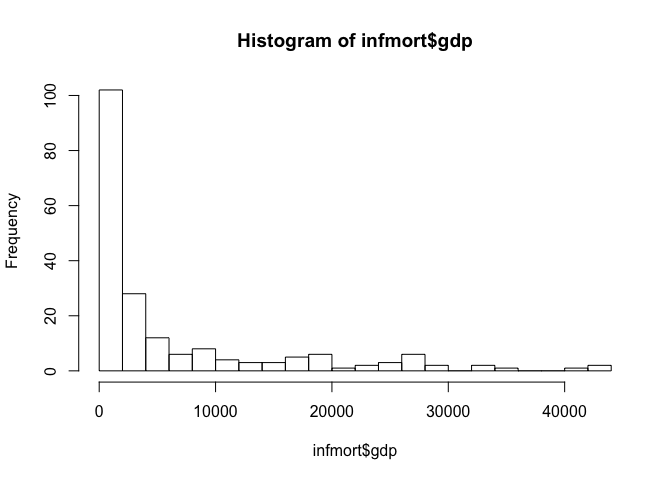
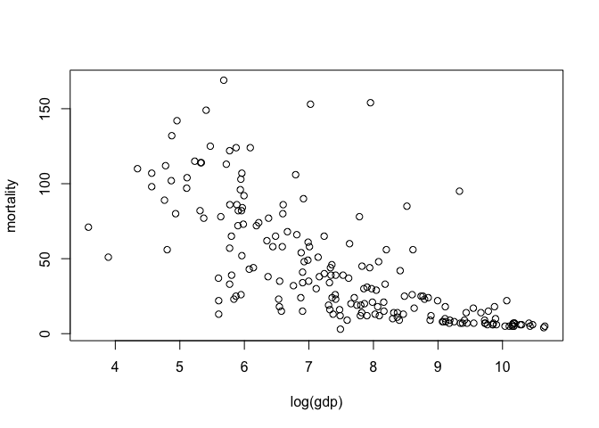
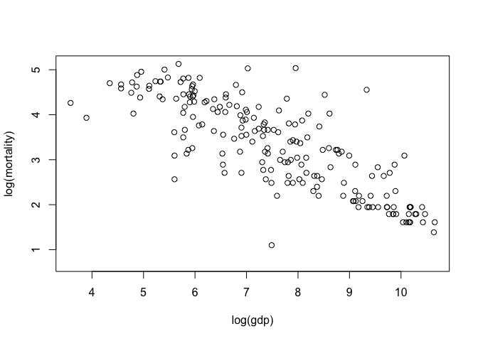
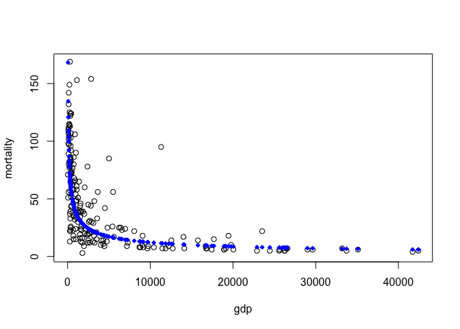
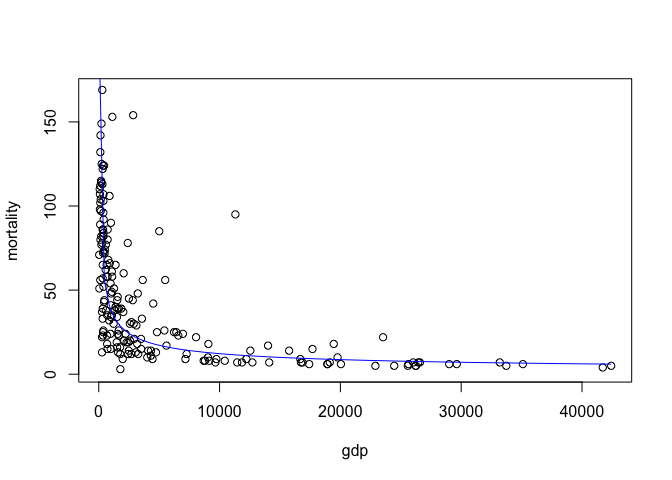

Economic development and infant mortality
-----------------------------------------

In this walk-through, you'll learn to fit a power law to data using
linear least squares and log transformations. The log transform is often
useful for data bounded below by 0, or data that span many orders of
magnitude.

Data files:  
\* [infmort.csv](infmort.csv): infant mortality and size of economy for
207 countries.

### Preliminaries

First load the mosaic library.

    library(mosaic)

Next, read in the infant mortality data set. The variables are infant
deaths per 1000 live births and GDP per capita, in U.S. dollars. Use the
Import Dataset button in RStudio, or the command line:

    infmort = read.csv('infmort.csv', header=TRUE)

If you use the Import Dataset button, you won't need this preceding
line.

### Log transformations

We'll start by plotting the data:

    summary(infmort)

    ##            country      mortality           gdp       
    ##  Afghanistan   :  1   Min.   :  2.00   Min.   :   36  
    ##  Albania       :  1   1st Qu.: 12.00   1st Qu.:  442  
    ##  Algeria       :  1   Median : 30.00   Median : 1779  
    ##  American.Samoa:  1   Mean   : 43.48   Mean   : 6262  
    ##  Andorra       :  1   3rd Qu.: 66.00   3rd Qu.: 7272  
    ##  Angola        :  1   Max.   :169.00   Max.   :42416  
    ##  (Other)       :201   NA's   :6        NA's   :10

    plot(mortality ~ gdp, data=infmort)

  
 There's a noticeable bunching of the data at the left of the plot. This
happens because GDP is a highly skewed variable; there are many small
economies and few large ones. We can see this effect easily in a
histogram.

    hist(infmort$gdp, breaks=20)

  
 Note the long right tail. This suggests that we should try using the
logarithm of GDP, which will have the effect of unbunching the data.
Let's try plotting infant mortality versus log GDP, by specifying that
we want the x variable to be transformed to a log scale.

    plot(mortality ~ log(gdp), data=infmort)

  
 Notice that the scale of the x axis changes: it's measured in units of
log GDP now. (In R, log means natural log... if you want the base-10
logarithm, use log10 instead.)

This plot looks better, but now we notice that the points are bunched
toward the bottom of the plot. This suggest we might also try taking the
log of the y variable.

    plot(log(mortality) ~ log(gdp), data=infmort)

  
 A straight line looks like it would fit very well here:

    lm1 = lm(log(mortality) ~ log(gdp), data= infmort)
    coef(lm1)

    ## (Intercept)    log(gdp) 
    ##   7.0452008  -0.4932026

We can add the line straight to the plot on the log-log scale:

    plot(log(mortality) ~ log(gdp), data=infmort)
    abline(lm1)

  

### Visualizing the fitted power law on the original scale

Suppose we wanted to show the model on the original scale. We know that
a linear model on the log-log scale corresponds to a power law on the
original scale. Let's exploit this to generate a plot of the fitted
curve. First let's remember what the data looks like on the original
scale.

    plot(mortality ~ gdp, data= infmort)

  
 Next, let's get the fitted values on the log-log scale, and transform
them back to the original scale. Because the exponential is the inverse
of the log transform, we do this by exponentiating the fitted values:

    # Extract the coefficients and compute the fitted values "by hand"
    mybeta = coef(lm1)
    logmort.pred = mybeta[1] + mybeta[2]*log(infmort$gdp)
    # Transform the fitted values to the original scale
    mort.pred = exp(logmort.pred)

Now we can add the predicted points to the plot in a different color and
point style:

    plot(mortality ~ gdp, data=infmort)
    points(mort.pred ~ gdp, data=infmort, col='blue', pch=18)

  
 Try typing in ?points if you want to see the options for pch.

We could also add the fitted curve directly to the scatter plot using
the `curve` function, based on what we know about power laws and log
transformations:

    plot(mortality ~ gdp, data= infmort)
    curve(exp(mybeta[1]) * x^(mybeta[2]), add=TRUE, col='blue')

