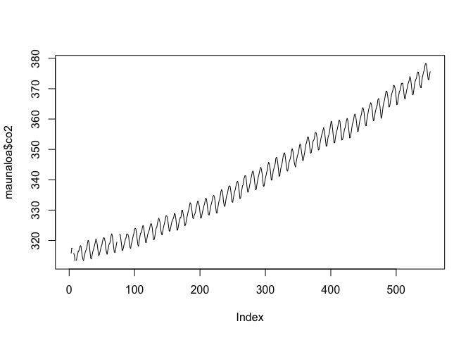
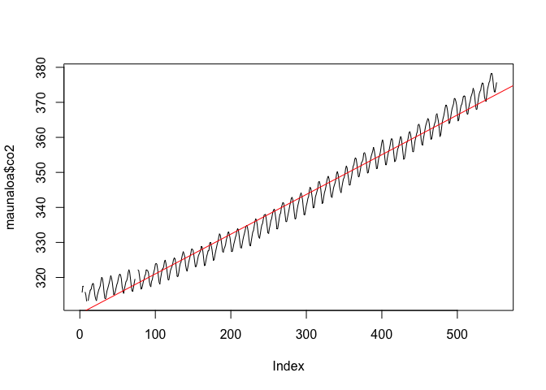
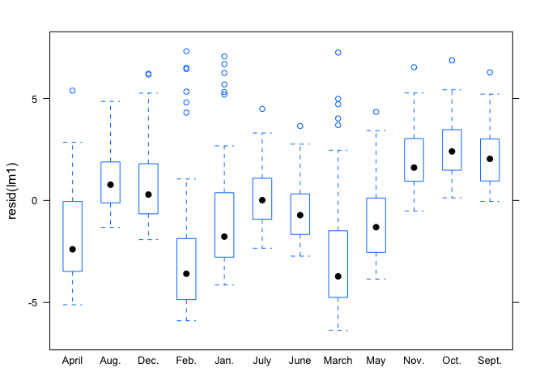
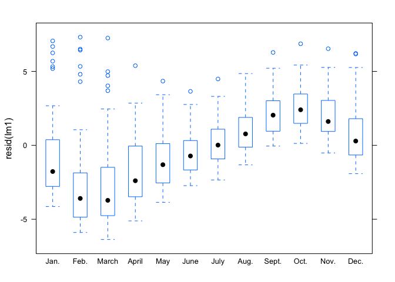
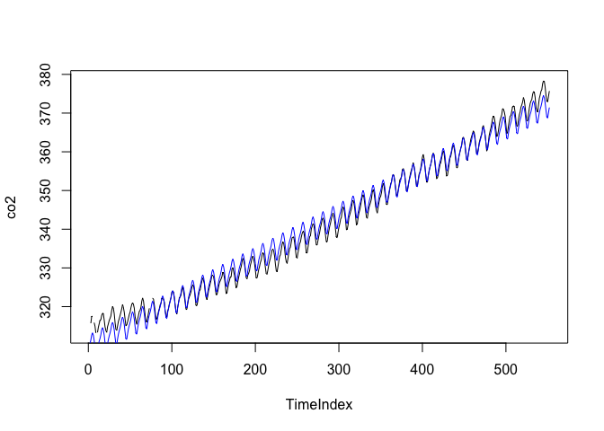

### Time series basics

In this walk-through, you'll learn two simple techniques for handling
the most common kinds of variation in time-series analysis:  
\* regressing on a time index to model trends.  
\* adding dummy variables to handle seasonal variation.

Data files:  
\* [maunaloa.csv](maunaloa.csv): Atmospheric CO2 concentrations
(measured in parts per million) derived from air samples collected at
Mauna Loa Observatory, Hawaii. Source: Carbon Dioxide Research Group,
Scripps Institution of Oceanography (SIO), University of California, La
Jolla. [Available here.](ftp://cdiac.esd.ornl.gov/pub/maunaloa-co2/).

First we'll load the required libraries and data set.

    library(mosaic)
    maunaloa = read.csv("maunaloa.csv", header=TRUE)
    summary(maunaloa)

    ##       Year          Month          co2       
    ##  Min.   :1958   April  : 46   Min.   :313.2  
    ##  1st Qu.:1969   Aug.   : 46   1st Qu.:325.0  
    ##  Median :1980   Dec.   : 46   Median :339.6  
    ##  Mean   :1980   Feb.   : 46   Mean   :341.4  
    ##  3rd Qu.:1992   Jan.   : 46   3rd Qu.:356.7  
    ##  Max.   :2003   July   : 46   Max.   :378.4  
    ##                 (Other):276   NA's   :7

We have data on the year and month of measurement (running from 1958 to
2003), along with the CO2 measurement itself. Notice that we have 7 NAs
in the CO2 column, which correspond to months in which the measurements
were missing or judged unreliable.

### Modeling linear trends

We will make a line plot of CO2 over time. Because the observations are
ordered temporally in the data set, we don't need to specify an x
variable for plotting here. R will just plot things in order:

    plot(maunaloa$co2, type='l')

The plot has two obvious features: it goes up over time, and it has a
noticeable "zig-zag" pattern on its way up. To build a model for CO2
concentration that addresses the trend, we will create a time index,
starting at 1 and ending at N (where N is the number of rows in the data
set).

    maunaloa$TimeIndex = 1:nrow(maunaloa)
    head(maunaloa)

    ##   Year Month    co2 TimeIndex
    ## 1 1958  Jan.     NA         1
    ## 2 1958  Feb.     NA         2
    ## 3 1958 March 315.71         3
    ## 4 1958 April 317.45         4
    ## 5 1958   May 317.50         5
    ## 6 1958  June     NA         6

This "time index" variable is now available to be used as a predictor in
a regression model:

    lm1 = lm(co2 ~ TimeIndex, data=maunaloa)
    summary(lm1)

    ## 
    ## Call:
    ## lm(formula = co2 ~ TimeIndex, data = maunaloa)
    ## 
    ## Residuals:
    ##     Min      1Q  Median      3Q     Max 
    ## -6.3688 -2.0712  0.0579  1.8602  7.3161 
    ## 
    ## Coefficients:
    ##              Estimate Std. Error t value Pr(>|t|)    
    ## (Intercept) 3.097e+02  2.477e-01    1250   <2e-16 ***
    ## TimeIndex   1.134e-01  7.713e-04     147   <2e-16 ***
    ## ---
    ## Signif. codes:  0 '***' 0.001 '**' 0.01 '*' 0.05 '.' 0.1 ' ' 1
    ## 
    ## Residual standard error: 2.844 on 543 degrees of freedom
    ##   (7 observations deleted due to missingness)
    ## Multiple R-squared:  0.9755, Adjusted R-squared:  0.9754 
    ## F-statistic: 2.162e+04 on 1 and 543 DF,  p-value: < 2.2e-16

The coefficient on the time index is 0.134. Since the unit of time here
is one month, we interpret this as an estimated rise in atmospheric
carbon concentration of 0.134 PPM per month, or about 1.6 PPM per year.

You'll notice that the linear trend certainly isn't a perfect fit to the
data:

    plot(maunaloa$co2, type='l')
    abline(lm1, col='red')

It underpredicts both at the beginning and end of the data set,
suggesting the trend is slightly nonlinear. Nonetheless, as a simplified
description of the average yearly rise in atmospheric CO2, we might be
perfectly happy with the linear approximation.

### Modeling seasonal variation

The other obvious feature of the original time-series plot was the
zig-zag pattern. We can see the cause for this if we look at the
residuals of the trend-only model stratified by month:

    bwplot(resid(lm1) ~ Month, data=maunaloa)

One annoying aspect of this plot is that the months aren't in order! We
can fix this by re-ordering the levels of the "Month" factor in the data
set:

    levels(maunaloa$Month)

    ##  [1] "April" "Aug."  "Dec."  "Feb."  "Jan."  "July"  "June"  "March"
    ##  [9] "May"   "Nov."  "Oct."  "Sept."

    month_order = c('Jan.', 'Feb.', 'March', 'April', 'May', 'June', 'July', 'Aug.', 'Sept.', 'Oct.', 'Nov.', 'Dec.')
    maunaloa$Month = factor(maunaloa$Month, levels=month_order)
    bwplot(resid(lm1) ~ Month, data=maunaloa)

Now the boxplot has the months in the correct calendar order, and we can
see the obvious seasonal pattern in the residuals. To address this, we
will introduce monthly dummy variables:

    lm2 = lm(co2 ~ TimeIndex + Month, data=maunaloa)
    summary(lm2)

    ## 
    ## Call:
    ## lm(formula = co2 ~ TimeIndex + Month, data = maunaloa)
    ## 
    ## Residuals:
    ##     Min      1Q  Median      3Q     Max 
    ## -3.0912 -1.5198 -0.4467  1.3788  5.6031 
    ## 
    ## Coefficients:
    ##               Estimate Std. Error t value Pr(>|t|)    
    ## (Intercept)  3.096e+02  3.317e-01 933.242  < 2e-16 ***
    ## TimeIndex    1.135e-01  5.391e-04 210.600  < 2e-16 ***
    ## MonthFeb.    6.213e-01  4.213e-01   1.475 0.140893    
    ## MonthMarch   1.449e+00  4.189e-01   3.458 0.000588 ***
    ## MonthApril   2.603e+00  4.189e-01   6.214 1.04e-09 ***
    ## MonthMay     3.075e+00  4.166e-01   7.380 6.13e-13 ***
    ## MonthJune    2.335e+00  4.189e-01   5.573 3.99e-08 ***
    ## MonthJuly    9.121e-01  4.166e-01   2.189 0.029009 *  
    ## MonthAug.   -1.166e+00  4.166e-01  -2.798 0.005322 ** 
    ## MonthSept.  -2.982e+00  4.166e-01  -7.157 2.74e-12 ***
    ## MonthOct.   -3.269e+00  4.190e-01  -7.803 3.22e-14 ***
    ## MonthNov.   -1.954e+00  4.166e-01  -4.689 3.49e-06 ***
    ## MonthDec.   -8.092e-01  4.167e-01  -1.942 0.052654 .  
    ## ---
    ## Signif. codes:  0 '***' 0.001 '**' 0.01 '*' 0.05 '.' 0.1 ' ' 1
    ## 
    ## Residual standard error: 1.987 on 532 degrees of freedom
    ##   (7 observations deleted due to missingness)
    ## Multiple R-squared:  0.9883, Adjusted R-squared:  0.988 
    ## F-statistic:  3738 on 12 and 532 DF,  p-value: < 2.2e-16

To show the fitted values, we will use the "predict" function on the
original data set, so that the missing values are filled using plug-in
prediction:

    plot(co2 ~ TimeIndex, data=maunaloa, type='l')
    co2_fitted = predict(lm2, newdata=maunaloa)  # predict to fill in missing values
    lines(co2_fitted ~ TimeIndex, data=maunaloa, col='blue')

Our fitted values inherit the deficit of assuming a linear trend, but
otherwise do a pretty good job at describing the variation in CO2
levels.
