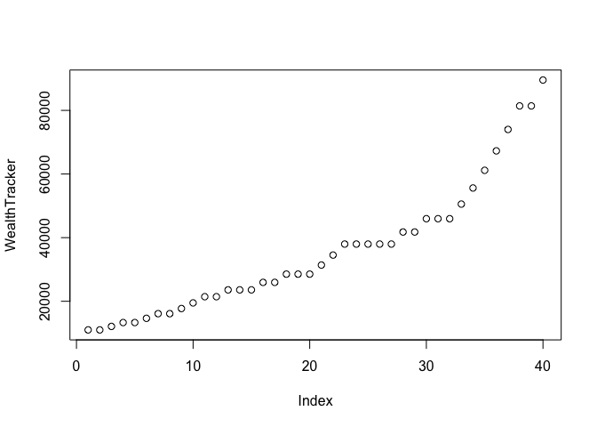
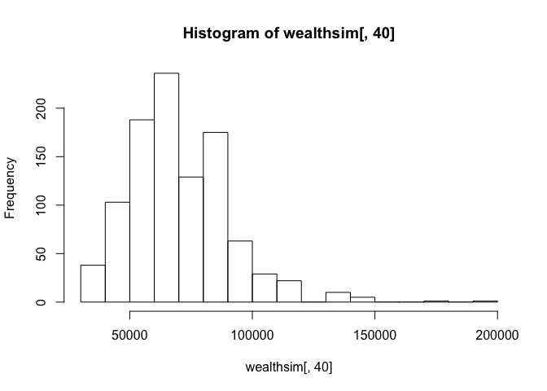

Monte Carlo simulation
----------------------

Imagine trying to forecast the likely value of your retirement
portfolio. If you're in college right now, retirement might be 45 or 50
years in the future. The final value of your savings when you retire
will be a product of many small events over the intervening years, whose
cumulative effect will be enormous. Some of these effects will be
decisions you make, like what percentage of your wealth to invest in
stocks versus bonds. Other effects will involve random forces beyond
your control, like how well your investments perform. To make
probability statements about what's likely to happen in 50 years, we
have to learn how to build models that chain together the results of
these many small events.

In this walkthrough, we'll begin learning some tools that can help us do
just this.

Learning goals:  
\* to set up calculations that chain together outcomes occurring
sequentially in time.  
\* to use the Monte Carlo method to simulate the growth of a very simple
financial portfolio.

### Tracking the growth in a savings account

Let's warm up by simulating the growth of very safe asset: a
[certificate of
deposit](https://en.wikipedia.org/wiki/Certificate_of_deposit), or CD,
at a bank. This is a particularly simple kind of portfolio, in which
there are no decisions to make along the way (because you can't take
your money out), and no randomness in the performance of the asset
(because the interest rate is contractually guaranteed).

Let's first define some variables for the interest rate (5%) and the
amount of your wealth ($10000) that you deposit in the CD.

    InterestRate = 0.05  # 5% interest
    Wealth = 10000

Now let's define a "for loop" that counts out the years, one by one, and
adds the interest to your account each year. A for loop is a block of
computer code that allows the same set of commands to be executed
repeatedly. Here's an example that calculates 10 years of 5% interest on
our initial CD:

    # Sweep through each year and update the value of wealth
    # Investment horizon = 10 years
    for(year in 1:10) {
        Wealth = Wealth * (1 + InterestRate)
    }

Here the "for loop" counts over the years from 1 to 10, using the "year"
variable (referred to as the "counter" of the for loop). For each year,
it executes the code block between the braces. In this case, the code
we've written between the braces updates the current value of the Wealth
variable (i.e. overwriting it in the computer's memory), by applying an
explicit updating formula involving the previous value of the Wealth
variable and the InterestRate variable. In the way, the computations are
chained together with the result in one year depending on the result in
the previous year.

We refer to each time the code block is executed as a "pass" of the for
loop. The above for- loop involves 10 passes through the same chunk of
code.

At the end of all 10 passes, this is how much money you have:

    Wealth

    ## [1] 16288.95

Let's verify that we get the same number we get sing the usual
compound-interest formula:

    10000 * (1+InterestRate)^10

    ## [1] 16288.95

Of course, we definitely didn't need the power of R in order to do this
calculation. But seeing how the for-loop works will set us up for the
much more realistic examples to come, in future walkthroughs.

### Understanding the for loop

If you're a little confused about what the for loop is doing, it helps
to add some "print" statements that explicitly print out information
about what is happening at each pass along the way.

In the following code block, R will execute several commands each time
it passes through the loop (i.e. for each year from 1 to 10:  
1) It will print out the year we're in: 1 for the first year, 2 for the
second, and so forth.  
2) It will print out the "old" value of wealth, i.e. the amount of money
in our account at the beginning of that year. It will also print out a
label "Old Wealth" for this number.  
3) It will update the Wealth variable, by applying the formula for
annual interest.  
4) It will finally print out the new value of wealth after that year's
interest has been earned.

Here's the code block:

    Wealth = 10000
    for(year in 1:10) {
      print(year)
      print("Old Wealth:")
      print(Wealth)
        Wealth = Wealth * (1 + InterestRate)  # Same command as above.  
      print("New Wealth:")
      print(Wealth)
    }

    ## [1] 1
    ## [1] "Old Wealth:"
    ## [1] 10000
    ## [1] "New Wealth:"
    ## [1] 10500
    ## [1] 2
    ## [1] "Old Wealth:"
    ## [1] 10500
    ## [1] "New Wealth:"
    ## [1] 11025
    ## [1] 3
    ## [1] "Old Wealth:"
    ## [1] 11025
    ## [1] "New Wealth:"
    ## [1] 11576.25
    ## [1] 4
    ## [1] "Old Wealth:"
    ## [1] 11576.25
    ## [1] "New Wealth:"
    ## [1] 12155.06
    ## [1] 5
    ## [1] "Old Wealth:"
    ## [1] 12155.06
    ## [1] "New Wealth:"
    ## [1] 12762.82
    ## [1] 6
    ## [1] "Old Wealth:"
    ## [1] 12762.82
    ## [1] "New Wealth:"
    ## [1] 13400.96
    ## [1] 7
    ## [1] "Old Wealth:"
    ## [1] 13400.96
    ## [1] "New Wealth:"
    ## [1] 14071
    ## [1] 8
    ## [1] "Old Wealth:"
    ## [1] 14071
    ## [1] "New Wealth:"
    ## [1] 14774.55
    ## [1] 9
    ## [1] "Old Wealth:"
    ## [1] 14774.55
    ## [1] "New Wealth:"
    ## [1] 15513.28
    ## [1] 10
    ## [1] "Old Wealth:"
    ## [1] 15513.28
    ## [1] "New Wealth:"
    ## [1] 16288.95

You can see how at each pass (from year=1 to year=10), the "Old Wealth"
is the same as the "New Wealth" from the previous step, indicating that
the computations have been chained together at each year to produce the
final result.

### Now with random interest rates

Now let's try to do a similar thing, but for a risky asset rather than a
simple savings account. Let's suppose we invest in a stock, and to keep
matters simple, let's suppose there are only two equally likely
possibilities for the stock in each year: it stays the same, or it goes
up by 10%. Thus the expected return in any given year is 5% (just like
the savings account above), but there is some variability about the
average. (Note: this is a very unrealistic stock, since you can't lose
money!)

Let's define some variables in R that describe this simple probability
distribution:

    outcome_values = c(0, 0.1)  # the possible interest rates
    outcome_probs = c(1/2, 1/2)  # the probabilities of each one

Next, let's simulate a single year with a random interest rate, drawn
from this stock's probability distribution of returns, using R's
"sample" function. Try executing the following block of code several
times. Sometimes you'll earn nothing, and sometimes you'll earn 10%:

    Wealth = 10000
    InterestRate = sample(outcome_values, size = 1, prob = outcome_probs)
    Wealth*(1 + InterestRate)

    ## [1] 10000

The middle line,
`InterestRate = sample(outcome_values, size = 1, prob = outcome_probs)`,
says to draw a single sample (size=1) from the possibilities in
`outcome_values`, and to choose from among these possibilities with
probabilities given in `outcome_probs`.

Now we're ready to simulate a long-term investment in this stock, by
chaining together individual years' of performance in a for loop to
simulate a final result. We'll do this over a longer horizon (say, 40
years), to simulate the growth of a retirement portfolio. Again, try
executing the following code block several times to see how your final
wealth changes from one simulation to the next:

    Wealth = 10000
    Horizon = 40
    for(year in 1:Horizon) {
      InterestRate = sample(outcome_values, size = 1, prob = outcome_probs)
        Wealth = Wealth * (1 + InterestRate)
    }
    Wealth

    ## [1] 74002.5

If you want, you can also add print statements (this is optional). I'm
going to make these "print" statements a little more concise, using R's
"cat" function (which doesn't automatically add new lines):

    Wealth = 10000
    for(year in 1:Horizon) {
      cat("Year = ", year)
      cat(", Old Wealth = ", Wealth)
      
      # Here's where the actual updating gets done
      InterestRate = sample(outcome_values, size = 1, prob = outcome_probs)
      Wealth = Wealth * (1 + InterestRate)  # Same command as above. 
        
      cat(", New Wealth = ", Wealth)
      cat("\n")  # adds a new line
    }

    ## Year =  1, Old Wealth =  10000, New Wealth =  10000
    ## Year =  2, Old Wealth =  10000, New Wealth =  11000
    ## Year =  3, Old Wealth =  11000, New Wealth =  11000
    ## Year =  4, Old Wealth =  11000, New Wealth =  12100
    ## Year =  5, Old Wealth =  12100, New Wealth =  12100
    ## Year =  6, Old Wealth =  12100, New Wealth =  12100
    ## Year =  7, Old Wealth =  12100, New Wealth =  12100
    ## Year =  8, Old Wealth =  12100, New Wealth =  12100
    ## Year =  9, Old Wealth =  12100, New Wealth =  12100
    ## Year =  10, Old Wealth =  12100, New Wealth =  12100
    ## Year =  11, Old Wealth =  12100, New Wealth =  13310
    ## Year =  12, Old Wealth =  13310, New Wealth =  13310
    ## Year =  13, Old Wealth =  13310, New Wealth =  13310
    ## Year =  14, Old Wealth =  13310, New Wealth =  14641
    ## Year =  15, Old Wealth =  14641, New Wealth =  16105.1
    ## Year =  16, Old Wealth =  16105.1, New Wealth =  16105.1
    ## Year =  17, Old Wealth =  16105.1, New Wealth =  17715.61
    ## Year =  18, Old Wealth =  17715.61, New Wealth =  19487.17
    ## Year =  19, Old Wealth =  19487.17, New Wealth =  21435.89
    ## Year =  20, Old Wealth =  21435.89, New Wealth =  23579.48
    ## Year =  21, Old Wealth =  23579.48, New Wealth =  23579.48
    ## Year =  22, Old Wealth =  23579.48, New Wealth =  23579.48
    ## Year =  23, Old Wealth =  23579.48, New Wealth =  25937.42
    ## Year =  24, Old Wealth =  25937.42, New Wealth =  28531.17
    ## Year =  25, Old Wealth =  28531.17, New Wealth =  31384.28
    ## Year =  26, Old Wealth =  31384.28, New Wealth =  31384.28
    ## Year =  27, Old Wealth =  31384.28, New Wealth =  34522.71
    ## Year =  28, Old Wealth =  34522.71, New Wealth =  37974.98
    ## Year =  29, Old Wealth =  37974.98, New Wealth =  37974.98
    ## Year =  30, Old Wealth =  37974.98, New Wealth =  37974.98
    ## Year =  31, Old Wealth =  37974.98, New Wealth =  41772.48
    ## Year =  32, Old Wealth =  41772.48, New Wealth =  45949.73
    ## Year =  33, Old Wealth =  45949.73, New Wealth =  45949.73
    ## Year =  34, Old Wealth =  45949.73, New Wealth =  45949.73
    ## Year =  35, Old Wealth =  45949.73, New Wealth =  50544.7
    ## Year =  36, Old Wealth =  50544.7, New Wealth =  50544.7
    ## Year =  37, Old Wealth =  50544.7, New Wealth =  50544.7
    ## Year =  38, Old Wealth =  50544.7, New Wealth =  50544.7
    ## Year =  39, Old Wealth =  50544.7, New Wealth =  50544.7
    ## Year =  40, Old Wealth =  50544.7, New Wealth =  55599.17

### Saving the trajectory of wealth over time

What if you wanted to keep track of the growth of your stock portfolio
at every step along the way, rather than just at the end of 40 years? To
this, we need a little extra bookkeeping, involving two modifications to
the above code:  
1) Before we run the for-loop, we need to create a "placeholder"
variable capable of storing each year's result.  
2) For each pass through the for loop, we need to store the current
Wealth variable in the corresponding location in the placeholder.

Let's see how this works. First, let's define our placeholder variable,
which we'll call `WealthTracker`. It doesn't matter what values the
placeholder contains at the beginning; all that matters it has enough
slots to track wealth over 40 years. (An analogy here is that, if you
want to hang 40 garments in a closet, you will need 40 hangers.) We'll
arbitrarily initialize our WealthTracker variable so that it contains 40
zeroes in it.

    WealthTracker = rep(0, Horizon)

Now as we sweep through the for loop, we'll change each 0 in the
WealthTracker variable to be an actual number. Try executing the
following block of code several times.

    Wealth = 10000
    Horizon = 40
    for(year in 1:Horizon) {
      InterestRate = sample(outcome_values, size = 1, prob = outcome_probs)
        Wealth = Wealth * (1 + InterestRate)
        WealthTracker[year] = Wealth
    }
    plot(WealthTracker)

### Multiple realizations: a Monte Carlo simulation

Each time you execute the above code block, you will get a different
simulated trajectory for the value of your portfolio over the next 40
years. To get a sense of how things might look in 40 years' time, 1 or 2
or even 10 simulations aren't going to cut it. We'll need to simulate
things many hundreds or thousands of times, in a much bigger Monte Carlo
simulation. We can do this using the `do()` function in the mosaic
library, just as we did when we wanted to run a bootstrap or permutation
test for a regression model. In other words, we'll have a for loop
inside a do loop, so that we execute the for loop many (in this case,
1000) times.

To this do so, we'll need to load the mosaic library.

    library(mosaic)

Now here's our main code block:

    # These settings are outside the do loop.
    # These do not need to be reset from simulation to simulation.
    outcome_values = c(0, 0.1)  # the possible interest rates
    outcome_probs = c(1/2, 1/2)  # the probabilities of each one
    Horizon = 40
    InitialWealth = 10000

    # Now the outer (do) loop begins
    wealthsim = do(1000)*{
      # These are inside the do loop, but outside the for loop.
      # They need to be reset at the beginning of each new for loop.
      Wealth = InitialWealth
      WealthTracker = rep(0, Horizon)
      
      # Now the inner (for) loop begins
      for(year in 1:Horizon) {
        InterestRate = sample(outcome_values, size = 1, prob = outcome_probs)
        Wealth = Wealth * (1 + InterestRate)
        WealthTracker[year] = Wealth
      }
      # Save WealthTracker at the end of each for loop
      WealthTracker
    }

What does the `wealthsim` variable look like? Here are the first 6
lines:

    head(wealthsim)

    ##      V1    V2    V3    V4    V5      V6       V7       V8       V9
    ## 1 11000 12100 12100 12100 13310 14641.0 16105.10 17715.61 17715.61
    ## 2 11000 11000 12100 13310 14641 14641.0 14641.00 14641.00 14641.00
    ## 3 10000 11000 11000 11000 12100 12100.0 13310.00 13310.00 13310.00
    ## 4 10000 11000 11000 11000 11000 11000.0 12100.00 12100.00 12100.00
    ## 5 11000 12100 13310 13310 14641 16105.1 17715.61 17715.61 17715.61
    ## 6 11000 12100 12100 12100 12100 13310.0 14641.00 14641.00 16105.10
    ##        V10      V11      V12      V13      V14      V15      V16      V17
    ## 1 19487.17 19487.17 21435.89 21435.89 21435.89 21435.89 23579.48 23579.48
    ## 2 14641.00 16105.10 16105.10 16105.10 16105.10 16105.10 17715.61 17715.61
    ## 3 13310.00 13310.00 14641.00 16105.10 16105.10 17715.61 19487.17 21435.89
    ## 4 13310.00 14641.00 14641.00 16105.10 17715.61 17715.61 17715.61 19487.17
    ## 5 17715.61 17715.61 17715.61 17715.61 17715.61 19487.17 21435.89 23579.48
    ## 6 17715.61 17715.61 17715.61 17715.61 19487.17 21435.89 21435.89 23579.48
    ##        V18      V19      V20      V21      V22      V23      V24      V25
    ## 1 23579.48 25937.42 25937.42 25937.42 25937.42 28531.17 31384.28 31384.28
    ## 2 19487.17 21435.89 23579.48 25937.42 25937.42 28531.17 31384.28 34522.71
    ## 3 23579.48 23579.48 23579.48 25937.42 28531.17 28531.17 28531.17 28531.17
    ## 4 21435.89 23579.48 23579.48 25937.42 25937.42 28531.17 28531.17 31384.28
    ## 5 23579.48 23579.48 23579.48 23579.48 25937.42 25937.42 28531.17 28531.17
    ## 6 23579.48 23579.48 25937.42 25937.42 25937.42 28531.17 31384.28 31384.28
    ##        V26      V27      V28      V29      V30      V31      V32      V33
    ## 1 34522.71 34522.71 37974.98 41772.48 41772.48 41772.48 45949.73 45949.73
    ## 2 34522.71 34522.71 34522.71 37974.98 37974.98 41772.48 45949.73 45949.73
    ## 3 31384.28 31384.28 34522.71 37974.98 37974.98 37974.98 37974.98 37974.98
    ## 4 34522.71 34522.71 34522.71 34522.71 37974.98 37974.98 41772.48 41772.48
    ## 5 31384.28 34522.71 37974.98 37974.98 41772.48 45949.73 50544.70 50544.70
    ## 6 34522.71 34522.71 34522.71 37974.98 37974.98 37974.98 37974.98 37974.98
    ##        V34      V35      V36      V37      V38      V39      V40
    ## 1 45949.73 45949.73 50544.70 55599.17 55599.17 61159.09 61159.09
    ## 2 50544.70 55599.17 61159.09 61159.09 61159.09 67275.00 74002.50
    ## 3 41772.48 45949.73 50544.70 55599.17 55599.17 61159.09 67275.00
    ## 4 45949.73 50544.70 50544.70 50544.70 50544.70 50544.70 55599.17
    ## 5 50544.70 55599.17 55599.17 55599.17 55599.17 61159.09 61159.09
    ## 6 41772.48 41772.48 45949.73 50544.70 50544.70 55599.17 55599.17

Each row corresponds to a single Monte Carlo simulation for the
trajectory for your portfolio (of which there are 1000). Each column
corresponds to a given year. So if we want to look at final wealth after
40 years under our 1000 different simulations, we look along the 40th
column of `wealthsim`:

    hist(wealthsim[,40], 20)

    mean(wealthsim[,40])

    ## [1] 69869.3

    sd(wealthsim[,40])

    ## [1] 21383.21

The expected value of your portfolio is about $70,000 after 40 years,
with a standard deviation of about $20,000.

### Postscript

The above example is unrealistic, in that it makes a several major
simplifying assumptions:  
1) There is only one asset to invest in.  
2) The probability distribution of that asset's returns is very simple,
with only two possibilities.  
3) We assume that we know exactly what those possibilities are (0% and
10% returns), along with their probabilities (50% each).  
4) We "buy and hold" the asset, without rebalancing our portfolio along
the way. Another way of saying this is: we follow a static, rather than
dynamic asset-allocation strategy.

Nonetheless, the example illustrates a very important concept: future
investment performance is path dependent, and the path is known. We can
describe individual components of that path using a probability
distribution, and then simulate many realizations of that path. This
allows us to arrive at a Monte Carlo approximation to the probability
distribution over future investment results.

Plus, in the walkthroughs to come, we will learn to relax all of the
above simplifying assumptions, so that in the end we'll have a powerful
set of tools for modeling realistic investment problems.
