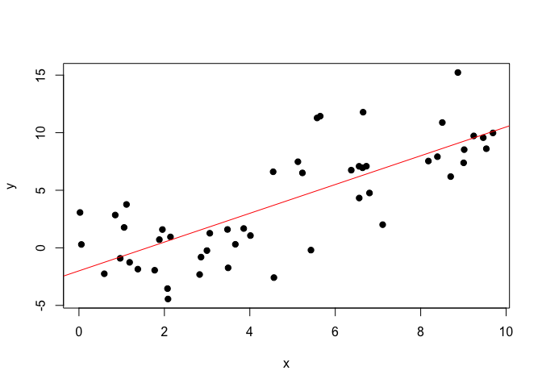
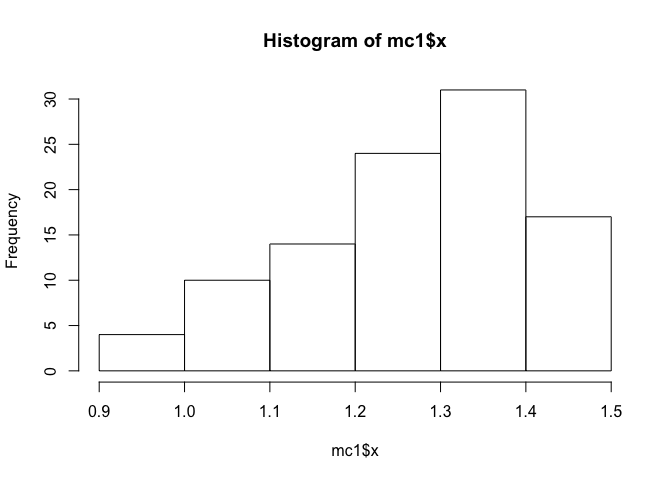
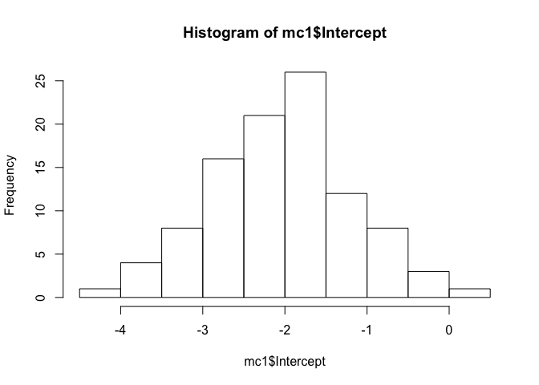
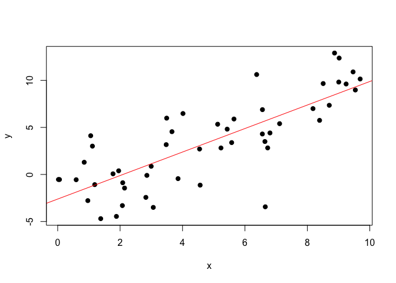
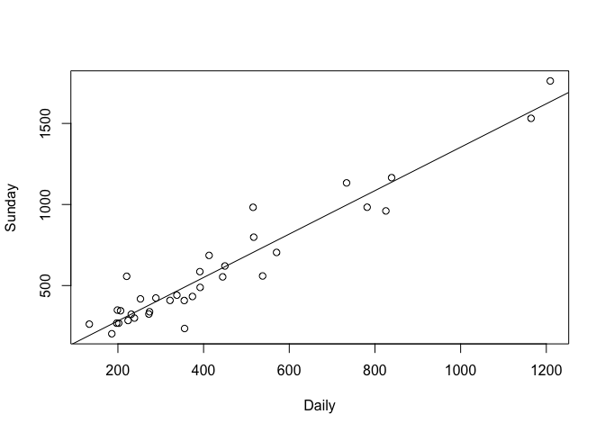
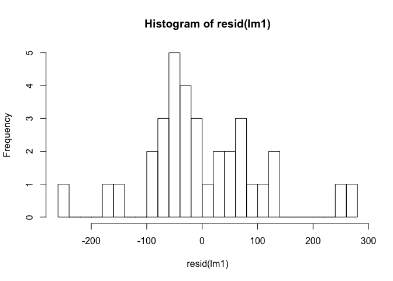
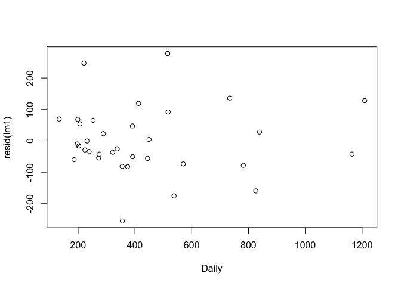

### Normal linear regression model

In this walk-through, you'll learn about the normal linear regression
model. Key ideas:  
\* Simulating from the normal linear regression model  
\* Using R's summary function to extract normal-theory standard errors  
\* Checking the validity of the normal-theory assumptions  
\* Comparing normal-theory standard errors with bootstrapped standard
errors

Data files:  
\* [newspapers.csv](newspapers.csv): Sunday and weekly circulation
numbers for major metropolitan newspapers.

### Simulating from the model

The normal linear regression model assumes that the residuals in a
regression follow a normal distribution. To get a sense of what this
means, it helps to simulate some data for which this assumption is true
by construction.

    # Load the mosaic library
    library(mosaic)

    # Choose some true parameters
    beta0 = -2
    beta1 = 1.25
    sigma = 3
    # Simulate some predictors between 0 and 10
    n = 50
    x = runif(n, 0, 10)
    # Simulate the residuals and form the responses
    epsilon = rnorm(n, 0, sigma) # mean of zero, std. dev. of sigma
    y = beta0 + beta1*x + epsilon
    plot(x,y, pch=19)
    # Plot the true line
    abline(beta0,beta1, col='red')

Try executing the block of code several times to get a sense of how the
data change from run to run. In each case, the simulated data look a lot
like what we might expect to see in a "real" data set.

A natural next step to build our intuition is to run a Monte Carlo
simulation. Each simulated data set will have the same underlying
parameters, just a different set of residuals simulated from a normal
distribution.

    mc1 = do(100)*{
      # Simulate new residuals each time
      epsilon = rnorm(n, 0, sigma)
      y = beta0 + beta1*x + epsilon
      lm_samp = lm(y~x)
      coef(lm_samp)
    }
    # Inspect and summarize the sampling distributions
    hist(mc1$x)

    hist(mc1$Intercept)

    sd(mc1$x)

    ## [1] 0.1400757

    sd(mc1$Intercept)

    ## [1] 0.8335437

### Using normality assumptions to quantify uncertainty

For real data, the assumption that residuals are normally distributed
can be either a good approximation or a bad approximation to reality.
When it's a good approximation, the nice result is that we have simple
mathematical formulas for the standard error of the sampling
distribution of the least-squares estimator. We need not appeal to these
formulas explicitly, because they are embedded into all common
statistical software, including R. They can be applied to the data set
as long as we know the right commands. Let's see how this works.

First we'll try this on simulated data, where we can compare the
normal-theory answers to Monte Carlo simulations. Let's start by
simulating a single data set from the normal linear regression model:

    epsilon = rnorm(n, 0, sigma)
    y = beta0 + beta1*x + epsilon
    lm_samp = lm(y~x)
    plot(x,y, pch=19)
    abline(lm_samp, col='red')

    summary(lm_samp)

    ## 
    ## Call:
    ## lm(formula = y ~ x)
    ## 
    ## Residuals:
    ##     Min      1Q  Median      3Q     Max 
    ## -9.1303 -1.4458 -0.1025  1.6254  5.4080 
    ## 
    ## Coefficients:
    ##             Estimate Std. Error t value Pr(>|t|)    
    ## (Intercept)  -2.6140     0.7741  -3.377  0.00146 ** 
    ## x             1.2491     0.1383   9.030 6.41e-12 ***
    ## ---
    ## Signif. codes:  0 '***' 0.001 '**' 0.01 '*' 0.05 '.' 0.1 ' ' 1
    ## 
    ## Residual standard error: 2.893 on 48 degrees of freedom
    ## Multiple R-squared:  0.6295, Adjusted R-squared:  0.6217 
    ## F-statistic: 81.54 on 1 and 48 DF,  p-value: 6.407e-12

Notice that R's summary function has a column called "standard error."
In fact, these are precisely the standard errors that are calculated
using the formulas for the normal linear regression model. (These
formulas are given in any standard textbook on regression analysis,
including in our own course packet.)

To provide a sanity check on these numbers, let's estimate the standard
error by Monte Carlo simulation under the normal model. We will re-run
the simulation above with many more than 100 Monte Carlo samples:

    mc1 = do(5000)*{
      # Simulate new residuals each time
      epsilon = rnorm(n, 0, sigma)
      y = beta0 + beta1*x + epsilon
      lm_samp = lm(y~x)
      coef(lm_samp)
    }
    sd(mc1$x)

    ## [1] 0.1436706

    sd(mc1$Intercept)

    ## [1] 0.8053196

These numbers should be pretty close to those given by the summary
function. It looks like the normal-theory standard errors are in the
ballpark.

Now let's take a look at some real data and apply the same logic. First
load the newspapers data set:

    newspapers = read.csv('newspapers.csv')

The two variables and the weekday and Sunday circulation numbers (in
thousands of papers) for 34 major metropolitan dailies. Let's fit a
model that uses daily circulation to predict Sunday circulation:

    plot(Sunday ~ Daily, data=newspapers)
    lm1 = lm(Sunday ~ Daily, data=newspapers)
    abline(lm1)

If we ask for a summary of the model, we will get the normal-theory
standard errors:

    summary(lm1)

    ## 
    ## Call:
    ## lm(formula = Sunday ~ Daily, data = newspapers)
    ## 
    ## Residuals:
    ##     Min      1Q  Median      3Q     Max 
    ## -255.19  -55.57  -20.89   62.73  278.17 
    ## 
    ## Coefficients:
    ##             Estimate Std. Error t value Pr(>|t|)    
    ## (Intercept) 13.83563   35.80401   0.386    0.702    
    ## Daily        1.33971    0.07075  18.935   <2e-16 ***
    ## ---
    ## Signif. codes:  0 '***' 0.001 '**' 0.01 '*' 0.05 '.' 0.1 ' ' 1
    ## 
    ## Residual standard error: 109.4 on 32 degrees of freedom
    ## Multiple R-squared:  0.9181, Adjusted R-squared:  0.9155 
    ## F-statistic: 358.5 on 1 and 32 DF,  p-value: < 2.2e-16

We can also get confidence intervals under the normal-theory assumption:

    confint(lm1, level = 0.95)

    ##                  2.5 %    97.5 %
    ## (Intercept) -59.094743 86.766003
    ## Daily         1.195594  1.483836

Finally, we can also use the model to get prediction intervals under the
normal-theory assumptions.

    new_data = data.frame(Daily = c(250, 500, 750))
    predict(lm1, new_data, interval='prediction', level = 0.95)

    ##         fit      lwr       upr
    ## 1  348.7643 121.1278  576.4008
    ## 2  683.6930 457.3367  910.0493
    ## 3 1018.6217 787.8570 1249.3864

Importantly, this prediction interval "bakes in" uncertainty about the
parameters of true regression line. (The formulas for doing so are all
taken care of "under the hood.") It is therefore slightly wider than a
naive prediction interval, in which parameter uncertainty is ignored.

### Residual diagnostics

Of course, if you're going to apply the normal-theory formulas, it's
always a good idea to check whether the assumptions look reasonable.
These assumptions are:  
1) The residuals are normally distributed.  
2) The residuals are independent of each other.  
3) The variance of the residuals is constant across the whole rage of
the predictor (x) variable.

We can check these assumptions visually.

    hist(resid(lm1), 20)

There are only 34 residuals, and so they don't form an especially pretty
bell curve. But they at least don't look wildly divergent from a normal
distribution. To check whether the residuals look correlated with one
another, or whether their variance changes noticeably as a function of
the predictor variable, we can plot the residuals versus Daily
circulation.

    plot(resid(lm1) ~ Daily, data = newspapers)

There are no obvious red flags here. If you look for awhile at the
figure, you might argue that the residuals are bit more bunched up for
small values of daily circulation (around 200), and a bit more spread
out for large values. But if the effect is there at all, it certainly
isn't dramatic. These plots lend further credence to the standard errors
calculated from the normality assumption.

### Comparison with bootstrapped standard errors

As a further sanity check, let's compare these normal-theory standard
errors to those we get from bootstrapping.

    my_boot = do(1000)*{
      lm_boot = lm(Sunday ~ Daily, data=resample(newspapers))
      coef(lm_boot)
    }
    sd(my_boot$Intercept)

    ## [1] 29.82942

    sd(my_boot$Daily)

    ## [1] 0.06904908

These should be reasonably close to the normal-theory standard errors.

Note: if you want to extract the standard errors alone, rather than view
them in a table, you can do so like this:

    summary(lm1)$coefficients[,2]

    ## (Intercept)       Daily 
    ## 35.80400579  0.07075395
