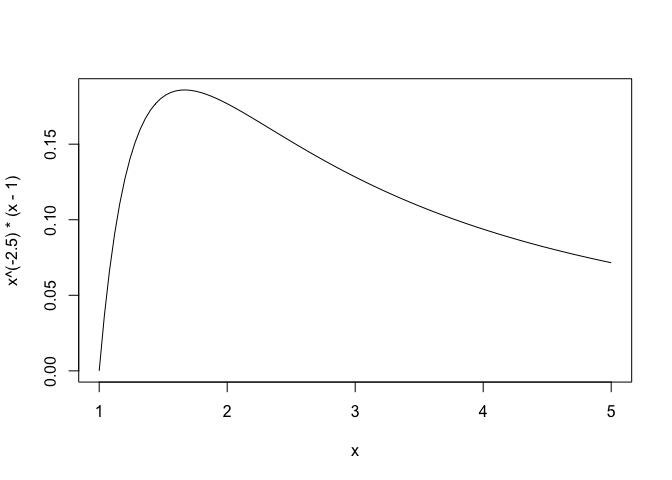
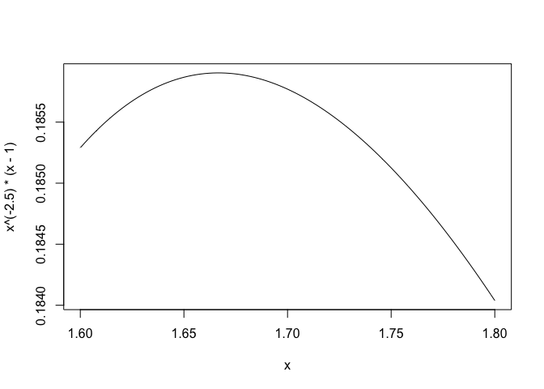
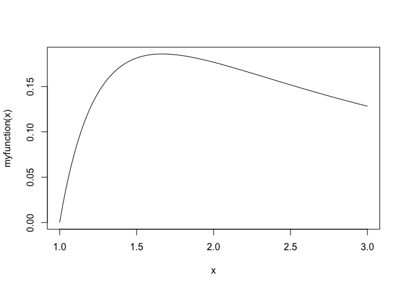
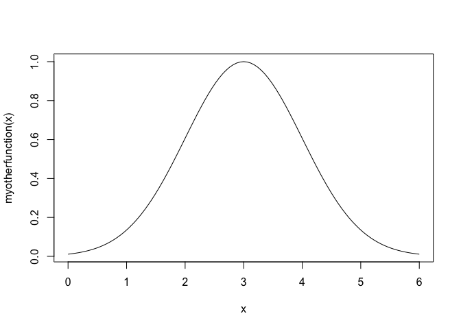

Optimizing a function in R
--------------------------

You'll often find yourself wanting to optimize some function, to find
either a minimum or maximum value. Let's see how to do this in R. You'll
need the mosaic library, so make sure to load it first:

    library(mosaic)

### Plot and point

As a simple case, we'll consider the function
*f*(*x*)=*x*−2.5(*x* − 1). Let's first plot this function:

    curve(x^(-2.5) * (x-1))

Why is this so ugly? It's because we're plotting this function over the
default domain from the `curve` function, which is \[0,1\]. Let's change
the domain to be plotted:

    curve(x^(-2.5) * (x-1), from = 1, to =5)

That's better! We can already see that the maximum is somewhere around
1.7. We can even zoom in further on this region:

    curve(x^(-2.5) * (x-1), from = 1.6, to = 1.8)

Just plotting and pointing ("hey, here's the optimum!") is enough to
tell us that this function obtains a maximum around *x* = 1.67.

### Using `makeFun` and `optimize`

As an alternative, you can follow a simple two-step process to get R to
optimize a function for you -- that is, without plotting and pointing.

First, you define your own function, using the mosaic library's
`makeFun` function. It works like this:

    myfunction = makeFun(x^(-2.5) * (x-1) ~ x)

On the left-hand side of the tilde (~) is the function f(x), and on the
right-hand side is that function's variable (x). This step creates a
*user-defined function* for R to optimize.

The second step is to call the `optimize` function on your own
user-defined function. The following code snippet says to find a maximum
of `myfunction` over the interval \[0,10\].

    optimize(myfunction, lower = 0, upper = 10, maximum = TRUE)

    ## $maximum
    ## [1] 1.666664
    ## 
    ## $objective
    ## [1] 0.1859032

The output tells you that the value of *x* at which your function
obtains a maximum is 1.6666 (rounded off), and that the value at that
point is *f*(*x*)=0.1859.

Three notes here:

First, you can call your user-defined function just like any other
function in R. For example:

    myfunction(4)

    ## [1] 0.09375

This tells you that the value your function takes at x=4 is f(x) =
0.09375.

Second, if you wanted to find the minimum, you would change "maximum =
TRUE" to "maximum = FALSE" in the above call to optimize. (Of course,
the function we chose is unbounded below, so it has no minimum.)

Third, in the above code, you are passing one function (`myfunction`) as
an argment to another function (`optimize`). This might make your head
spin a bit at first, but it's a perfectly valid thing to do. Many
functions in R, in fact, *expect* that their arguments are other
functions. `curve` is an example:

    curve(myfunction, from=1, to=3)

### A second example

Just to put all this together, let's maximize a different function,
*f*(*x*)=*e**x**p*(−0.5 \* (*x* − 3)2).

    myotherfunction = makeFun(exp(-0.5*(x-3)^2) ~ x)
    optimize(myotherfunction, lower = -10, upper = 10, maximum=TRUE)

    ## $maximum
    ## [1] 3
    ## 
    ## $objective
    ## [1] 1

This tells us that the maximum occurs at x=3 with value f(x) = 1, which
we can verify by plotting:

    curve(myotherfunction, from=0, to=6)

