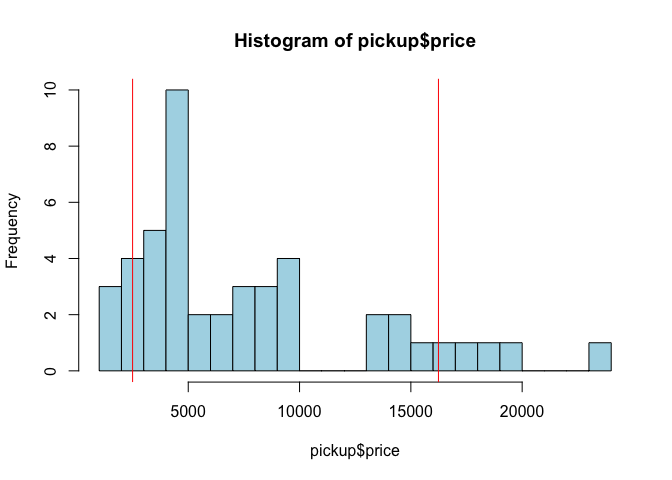
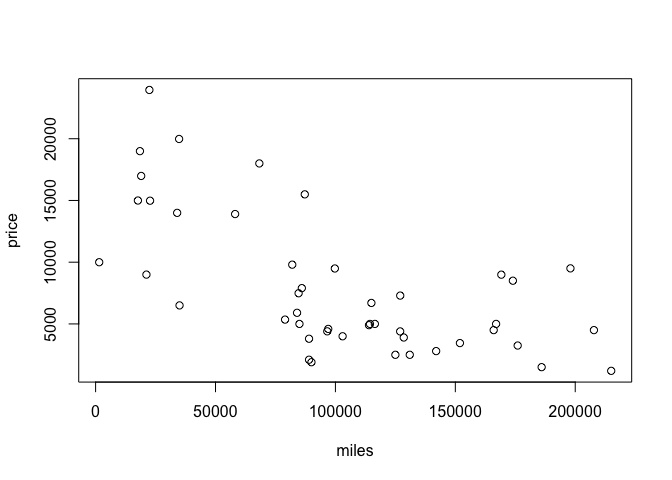
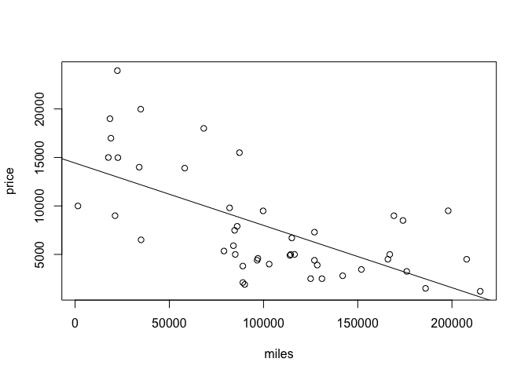
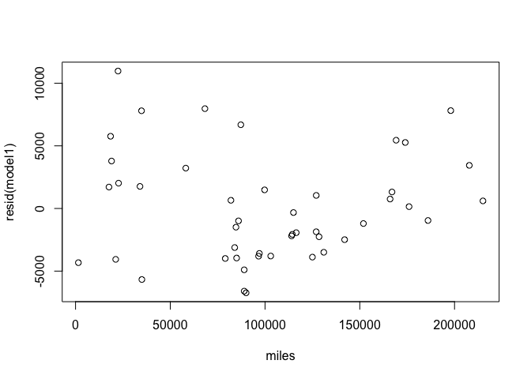

### Asking prices of pickup trucks.

In this walk-through, you'll learn simple linear regression: that is,
how to fit a straight line by ordinary least squares. You will also
learn how to summarize the results of a simple linear regression model.

Data files:  
\* [pickup.csv](pickup.csv): details on pickup trucks sold on Craiglist
in Austin.

### Warm-up

First load the mosaic library and read in the data. For the sake of
completeness here's the command-line version; you should probably use
the RStudio Import Dataset button.

    library(mosaic)
    pickup=read.csv('pickup.csv', header=TRUE)
    summary(pickup)

    ##       year          miles            price          make   
    ##  Min.   :1978   Min.   :  1500   Min.   : 1200   Dodge:10  
    ##  1st Qu.:1996   1st Qu.: 70958   1st Qu.: 4099   Ford :12  
    ##  Median :2000   Median : 96800   Median : 5625   GMC  :24  
    ##  Mean   :1999   Mean   :101233   Mean   : 7910             
    ##  3rd Qu.:2003   3rd Qu.:130375   3rd Qu.: 9725             
    ##  Max.   :2008   Max.   :215000   Max.   :23950

Let's warm up by looking at a histogram of the asking prices for each
pickup and quantify the dispersion in the distribution by quoting an 80%
coverage interval.

    hist(pickup$price, breaks=20)

  

    endpoints80 = qdata(pickup$price, p=c(0.1, 0.9))
    endpoints80

    ##     quantile   p
    ## 10%     2500 0.1
    ## 90%    16240 0.9

The `endpoints80` variable is a data frame containing the quantiles and
corresponding probabilities.

You can now superimpose those endpoints on the histogram to show the
coverage interval.

    hist(pickup$price, breaks=20, col='lightblue')
    abline(v=endpoints80$quantile, col='red')

  
 Notice the color we've added to our lives.

### Fitting a straight line by ordinary least squares (OLS)

Next, let's make a scatterplot of asking price versus mileage.

    plot(price~miles, data=pickup)

  
 Notice the downward trend. We'll use the `lm` function to fit a trend
line by ordinary least squares, to quantify the steepness of the
decline.

    lm(price~miles, data=pickup)

    ## 
    ## Call:
    ## lm(formula = price ~ miles, data = pickup)
    ## 
    ## Coefficients:
    ## (Intercept)        miles  
    ##  14419.3762      -0.0643

This command just returns some information about the model to the
console. But it's better if we save the result, so that we can use other
functions to extract information about the fitted model.

    model1 = lm(price~miles, data=pickup)
    coef(model1)

    ##   (Intercept)         miles 
    ##  1.441938e+04 -6.429944e-02

The second (slope) coefficient summarizes the downward trend of price
versus mileage.

We can also use the fitted model object (which we called `model1`) to
add the fitted trend-line to the scatter plot, like this:

    plot(price~miles, data=pickup)
    abline(model1)

  
 \#\#\# Plug-in prediction

One simple thing we can use the model to do is to make plug-in
predictions. Let's say we had saw pickups for sale: one with 25000
miles, one with 50000 miles, and one with 100000 miles. What should we
expect their asking price to be? We could do this by hand:

    new_pickups = c(25000,50000,100000)
    yhat = 14419.3762 + (-0.0643)*new_pickups
    yhat

    ## [1] 12811.876 11204.376  7989.376

Or we could pass in a new data frame to the `predict` function:

    new_pickups = data.frame(miles=c(25000,50000,100000))
    predict(model1, newdata=new_pickups)

    ##         1         2         3 
    ## 12811.890 11204.404  7989.433

The new data frame must have the same predictors that the original data
frame did. These two ways of doing plug-in prediction given the same
answer, but for more complicated settings, the second way will be far
easier (as we'll see later).

### Residual summaries and plots

We can extract the fitted values and residuals of the model like this:

    fitted(model1)

    ##          1          2          3          4          5          6 
    ## 13285.2627  3231.2744 14322.9270 12977.6542 12180.7913  3681.3704 
    ##          7          8          9         10         11         12 
    ##  5288.8563  8889.6247  7024.9411  1058.0177 12959.6504  9018.2236 
    ##         13         14         15         16         17         18 
    ##  6156.8987  8953.9241 12168.8959 13056.5496  9146.8224   594.9975 
    ##         19         20         21         22         23         24 
    ## 13197.6869  5996.1501  8696.7264 10679.0780  1688.0879  6251.7404 
    ##         25         26         27         28         29         30 
    ##  7089.2405  8810.7936 12233.1954  9339.7208  8182.3309  7796.5343 
    ##         31         32         33         34         35         36 
    ##  8004.8645  4650.8130  6253.3478 10029.2036  3540.9404  7063.5207 
    ##         37         38         39         40         41         42 
    ##  3102.6755 13230.4796  8208.0507  6931.3854  8976.3003  3745.6698 
    ##         43         44         45         46 
    ##  8696.7264  8632.4270  2459.6811  6381.9467

    resid(model1)

    ##          1          2          3          4          5          6 
    ##  1709.7373  5268.7256 -4324.9270 10972.3458  7799.2087  1318.6296 
    ##          7          8          9         10         11         12 
    ## -2488.8563  -989.6247  -324.9411  3441.9823  2020.3496 -3118.2236 
    ##         13         14         15         16         17         18 
    ## -2256.8987 -3953.9241 -5668.8959 -4061.5496   653.1776   605.0025 
    ##         19         20         21         22         23         24 
    ##  3787.3131 -3496.1501 -6596.7264  3220.9220  7811.9121  1043.2596 
    ##         25         26         27         28         29         30 
    ## -2189.2405  6684.2064  1761.8046 -3989.7208 -3587.3309 -3796.5343 
    ##         31         32         33         34         35         36 
    ##  1485.1355 -1200.8130 -1858.3478  7969.7964  5449.0596 -2064.5207 
    ##         37         38         39         40         41         42 
    ##   147.3245  5764.5204 -3808.0507 -1931.3854 -1491.3003   754.3302 
    ##         43         44         45         46 
    ## -4896.7264 -6732.4270  -959.6811 -3881.9467

A very common model diagnostic is to plot the residuals versus the
original x variable:

    plot(resid(model1) ~ miles, data=pickup)

  
 There is no systematic trend left in the residuals, which is just as it
should be if we've done a good job modeling the response using the
predictor.

### Statistical adjustment (taking the X-ness out of Y)

Which pickup looks like the best deal, adjusting for mileage? We could
assess this by finding the minimum residual, which is the truck whose
asking price is the farthest below its expected cost, given its mileage.
We can get the minimum residual itself with the `min` function, and the
*index* of the minimum residual (i.e. which case in the data set) using
the `which.min` function:

    min(resid(model1))

    ## [1] -6732.427

    which.min(resid(model1))

    ## 44 
    ## 44

It looks like the 44th pickup in the data set is the best price,
adjusting for mileage:

    pickup[44,]

    ##    year miles price make
    ## 44 1993 90000  1900  GMC

It's a 1993 GMC with 90000 miles on it, priced at only $1900. It's
probably cheap because it's old.

### Quantifying residual variation

Finally, how much variation is left in the residuals, compared to the
original variation in price?

    sd(pickup$price)

    ## [1] 5584.154

    sd(fitted(model1))

    ## [1] 3606.486

    sd(resid(model1))

    ## [1] 4263.337

This quantifies the information content of the model: that is, how much
our uncertainty in a truck's price is reduced by knowing its mileage,
and how much remains in the residuals.
