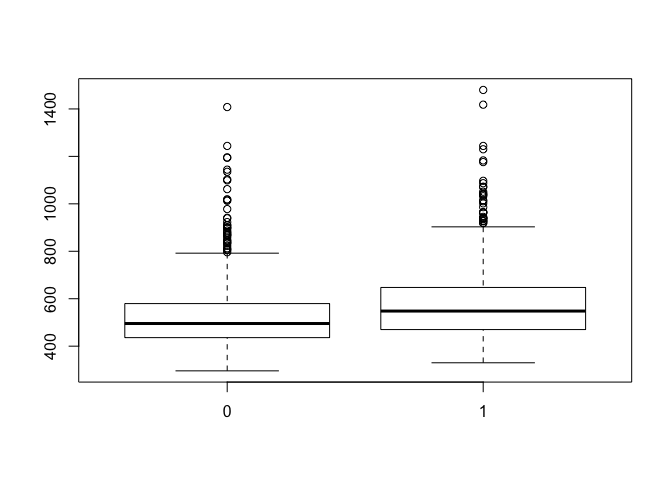
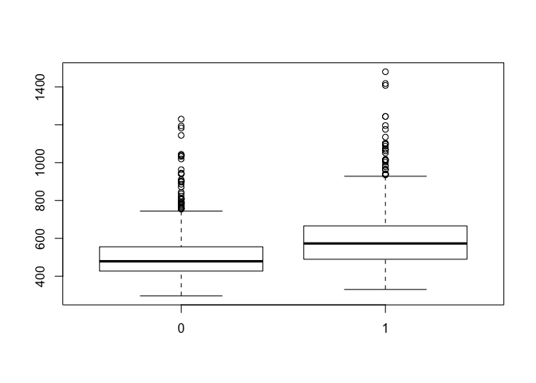
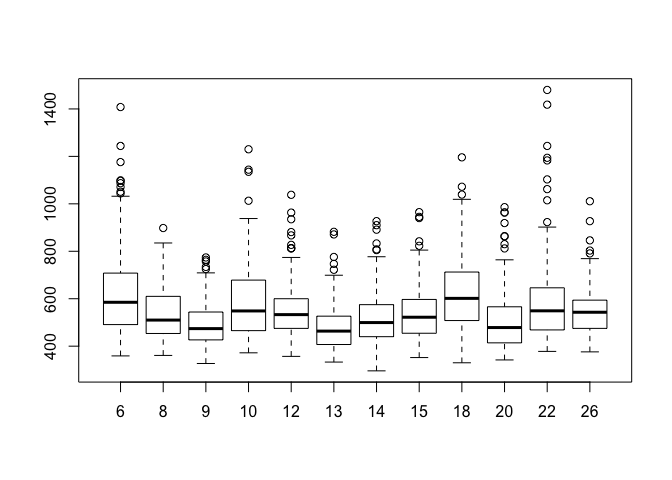

Reaction times in video games
-----------------------------

Learning goals:  
\* model a numerical outcome in terms of multiple categorical
predictors  
\* understand the appropriate use and interpretation of dummy variables
and interaction terms

Data files:  
\* [rxntime.csv](http://jgscott.github.io/teaching/data/rxntime.csv):
data on a neuroscience experiment measuring people's reaction time to
visual stimuli

### More than one categorical predictor

The reaction-time data set comes from an experiment run by a British
video-game manufacturer in an attempt to calibrate the level of
difficulty of certain tasks in the video game. Subjects in this
experiment were presented with a simple "Where's Waldo?"-style visual
scene. The subjects had to find a number (1 or 2) floating somewhere in
the scene, to identify the number, and to press the corresponding button
as quickly as possible. The response variable is their reaction time.
The predictors are different characteristics of the visual scene.

You'll need the mosaic library, so make sure to load it first.

    library(mosaic)

    rxntime = read.csv('rxntime.csv')
    summary(rxntime)

    ##     Subject         Session         Trial       CorrectAnswer
    ##  Min.   : 6.00   Min.   :1.00   Min.   : 1.00   Min.   :1.0  
    ##  1st Qu.: 9.75   1st Qu.:1.75   1st Qu.:10.75   1st Qu.:1.0  
    ##  Median :13.50   Median :2.50   Median :20.50   Median :1.5  
    ##  Mean   :14.42   Mean   :2.50   Mean   :20.50   Mean   :1.5  
    ##  3rd Qu.:18.50   3rd Qu.:3.25   3rd Qu.:30.25   3rd Qu.:2.0  
    ##  Max.   :26.00   Max.   :4.00   Max.   :40.00   Max.   :2.0  
    ##                                                              
    ##     FarAway       Littered   PictureTarget.ACC PictureTarget.RT
    ##  Min.   :0.0   Min.   :0.0   Min.   :0.0000    Min.   : 296.0  
    ##  1st Qu.:0.0   1st Qu.:0.0   1st Qu.:1.0000    1st Qu.: 451.0  
    ##  Median :0.5   Median :0.5   Median :1.0000    Median : 522.0  
    ##  Mean   :0.5   Mean   :0.5   Mean   :0.9896    Mean   : 550.4  
    ##  3rd Qu.:1.0   3rd Qu.:1.0   3rd Qu.:1.0000    3rd Qu.: 610.0  
    ##  Max.   :1.0   Max.   :1.0   Max.   :1.0000    Max.   :1480.0  
    ##                                                                
    ##  SceneLetter    Side          Target       TrialList    
    ##  b:384       left :960   00lb.bmp:  48   Min.   : 1.00  
    ##  c:384       right:960   00lc.bmp:  48   1st Qu.:10.75  
    ##  d:384                   00ld.bmp:  48   Median :20.50  
    ##  e:384                   00le.bmp:  48   Mean   :20.50  
    ##  f:384                   00lf.bmp:  48   3rd Qu.:30.25  
    ##                          00rb.bmp:  48   Max.   :40.00  
    ##                          (Other) :1632

The variables of interest for us are:  
\* PictureTarget.RT: the subject's reaction time in milliseconds.  
\* Subject: a numerical identifier for the subject undergoing the
test.  
\* FarAway: a dummy variable. Was the number to be identified far away
(1) or near (0) in the visual scene?  
\* Littered: the British way of saying whether the scene was cluttered
(1) or mostly free of clutter (0).

First let's look at some plots to show between-group and within-group
variation for the three predictors:

    boxplot(PictureTarget.RT ~ FarAway, data=rxntime)

    boxplot(PictureTarget.RT ~ Littered, data=rxntime)

    boxplot(PictureTarget.RT ~ factor(Subject), data=rxntime)

### Main effects

Our first model will use whether the scene was littered as a predictor:

    lm1 = lm(PictureTarget.RT ~ Littered, data=rxntime)

Remember baseline/offset form: the coefficients of this model are simply
a different way of expressing the group means for the littered and
unlittered scenes:

    mean(PictureTarget.RT ~ Littered, data=rxntime)

    ##        0        1 
    ## 506.7104 594.1740

    coef(lm1)

    ## (Intercept)    Littered 
    ##   506.71042    87.46354

    # Add the baseline and offset to get the second group mean
    506.71042 + 87.46354 

    ## [1] 594.174

Now we will add a second dummy variable for whether the number to be
identified was near or far away:

    lm2 = lm(PictureTarget.RT ~ Littered + FarAway, data=rxntime)
    coef(lm2)

    ## (Intercept)    Littered     FarAway 
    ##   481.64323    87.46354    50.13437

This model says that the predicted "baseline" reaction time (for
unlittered scenes with a nearby target) is 481.6 ms. For scenes that
were littered, we'd predict a reaction time 87.5 ms longer than the
baseline. For scenes with a far-away target, we'd predict a reaction
time 50.1 ms longer than baseline. For scenes that are both littered
*and* far away, the model tells us to simply add the sum of the two
individual effects:

    87.46354 + 50.13437

    ## [1] 137.5979

So according to the model, we'd predict these scenes to be 137.6 ms
longer than baseline.

For reasons that will become clear in a moment, we refer to the Littered
and FarAway coefficients as the "main effects" of the model.

### Interactions

The model we just fit assumed that the Littered and FarAway variables
had individual additive effects on the response. However, what if scenes
that are both Littered and FarAway are even harder than we'd expect
based on the individual Littered and FarAway effects? If we think this
may be the case, we should consider adding an interaction term to the
model:

    lm3 = lm(PictureTarget.RT ~ Littered + FarAway + Littered:FarAway, data=rxntime)
    summary(lm3)

    ## 
    ## Call:
    ## lm(formula = PictureTarget.RT ~ Littered + FarAway + Littered:FarAway, 
    ##     data = rxntime)
    ## 
    ## Residuals:
    ##    Min     1Q Median     3Q    Max 
    ## -296.0  -84.0  -26.0   56.6  851.0 
    ## 
    ## Coefficients:
    ##                  Estimate Std. Error t value Pr(>|t|)    
    ## (Intercept)       491.423      6.092  80.671  < 2e-16 ***
    ## Littered           67.904      8.615   7.882 5.35e-15 ***
    ## FarAway            30.575      8.615   3.549 0.000396 ***
    ## Littered:FarAway   39.119     12.183   3.211 0.001345 ** 
    ## ---
    ## Signif. codes:  0 '***' 0.001 '**' 0.01 '*' 0.05 '.' 0.1 ' ' 1
    ## 
    ## Residual standard error: 133.5 on 1916 degrees of freedom
    ## Multiple R-squared:  0.1292, Adjusted R-squared:  0.1278 
    ## F-statistic: 94.73 on 3 and 1916 DF,  p-value: < 2.2e-16

As before, the first two terms are called "main effects." The last term
in the model is an interaction variable, with an estimated coefficient
of 39.1. It allows the joint effect of the two predictors to be
different than the sum of the individual (main) effects.

To understand the output, let's work our way through the predictions of
the above model based on the fitted coefficients:  
\* Baseline scenes: (Littered=0, FarAway=0): baseline only (491.4 ms)  
\* Littered=1, FarAway=0 scenes: add the baseline and the Littered main
effect (491.4 + 67.9 = 559.3 ms)  
\* FarAway=1, Littered=0 scenes: add the baseline and the FarAway main
effect (491.4 + 30.6 = 522 ms)  
\* Littered=1, FarAway=1 scenes: add the baseline, both main effects,
and the interaction term (491.4 + 67.9 + 30.6 + 39.1 = 629 ms)

Notice that to get the prediction for scenes that are both littered and
far away, we add the baseline, both main effects, and the interaction
term. The resulting predictions match up exactly with the group means we
calculate if we stratify the scenes into all four possible combinations
of Littered and FarAway:

    mean(PictureTarget.RT ~ Littered + FarAway, data=rxntime)

    ##      0.0      1.0      0.1      1.1 
    ## 491.4229 559.3271 521.9979 629.0208

A reasonable question is: why bother with the extra complexity of main
effects and interactions if all we're doing is computing the group-wise
means for all four combinations of the two variables?

In fact, if we have only these two variables, there isn't really a
compelling reason to do so. However, let's suppose we wanted to add a
third variable:

    lm4 = lm(PictureTarget.RT ~ Littered + FarAway + Littered:FarAway + factor(Subject), data=rxntime)
    summary(lm4)

    ## 
    ## Call:
    ## lm(formula = PictureTarget.RT ~ Littered + FarAway + Littered:FarAway + 
    ##     factor(Subject), data = rxntime)
    ## 
    ## Residuals:
    ##     Min      1Q  Median      3Q     Max 
    ## -299.84  -78.71  -18.70   49.99  807.29 
    ## 
    ## Coefficients:
    ##                   Estimate Std. Error t value Pr(>|t|)    
    ## (Intercept)        569.549     11.104  51.290  < 2e-16 ***
    ## Littered            67.904      8.110   8.373  < 2e-16 ***
    ## FarAway             30.575      8.110   3.770 0.000168 ***
    ## factor(Subject)8   -89.519     14.046  -6.373 2.32e-10 ***
    ## factor(Subject)9  -135.969     14.046  -9.680  < 2e-16 ***
    ## factor(Subject)10  -44.119     14.046  -3.141 0.001710 ** 
    ## factor(Subject)12  -76.137     14.046  -5.421 6.70e-08 ***
    ## factor(Subject)13 -147.381     14.046 -10.493  < 2e-16 ***
    ## factor(Subject)14 -112.488     14.046  -8.008 2.00e-15 ***
    ## factor(Subject)15  -92.894     14.046  -6.613 4.86e-11 ***
    ## factor(Subject)18   -7.613     14.046  -0.542 0.587905    
    ## factor(Subject)20 -117.662     14.046  -8.377  < 2e-16 ***
    ## factor(Subject)22  -34.438     14.046  -2.452 0.014306 *  
    ## factor(Subject)26  -79.300     14.046  -5.646 1.89e-08 ***
    ## Littered:FarAway    39.119     11.469   3.411 0.000661 ***
    ## ---
    ## Signif. codes:  0 '***' 0.001 '**' 0.01 '*' 0.05 '.' 0.1 ' ' 1
    ## 
    ## Residual standard error: 125.6 on 1905 degrees of freedom
    ## Multiple R-squared:  0.2328, Adjusted R-squared:  0.2271 
    ## F-statistic: 41.29 on 14 and 1905 DF,  p-value: < 2.2e-16

Now we've added subject-level dummy variables to account for
between-subject variability, and R-squared has jumped from 13% to 23%.
But we're still assuming that the effect of the Littered and FarAway
variables is the same for every subject. Thus we have 15 parameters to
estimate: an intercept/baseline, two main effects for Littered and
FarAway, one interaction term, and 11 subject-level dummy variables.
Suppose that instead we were to look at all possible combinations of
subject, Littered, and FarAway variables, and compute the groupwise
means:

    mean(PictureTarget.RT ~ Littered + FarAway + factor(Subject), data=rxntime)

    ##   0.0.6   1.0.6   0.1.6   1.1.6   0.0.8   1.0.8   0.1.8   1.1.8   0.0.9 
    ## 517.850 671.425 571.075 753.925 479.750 555.175 506.375 614.900 435.525 
    ##   1.0.9   0.1.9   1.1.9  0.0.10  1.0.10  0.1.10  1.1.10  0.0.12  1.0.12 
    ## 524.325 456.950 553.600 517.975 576.300 566.625 676.900 482.750 575.225 
    ##  0.1.12  1.1.12  0.0.13  1.0.13  0.1.13  1.1.13  0.0.14  1.0.14  0.1.14 
    ## 520.100 631.650 451.200 483.600 464.025 525.925 484.725 503.525 503.925 
    ##  1.1.14  0.0.15  1.0.15  0.1.15  1.1.15  0.0.18  1.0.18  0.1.18  1.1.18 
    ## 572.150 481.500 516.600 537.375 607.225 566.450 652.450 583.325 681.600 
    ##  0.0.20  1.0.20  0.1.20  1.1.20  0.0.22  1.0.22  0.1.22  1.1.22  0.0.26 
    ## 427.825 501.575 476.075 638.150 551.900 603.800 544.225 676.600 499.625 
    ##  1.0.26  0.1.26  1.1.26 
    ## 547.925 533.900 615.625

Now we've got 48 parameters to estimate: the group mean for each
combination of 12 subjects and 4 experimental conditions. Moreover,
we're now implicitly assuming that the Littered and FarAway variables
affect each person in a different way, rather than all people in the
same way. There's no way to reproduce the output of the model we just
fit (`lm4`) by computing group-wise means.

This should convey the power of using dummies and interactions to
express how a response variable changes as a function of several
grouping variables. It allows us to be selective: some variables may
interact with each other, while other variables have only a "main
effect" that holds across the entire data set, regardless of what values
the other predictors take.

The choice of which variables fall in which category can be guided both
by the data itself and by knowledge of the problem at hand. This is an
important modeling decision---one which we'll study carefully.

### Analysis of variance

Finally, what if we wanted to quantify how much each predictor was
contributing to the overall explanatory power of the model? A natural
way to do so is to compute the amount by which the addition of each
predictor reduces the unpredictable (residual) variation, compared to a
model without that predictor. R's \`anova' function computes this for
us:

    anova(lm4)

    ## Analysis of Variance Table
    ## 
    ## Response: PictureTarget.RT
    ##                    Df   Sum Sq Mean Sq F value    Pr(>F)    
    ## Littered            1  3671938 3671938 232.646 < 2.2e-16 ***
    ## FarAway             1  1206459 1206459  76.439 < 2.2e-16 ***
    ## factor(Subject)    11  4060822  369166  23.390 < 2.2e-16 ***
    ## Littered:FarAway    1   183633  183633  11.635 0.0006609 ***
    ## Residuals        1905 30067371   15783                      
    ## ---
    ## Signif. codes:  0 '***' 0.001 '**' 0.01 '*' 0.05 '.' 0.1 ' ' 1

The "Sum Sq" (for sums of squares) column in the one that interests us.
This column is computed by adding the predictors sequentially and
asking: by how much did the residual sum of squares drop when this
predictor was added to the previous model? (Remember the variance
decomposition here.) The larger the entry in the "Sum Sq" column, the
more that variable improved the predictive ability of the model. The
final entry (Residuals) tells you the residual sums of squares after all
variables were added. This serves as a useful basis for comparison when
trying to interpret the magnitude of the other entries in this column.

This breakdown of the sums of squares into its constituent parts is
called the "analysis of variance" for the model, or "ANOVA" for short.

### A modified ANOVA table

However, I've always found R's basic `anova` table to be kind of hard to
read. After all, how is a normal human being supposed to interpret sums
of squares? The number are on a completely non-intuitive scale.

So I coded up a different version of an ANOVA table, called
`simple_anova`, which you can find on my website. The following code
snippet shows you how to source this function directly into R; this is
kind of like loading a library, except less official :-)

    # Load some useful utility functions
    source('http://jgscott.github.io/teaching/r/utils/class_utils.R')

Now you can call the `simple_anova` function in the same way you call
the `anova` one:

    simple_anova(lm4)

    ##                    Df       R2 R2_improve     sd sd_improve       pval
    ## Intercept           1 0.000000            142.91                      
    ## Littered            1 0.093695   0.093695 136.08     6.8240 0.00000000
    ## FarAway             1 0.124480   0.030785 133.79     2.2963 0.00000000
    ## factor(Subject)    11 0.228098   0.103618 125.98     7.8041 0.00000000
    ## Littered:FarAway    1 0.232784   0.004686 125.63     0.3500 0.00066088
    ## Residuals        1905

As before, each row involves adding a variable to the model. But the
output is a little different. There are six columns:  
- Df: how many degrees of freedom (i.e. parameters added to the model)
did this variable use?  
- R2: what was the R-squared of the model?  
- R2\_improve: how much did R-squared improve (go up), compared to the
previous model, when we added this variable?  
- sd: what was the residual standard deviation of the model?  
- sd\_improve: how much did the residual standard deviation improve (go
down), compared to the previous model, when we added this variable?  
- pval: don't worry about this for now, but this corresponds to a
hypothesis test (specifically, an F test) about whether the variable
appears to have a statistically significant partial relationship with
the response.

For me, at least, these quantities convey a lot more useful information
than the basic `anova` table. Just remember that if you want to use the
`simple_anova` command in the future, you'll always have to preface it
by sourcing the function using the command we saw above:

    # Put this at the top of any script where you use "simple_anova"  
    source('http://jgscott.github.io/teaching/r/utils/class_utils.R')
