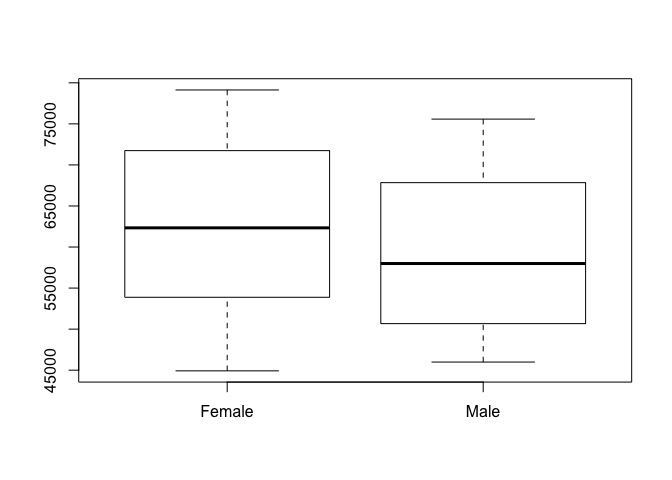
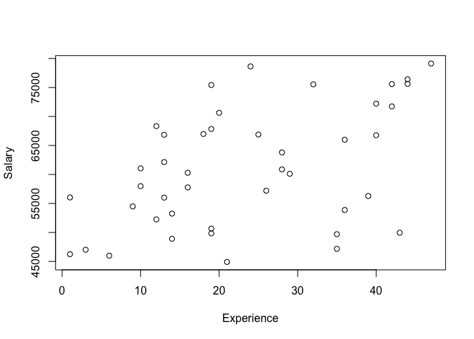
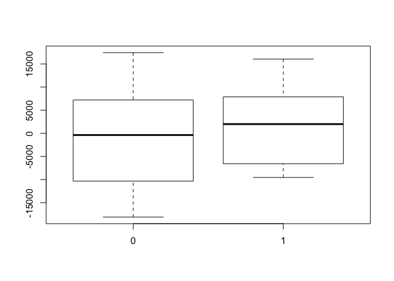
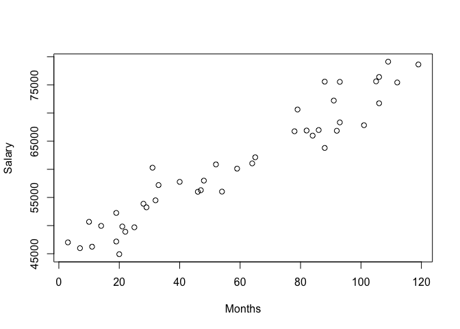
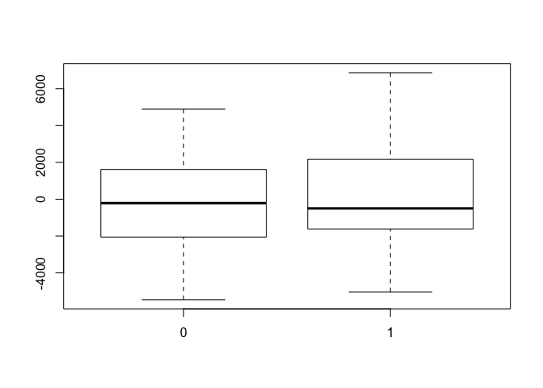
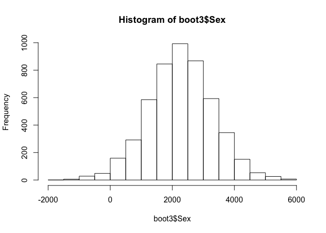

### Example: predictors of white-collar salaries

In this walk-through, we'll look at whether there seems to be a "wage
gap" at a tech firm between male and female employees with similar
qualifications. We will use multiple regression to adjust for the effect
of education and experience in evaluating the correlation between an
employee's sex and his or her annual salary.

Learning goals:  
\* fit a multiple regression model  
\* correctly interpret the estimated coefficients  
\* quantify uncertainty about parameters in a multiple-regression model
using bootstrapping

Data files:  
\* [salary.csv](salary.csv): human-resources data on employees at a tech
firm.

First load the mosaic library and read in the data.

    library(mosaic)

The variables we'll use from this data set are:  
\* Salary: annual salary in dollars  
\* Experience: months of experience at the particular company  
\* Months: total months of work experience, including all previous
jobs  
\* Sex: whether the employee is male or female

Let's first Look at the distibution of salary by sex.

    mean(Salary~Sex,data=salary)

    ##        0        1 
    ## 62610.45 59381.90

    boxplot(Salary~Sex,data=salary, names=c("Female", "Male"))

<!-- -->

Upon first glance, it looks as though women are paid more at this
company than men, on average.

### Statistical adjustment for experience.

However, does the story change if we adjust for work experience?

    plot(Salary~Experience, data=salary)

<!-- -->

    lm1 = lm(Salary~Experience, data=salary)
    coef(lm1)

    ## (Intercept)  Experience 
    ##  52516.6821    361.5327

We expect experienced workers to be paid more, all else being equal. How
do these residuals---that is, salary adjusted for experience---look when
we stratify them by sex?

    boxplot(resid(lm1)~salary$Sex)

<!-- -->

Now it looks like men are being paid more than women for an equivalent
amount of work experience, since men have a positive residual, on
average. The story is similar if we look at overall work experience,
including jobs prior to the one with this particular company:

    plot(Salary~Months, data=salary)

<!-- -->

    lm2 = lm(Salary~Months, data=salary)
    coef(lm2)

    ## (Intercept)      Months 
    ##  44807.1515    277.8743

The story in the residuals is similar: the distribution of adjusted
salaries for men is shifted upward compared to that for women.

    boxplot(resid(lm2)~salary$Sex)

<!-- -->

### Fitting a multiple regression model by least squares

To get at the partial relationship between gender and salary, we must
fit multiple-regression model that accounts for experience with the
company and total number of months of professional work. It is
straightforward to fit such a model by least squares in R.

    lm3 = lm(Salary ~ Experience + Months + Sex, data=salary)
    coef(lm3)

    ## (Intercept)  Experience      Months         Sex 
    ##  41348.0287    125.8495    265.5492   2485.9645

According to this model, men are paid $2486 more per year than women
with similar levels of work experience, both overall and with this
particular company.

### Bootstrapping a multiple regression model

We can quantify our uncertainty about this effect via bootstrapping:

    boot3 = do(10000)*{
      lm(Salary~Experience+Education+Sex, data=resample(salary))
    }
    hist(boot3$Sex)

<!-- -->

    confint(boot3)

    ## Warning: confint: Using df=Inf.

    ##         name         lower        upper level method     estimate
    ## 1  Intercept  3.011667e+04 5.542272e+04  0.95 stderr 4.292237e+04
    ## 2 Experience  2.114495e+02 6.492590e+02  0.95 stderr 4.394266e+02
    ## 3  Education -6.234819e+02 3.843099e+03  0.95 stderr 1.533799e+03
    ## 4        Sex -2.607113e+03 9.782201e+03  0.95 stderr 3.544613e+03
    ## 5      sigma  6.945121e+03 1.045042e+04  0.95 stderr 9.092978e+03
    ## 6  r.squared  6.212497e-02 5.352548e-01  0.95 stderr 2.640703e-01
    ## 7          F -1.298750e+00 1.363493e+01  0.95 stderr 4.664730e+00
    ##   margin.of.error
    ## 1    1.265302e+04
    ## 2    2.189047e+02
    ## 3    2.233291e+03
    ## 4    6.194657e+03
    ## 5    1.752648e+03
    ## 6    2.365649e-01
    ## 7    7.466838e+00

In this case, the bootstrapped confidence interval runs from about
-$2600 to about $9600. Thus while there is the suggestion of higher
salaries for men, we cannot rule the hypothesis that there is no overall
difference (i.e. a coefficient of zero on the dummy variable) on
average.
