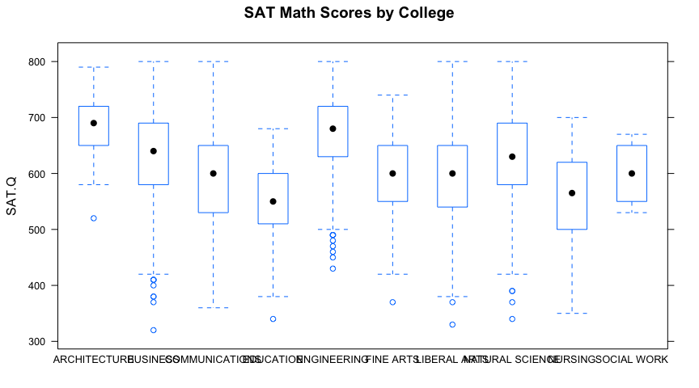
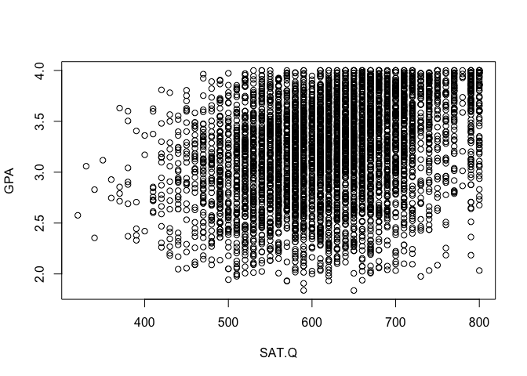
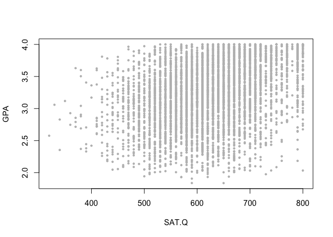
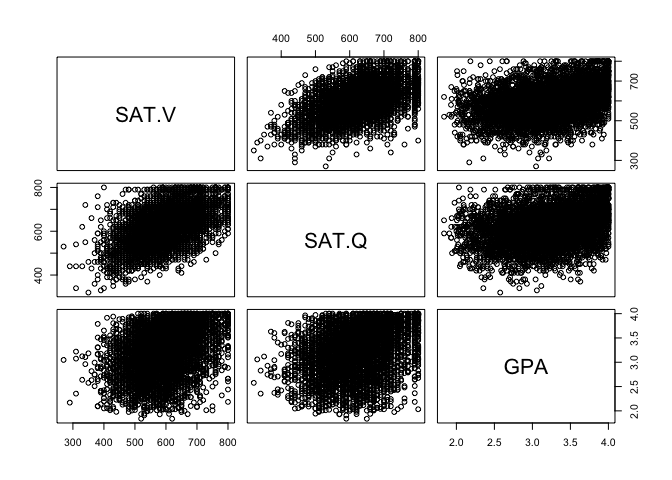
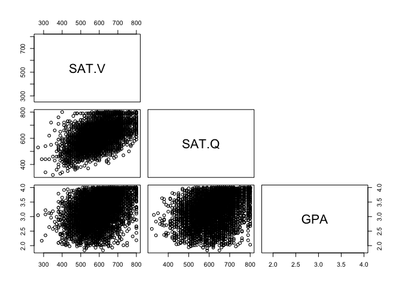
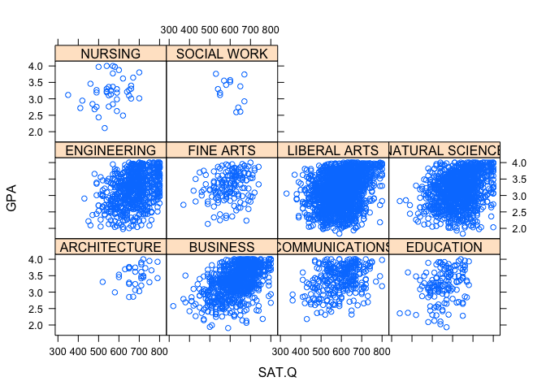
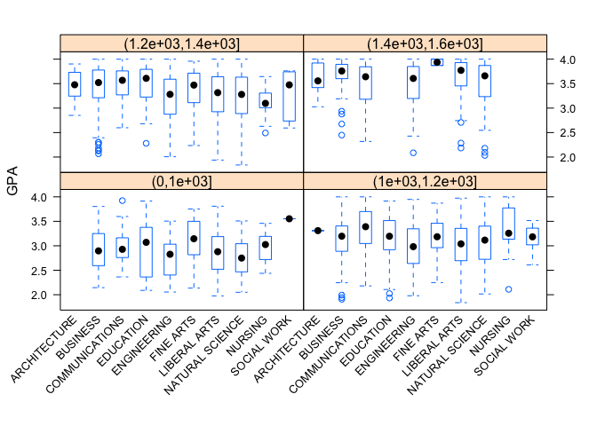

Test scores and GPA for UT graduates
------------------------------------

In this walk-through, you'll learn how to summarize and visualize the
following kinds of relationships:  
- between a numerical variable and a categorical variable, via
group-wise means and boxplots.  
- between two numerical variables, via scatter plots and correlation
coefficients.  
- three variables, using lattice plots.

You will also learn how to change more of the default plot settings in R
plots.

You'll need this data file:  
\* [ut2000.csv](http://jgscott.github.io/teaching/data/ut2000.csv): data
on SAT scores and graduating GPA for every student who entered the
University of Texas at Austin in the fall of 2000 and went on to
graduate within 6 years.

### Preliminaries

First, in order to complete this analysis we need to load in the
`mosaic` library from within RStudio:

    library(mosaic)

Next, download the ut2000.csv file and read it in.

    ut2000 = read.csv('ut2000.csv')
    summary(ut2000)

    ##      SAT.V         SAT.Q         SAT.C                  School    
    ##  Min.   :270   Min.   :320   Min.   : 650   LIBERAL ARTS   :1847  
    ##  1st Qu.:540   1st Qu.:560   1st Qu.:1120   NATURAL SCIENCE:1125  
    ##  Median :590   Median :620   Median :1210   BUSINESS       : 832  
    ##  Mean   :595   Mean   :620   Mean   :1215   ENGINEERING    : 695  
    ##  3rd Qu.:650   3rd Qu.:680   3rd Qu.:1320   COMMUNICATIONS : 306  
    ##  Max.   :800   Max.   :800   Max.   :1600   FINE ARTS      : 156  
    ##                                             (Other)        : 230  
    ##       GPA        Status  
    ##  Min.   :1.837   G:5191  
    ##  1st Qu.:2.872           
    ##  Median :3.252           
    ##  Mean   :3.212           
    ##  3rd Qu.:3.595           
    ##  Max.   :4.000           
    ## 

### Between-group and within-group variation

School (which of the 10 different undergraduate schools at UT the
student graduated from) is a natural grouping variable here. To see both
the between-group and within-group variation, let's examine a boxplot of
SAT math scores (SAT.Q) versus school.

    bwplot(SAT.Q ~ School, data=ut2000, main="SAT Math Scores by College")

The `bwplot` command is available because we loaded the `mosaic` package
(if you didn't do this, the bwplot command will produce only an error).
The aesthetics of `bwplot` are a little nicer than the basic R command
`boxplot`, which would also work just fine. You may also notice the
names of the colleges along the x axis running together, which you can
fix by clicking "Zoom" in the Plots tab and manually resizing the
window.

The boxplot allows you to get a sense of whether the between-group or
within-group variation of SAT math scores is larger.  
- Between-group variation: how much do the central dots for each group
differ from one another?  
- Within-group variation: how spread out are the cases within each
group?

Let's first focus the between-group variation, by examining how the
group means differ from one another.

    mean(SAT.Q ~ School, data=ut2000)

    ##    ARCHITECTURE        BUSINESS  COMMUNICATIONS       EDUCATION 
    ##        684.6875        632.9207        591.6340        554.6479 
    ##     ENGINEERING       FINE ARTS    LIBERAL ARTS NATURAL SCIENCE 
    ##        675.1655        597.1795        597.5041        632.9067 
    ##         NURSING     SOCIAL WORK 
    ##        561.1905        602.1429

Informally, it looks like the typical difference between group means is
about 40 points.

We can also examine the within-group variation, by looking at the
standard deviation of SAT math scores within each college:

    sd(SAT.Q ~ School, data=ut2000)

    ##    ARCHITECTURE        BUSINESS  COMMUNICATIONS       EDUCATION 
    ##        59.35048        81.71892        82.62860        66.81893 
    ##     ENGINEERING       FINE ARTS    LIBERAL ARTS NATURAL SCIENCE 
    ##        74.23923        71.53429        76.69357        79.47781 
    ##         NURSING     SOCIAL WORK 
    ##        78.46709        49.64157

It looks as if SAT math scores vary most within Communications, and
least within Social Work.

The `favstats` command will compute both the mean and standard
deviation, along with several of your favorite statistics (like the
minimum/maximum values, the first and third quartiles, and the median),
for each college:

    favstats(SAT.Q ~ School, data=ut2000)

    ##             School min    Q1 median    Q3 max     mean       sd    n
    ## 1     ARCHITECTURE 520 650.0    690 720.0 790 684.6875 59.35048   32
    ## 2         BUSINESS 320 580.0    640 690.0 800 632.9207 81.71892  832
    ## 3   COMMUNICATIONS 360 532.5    600 650.0 800 591.6340 82.62860  306
    ## 4        EDUCATION 340 510.0    550 597.5 680 554.6479 66.81893  142
    ## 5      ENGINEERING 430 630.0    680 720.0 800 675.1655 74.23923  695
    ## 6        FINE ARTS 370 550.0    600 650.0 740 597.1795 71.53429  156
    ## 7     LIBERAL ARTS 330 540.0    600 650.0 800 597.5041 76.69357 1847
    ## 8  NATURAL SCIENCE 340 580.0    630 690.0 800 632.9067 79.47781 1125
    ## 9          NURSING 350 507.5    565 615.0 700 561.1905 78.46709   42
    ## 10     SOCIAL WORK 530 555.0    600 647.5 670 602.1429 49.64157   14
    ##    missing
    ## 1        0
    ## 2        0
    ## 3        0
    ## 4        0
    ## 5        0
    ## 6        0
    ## 7        0
    ## 8        0
    ## 9        0
    ## 10       0

### Two numerical variables

Our basic tool for visualizing the relationship between two numerical
variables is the scatter plot. Let's make one which shows graduating GPA
versus SAT math scores for all students.

    plot(GPA ~ SAT.Q, data=ut2000)

If you want to get fancy, you can change the type of mark (pch), size
(cex), or color (col) of the plotted points:

    plot(GPA ~ SAT.Q, data=ut2000, pch=19, cex=0.5, col='grey')

 Try `?plot`,
`?points`, and `?par` to see some more of the plotting options.

To compute a correlation coefficient, use the `cor` function:

    cor(GPA ~ SAT.Q, data=ut2000)

    ## [1] 0.3164184

### Scatter plot matrix

To visualize the relationships among three or more numerical variables,
we can create a pairs plot showing each bivariate relationship. In this
case, we'll make a matrix of scatter plots corresponding to the 1st,
2nd, and 5th columns of the `ut2000` data set (for SAT Verbal, SAT Math,
and GPA, respectively):

    pairs(ut2000[,c(1,2,5)])

 The
brackets to the right of our data set, `ut2000[,c(1,2,5)]`, say "give me
all rows from the 1st, 2nd, and 5th columns." If you wanted, say, the
first 100 rows of these columns, you'd use `ut2000[1:100,c(1,2,5)]`. But
because we left the row index blank in the command above, R gives us all
the rows by default.

You might find this pairs plot redundant---for example, the plot of
SAT.V versus GPA (row 1, column 3) contains the same information as the
plot of GPA versus SAT.V (row 3, column 1). We've just flipped which
variable appears on the vertical axis. To suppress this redundancy, pass
in the following flag:

    pairs(ut2000[,c(1,2,5)], upper.panel=NULL)

### Lattice plots

Finally, if we want to see this bivariate relationship plotted
separately for each of the 10 colleges, we need what's called a lattice
plot. A lattice plot allows us to see whether, and how, the relationship
between two variables is modulated by a third variable. The `xyplot`
command produces one:

    xyplot(GPA ~ SAT.Q | School, data=ut2000)

 The
vertical bar (|) should be read as "conditional upon" or "stratified
by." In this case, the GPA versus SAT.Q relationship looks broadly
similar across all colleges.

We can also make a lattice of boxplots. For example, we might be
interested the relationship between graduating GPA and college depends
on a student's incoming SAT score. We can do this by discretizing SAT
score into intervals. (You'll remember we did this using the `cut`
function in an [earlier
walkthrough](http://jgscott.github.io/teaching/r/titanic/titanic.html).)
We can then use these intervals to define a lattice plot.

    ut2000$SATcat = cut(ut2000$SAT.C, breaks=c(0, 1000, 1200, 1400, 1600))
    bwplot(GPA ~ School | SATcat, data=ut2000)

This is really ugly because all the axis labels are running together. We
can rotate the college labels to 45 degrees using the (admittedly also
ugly) command below:

    bwplot(GPA ~ School | SATcat, data=ut2000, scales=list(x=list(rot=45)))

