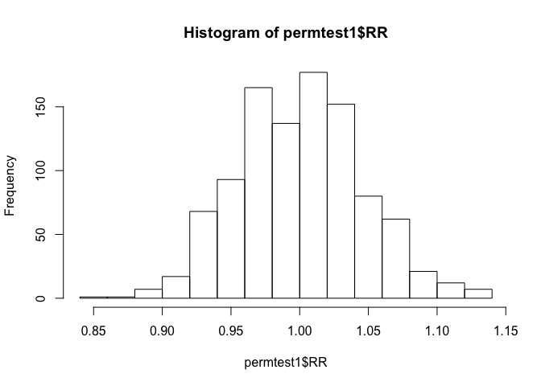
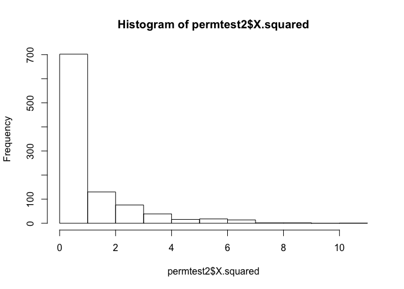

### Tests of association in 2x2 tables

In this walk-through, you will revisit the Titanic data to learn about
permutation tests in the context of a 2x2 contingency table.

Data files:  
\*
[TitanicSurvival.csv](http://jgscott.github.io/teaching/data/TitanicSurvival.csv)

First download the TitanicSurvival.csv file and read it in. You can use
RStudio's Import Dataset button, or the read.csv command:

    library(mosaic)
    TitanicSurvival = read.csv('TitanicSurvival.csv')

Recall that this data set shows the name of each passenger and whether
they survived, along with their age, sex, and cabin class.

    head(TitanicSurvival)

    ##                                 X survived    sex     age passengerClass
    ## 1   Allen, Miss. Elisabeth Walton      yes female 29.0000            1st
    ## 2  Allison, Master. Hudson Trevor      yes   male  0.9167            1st
    ## 3    Allison, Miss. Helen Loraine       no female  2.0000            1st
    ## 4 Allison, Mr. Hudson Joshua Crei       no   male 30.0000            1st
    ## 5 Allison, Mrs. Hudson J C (Bessi       no female 25.0000            1st
    ## 6             Anderson, Mr. Harry      yes   male 48.0000            1st

### Relative risk in 2x2 tables

One of the very first contingency tables we made looked at survival
status stratified by sex:

    t1 = xtabs(~sex + survived, data=TitanicSurvival)
    prop.table(t1, margin=1)

    ##         survived
    ## sex             no       yes
    ##   female 0.2725322 0.7274678
    ##   male   0.8090154 0.1909846

This seems to suggest a strong association between survival status and
sex. A natural *test statistic* to quantify this association between the
rows and columns of this table is the [relative
risk](http://en.wikipedia.org/wiki/Relative_risk) of dying: that is, the
probability of dying for men, divided by the probability of dying for
women. We can compute this as follows:

    # Save the table output in an object called t1
    t1 = xtabs(~sex + survived, data=TitanicSurvival)
    # Convert to proportions normalized by row
    p1 = prop.table(t1, margin=1)
    # Calculate the relative risk of dying for both men and women
    # in terms of the individual cells of the table
    risk_female = p1[1,1]
    risk_male = p1[2,1]
    relative_risk = risk_male/risk_female
    relative_risk

    ## [1] 2.968513

The relative risk says that men were about 3 times as likely to die as
women. There's also shortcut way to calculate this number:

    t1 = xtabs(~sex + survived, data=TitanicSurvival)
    relrisk(t1)

    ## [1] 2.968513

Note that the `relrisk` function expects the predictor variable to be
along the rows and the outcome variable to be along the columns. If you
get this wrong, you'll calculate the incorrect relative risk.

### Permutation tests: shuffling the cards

A natural follow-up question is: could this association have arisen due
to chance? One way of addressing this is by something called a
permutation test, which explicitly breaks any association between the
predictor and the response by "shuffling the cards." We will build up
this idea in stages.

First let's create a simple data set with two variables called
"sesame\_street" and "army":

    sesame_street = c('A', 'B', 'C', 'D', 'E')
    army = c('alpha', 'bravo', 'charlie', 'delta', 'echo')
    data.frame(sesame_street, army)

    ##   sesame_street    army
    ## 1             A   alpha
    ## 2             B   bravo
    ## 3             C charlie
    ## 4             D   delta
    ## 5             E    echo

If we look along the rows of this data set, we see a perfect
correspondence between the Sesame Street and Army versions of the
alphabet. However, we can break this correspondence by shuffling one set
of letters:

    data.frame(shuffle(sesame_street), army)

    ##   shuffle.sesame_street.    army
    ## 1                      B   alpha
    ## 2                      A   bravo
    ## 3                      E charlie
    ## 4                      D   delta
    ## 5                      C    echo

Try executing the line above a few times. Each time you'll get a
different permutation of the Sesame Street alphabet, and therefore a
data frame in which the correspondence in the original data set has been
broken.

We can do the same thing for the Titanic data. Try this block a few
different times:

    titanic_shuffle = data.frame(shuffle(TitanicSurvival$sex), TitanicSurvival$survived)
    # Look at the first 10 lines
    head(titanic_shuffle, 10)

    ##    shuffle.TitanicSurvival.sex. TitanicSurvival.survived
    ## 1                          male                      yes
    ## 2                        female                      yes
    ## 3                        female                       no
    ## 4                          male                       no
    ## 5                          male                       no
    ## 6                        female                      yes
    ## 7                        female                      yes
    ## 8                          male                       no
    ## 9                          male                      yes
    ## 10                         male                       no

In this new data frame `titanic_shuffle`, any connection between sex and
survival status has been explicitly broken. This simple trick of
"shuffling the cards" allows us to assess the plausible range of values
for the relative risk under the assumption that there is no association
between the two variables. We can do this a little more concisely as
follows:

    t1_shuffle = xtabs(~shuffle(sex) + survived, data=TitanicSurvival)
    relrisk(t1_shuffle)

    ## [1] 1.055864

Try executing the code block above a few times. You notice that each
time you calculate the relative risk, you get something much closer to 1
than for the actual data. Let's use a Monte Carlo simulation to repeat
this process 1000 times. This will allow us to make a histogram that
shows the sampling distribution of the relative risk under the null
hypothesis of no assocation between sex and survival status.

    permtest1 = do(1000)*{
      t1_shuffle = xtabs(~shuffle(sex) + survived, data=TitanicSurvival)
      relrisk(t1_shuffle)
    }
    head(permtest1)

    ##          RR
    ## 1 0.9683185
    ## 2 1.0793482
    ## 3 0.9787371
    ## 4 0.9735100
    ## 5 0.9735100
    ## 6 0.9946352

    hist(permtest1$RR)

When the cards are shuffled -- and therefore when any possible
connection between sex and survival status is explicitly broken -- the
relative risk almost never falls outside the interval (0.85, 1.15). This
is pretty convincing evidence that the actual value we observed (about
3) could not have arisen due to chance:

    # actual relative risk:
    t1 = xtabs(~sex + survived, data=TitanicSurvival)
    relrisk(t1)

    ## [1] 2.968513

    # P value
    # upper tail area of sampling distribution under null hypothesis:
    pdata(permtest1$RR, relrisk(t1), lower=FALSE)

    ## RR 
    ##  0

From this simple `pdata` calculation, you can see that literally none of
the relative risks we calculated under the permutation test
(`permtest1$RR`) exceeded the *actual* relative risk of 2.97. Therefore
the p-value of our test statistic is effectively zero. (In reality it's
not actually zero, but no realistic number of Monte Carlo samples will
detect a nonzero p value here.)

### Using other statistics in the permutation test

Aanother common measure of association is the [chi-squared
statistic](http://en.wikipedia.org/wiki/Pearson's_chi-squared_test#Calculating_the_test-statistic).
This statistic compares the counts in each cell of the table to what
would be expected under the hypothesis that the rows and columns are
independent of each other.

    t1 = xtabs(~sex + survived, data=TitanicSurvival)
    chisq(t1)

    ## X.squared 
    ##  365.8869

You can also use the chi-squared statistic in a permutation test, like
this:

    permtest2 = do(1000)*{
      t1_shuffle = xtabs(~shuffle(sex) + survived, data=TitanicSurvival)
      chisq(t1_shuffle)
    }
    head(permtest2)

    ##   X.squared
    ## 1 0.2256706
    ## 2 6.2257074
    ## 3 0.5084059
    ## 4 2.0331059
    ## 5 0.1271662
    ## 6 4.5741000

    hist(permtest2$X.squared)

Similarly, you could compute a p-value for the chi-squared test as
follows:

    pdata(permtest2$X.squared, chisq(t1), lower=FALSE)

    ## X.squared 
    ##         0

Again, it is zero, up to Monte Carlo accuracy.

There are advantages and disadvantages to chi-square as a test
statistic. The relative risk is certainly a lot easier to understand and
interpret, especially for non-experts. On the other hand, relative risk
only makes sense 2x2 tables, while the chi-squared statistic generalizes
quite readily to tables with more than two rows or more than two
columns.
